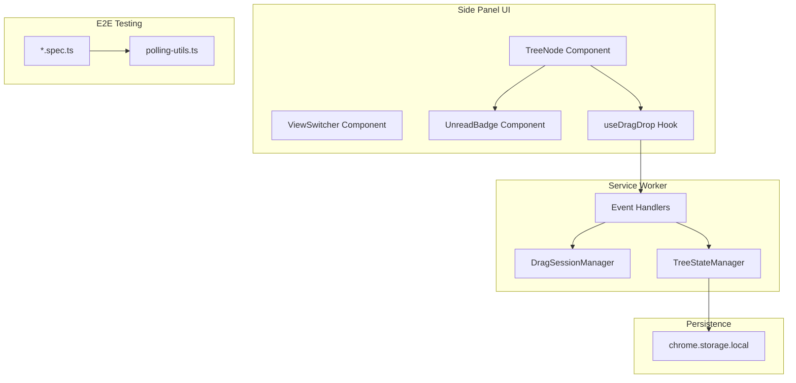
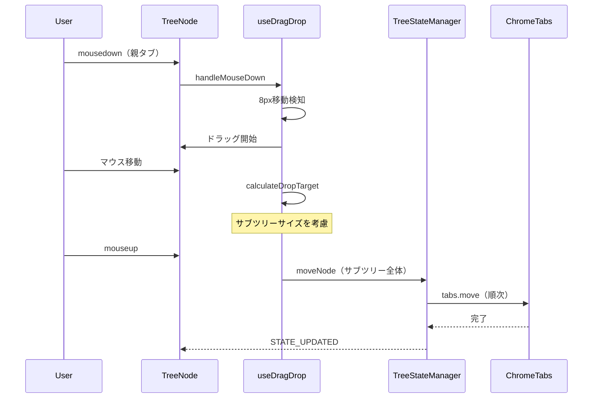
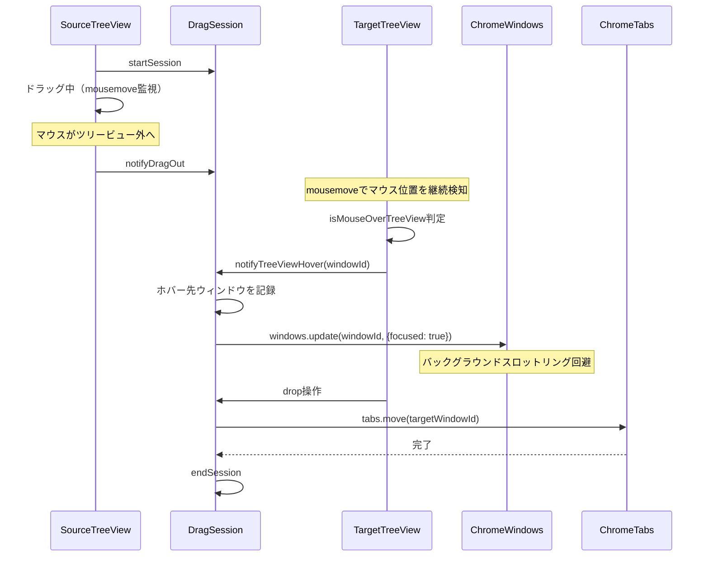
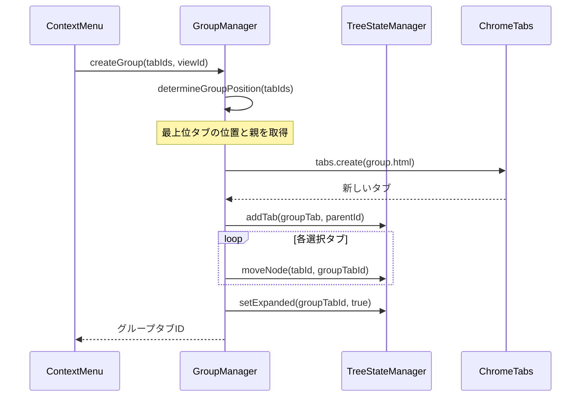
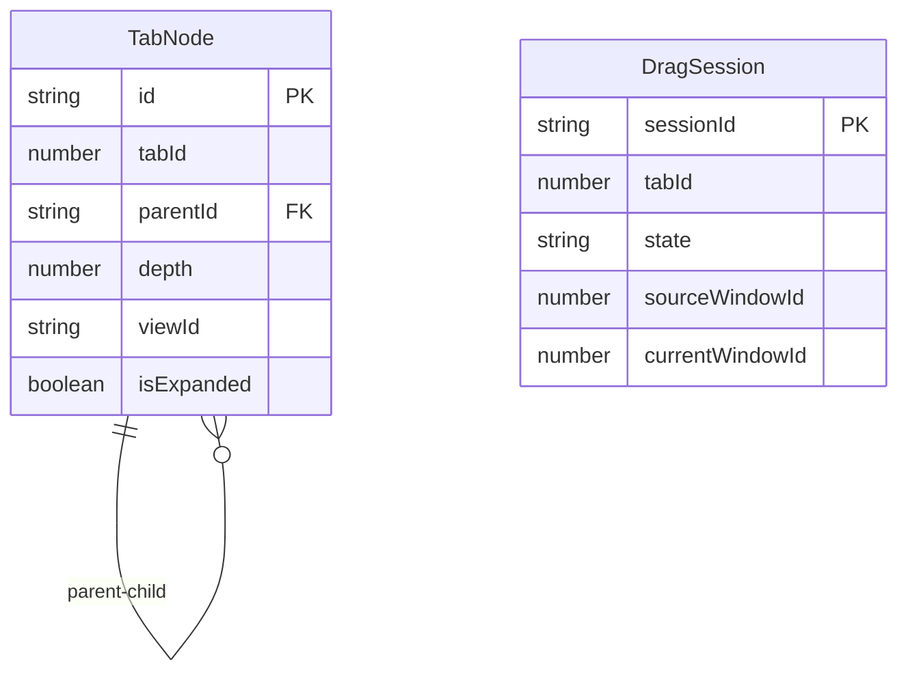

# Technical Design Document: comprehensive-bugfix

## Overview

**Purpose**: Vivaldi-TTのツリー型タブマネージャーにおける17項目のバグ修正と品質改善を実現する。

**Users**: 開発者（E2Eテスト安定化）およびエンドユーザー（UI/UX改善）が対象。

**Impact**: 既存のツリー管理ロジック、ドラッグ&ドロップ処理、UI表示、永続化機能に対する修正を行う。

### Goals
- E2Eテストの100%安定通過（フレーキーテストゼロ）
- サブツリードラッグ操作の正確性確保
- タブグループ化機能の完全動作
- 永続化機能の信頼性向上
- UI表示の視認性・一貫性向上

### Non-Goals
- 新機能の追加（バグ修正のみ）
- パフォーマンス最適化（別タスク）
- アーキテクチャの大規模リファクタリング

---

## Architecture

### Existing Architecture Analysis

**現在のアーキテクチャ**:
- **Service Worker**: イベント処理、状態管理、ウィンドウ間通信
- **Side Panel UI**: React 18ベースのツリービュー
- **Storage Layer**: chrome.storage.localによる永続化

**維持するパターン**:
- Provider Pattern（TreeStateProvider, ThemeProvider）
- カスタムフック（useDragDrop, useMenuActions）
- ポーリングベースのE2Eテスト待機

**対処する技術的負債**:
- 一部のE2Eテストでの不安定な待機条件
- サブツリー移動計算の不完全性
- 未読インジケーターのdepth非対応

### Architecture Pattern & Boundary Map



**Architecture Integration**:
- 選択パターン: 既存パターン拡張（変更最小化）
- ドメイン境界: UI層・Background層・Storage層の分離を維持
- 既存パターン保持: Provider Pattern、カスタムフック、ポーリング待機
- 新規サービス追加: GroupManager.ts（グループ化機能）
- Steering準拠: TypeScript strict mode、`any`禁止、ポーリング待機必須

### Technology Stack

| Layer | Choice / Version | Role in Feature | Notes |
|-------|------------------|-----------------|-------|
| Frontend | React 18 | ツリービューUI、状態管理 | 変更なし |
| Background | Service Worker (MV3) | イベント処理、クロスウィンドウ通信 | 既存ロジック修正 |
| Storage | chrome.storage.local | ツリー状態・設定の永続化 | 既存スキーマ維持 |
| Testing | Playwright | E2Eテスト実行 | テスト追加・修正 |

---

## System Flows

### サブツリードラッグ移動フロー（要件2）



**Key Decisions**:
- サブツリー移動時は子ノードを含む全ノードを順次移動
- 折りたたみ状態でも非表示ノードを含めて移動

### クロスウィンドウドラッグフロー（要件4）



**Key Decisions**:
- DragSessionManagerが状態マシンでセッション管理
- ウィンドウ間移動はchrome.tabs.moveを使用
- **ツリービュー領域上の検知**: `mousemove`イベントで継続的にマウス位置を監視し、ツリービュー領域上にあるかどうかを判定（`mouseenter`ではなく`mousemove`を使用することでバックグラウンドスロットリングの影響を受けにくくする）
- **バックグラウンドスロットリング対策**: ツリービュー上のホバー検知時に`chrome.windows.update({focused: true})`で対象ウィンドウにフォーカスを移動。これによりChromeのバックグラウンドタブでのタイマー・イベントスロットリング（1秒間隔制限）を回避

---

## Requirements Traceability

| Requirement | Summary | Components | Interfaces | Flows |
|-------------|---------|------------|------------|-------|
| 1.1-1.6 | E2Eテスト安定化 | polling-utils.ts, *.spec.ts | waitForCondition | - |
| 2.1-2.5 | サブツリードラッグ移動 | useDragDrop.ts, TreeStateManager.ts | moveNode, calculateDropTarget | サブツリードラッグ |
| 3.1-3.13 | グループ化機能 | GroupManager.ts, ContextMenu.tsx | createGroup, canCreateGroup, determineGroupPosition | グループ化処理 |
| 4.1-4.7 | クロスウィンドウドラッグ | drag-session-manager.ts, TabTreeView.tsx | notifyTreeViewHover, notifyDragOut | クロスウィンドウ |
| 5.1-5.9 | 空ウィンドウ自動クローズ | event-handlers.ts, drag-session-manager.ts | handleTabRemoved, tryCloseEmptyWindow, onDragSessionEnd | シンプル設計 |
| 6.1-6.5 | ビューへの新規タブ追加 | event-handlers.ts, TreeStateManager.ts | addTab, getCurrentViewId | - |
| 7.1-7.5 | 設定タブタイトル表示 | TreeNode.tsx, settings.html | getDisplayTitle, HTML title | - |
| 8.1-8.5 | 内部ページタイトル表示 | TreeNode.tsx | getDisplayTitle | - |
| 9.1-9.5 | 未読インジケーター位置 | UnreadBadge.tsx, TreeNode.tsx | UnreadBadgeProps | - |
| 10.1-10.4 | 新規タブ作成時のツリー展開 | event-handlers.ts, TreeStateManager.ts | expandNode | - |
| 11.1-11.6 | 親子関係解消の永続化 | TreeStateManager.ts | moveNode | - |
| 12.1-12.4 | ファビコン永続化復元 | event-handlers.ts | TAB_FAVICONS | - |
| 13.1-13.6 | ツリー状態永続化 | TreeStateManager.ts | persistState, loadState | - |
| 14.1-14.4 | タブ複製時の配置 | event-handlers.ts | pendingDuplicateSources | - |
| 15.1-15.5 | リンクタブ配置設定 | event-handlers.ts | newTabPositionFromLink | - |
| 16.1-16.5 | 不要なバッジ非表示 | UnreadBadge.tsx, UnreadTracker.ts | - | - |
| 17.1-17.4 | タブ数表示視認性 | ViewSwitcher.tsx | - | - |

---

## Components and Interfaces

### Component Summary

| Component | Domain/Layer | Location | Intent | Req Coverage | Key Dependencies | Contracts |
|-----------|--------------|----------|--------|--------------|------------------|-----------|
| polling-utils.ts | Testing | `/e2e/utils/` | E2Eポーリング待機 | 1.1-1.6 | Playwright (P0) | - |
| useDragDrop.ts | UI/Hooks | `/src/sidepanel/hooks/` | D&D操作管理 | 2.1-2.5 | GapDropDetection (P0) | State |
| TreeStateManager.ts | Services | `/src/services/` | ツリー状態管理 | 2, 6, 10, 11, 13 | StorageService (P0) | Service |
| GroupManager.ts | Services | `/src/services/` | グループ管理 | 3.1-3.6 | TreeStateManager (P0), chrome.tabs (P0) | Service |
| drag-session-manager.ts | Background | `/src/background/` | クロスウィンドウセッション | 4.1-4.5 | chrome.tabs (P0) | Service |
| event-handlers.ts | Background | `/src/background/` | イベント処理 | 5, 6, 10, 12, 14, 15 | TreeStateManager (P0) | - |
| TreeNode.tsx | UI/Components | `/src/sidepanel/components/` | タブノード表示 | 7, 8, 9 | UnreadBadge (P1) | - |
| UnreadBadge.tsx | UI/Components | `/src/sidepanel/components/` | 未読インジケーター | 9.1-9.5, 16.1-16.5 | - | - |
| ViewSwitcher.tsx | UI/Components | `/src/sidepanel/components/` | ビュー切り替え | 17.1-17.4 | - | - |

### Testing Layer

#### polling-utils.ts

| Field | Detail |
|-------|--------|
| Intent | E2Eテストでの安定したポーリング待機を提供 |
| Requirements | 1.1, 1.2, 1.3, 1.4, 1.5, 1.6 |

**Responsibilities & Constraints**
- ポーリングベースの条件待機を標準化
- タイムアウトとインターバルの設定を統一
- Service Workerコンテキストでの実行をサポート

**Dependencies**
- Outbound: Playwright — テスト実行フレームワーク (P0)

**Contracts**: Service [x]

##### Service Interface
```typescript
interface PollingOptions {
  timeout?: number;      // デフォルト: 5000ms
  interval?: number;     // デフォルト: 100ms
  timeoutMessage?: string;
}

function waitForCondition(
  condition: () => Promise<boolean> | boolean,
  options?: PollingOptions
): Promise<void>;

function waitForTabInTreeState(
  context: BrowserContext,
  tabId: number,
  options?: PollingOptions
): Promise<void>;

function waitForParentChildRelation(
  context: BrowserContext,
  childTabId: number,
  parentTabId: number,
  options?: PollingOptions
): Promise<void>;
```

**Implementation Notes**
- Integration: 既存のE2Eテストパターンを維持
- Validation: 条件関数がboolean以外を返す場合はfalse扱い
- Risks: ネットワーク遅延によるタイムアウトリスク

### UI Hooks Layer

#### useDragDrop.ts

| Field | Detail |
|-------|--------|
| Intent | ドラッグ&ドロップ操作の状態管理と計算 |
| Requirements | 2.1, 2.2, 2.3, 2.4, 2.5 |

**Responsibilities & Constraints**
- mousedown/mousemove/mouseupイベントの処理
- 8px移動検知によるドラッグ開始
- サブツリー全体の移動インデックス計算

**Dependencies**
- Outbound: GapDropDetection — ドロップ位置計算 (P0)
- Outbound: TreeStateManager — ノード移動 (P0)

**Contracts**: State [x]

##### State Management
```typescript
interface DragState {
  isDragging: boolean;
  draggedItemId: string | null;
  draggedTabId: number | null;
  dropTarget: DropTarget | null;
  // サブツリー情報（修正ポイント）
  subtreeSize: number;  // 追加: サブツリーのノード数
}
```

**Implementation Notes**
- Integration: calculateDropTargetでサブツリーサイズを考慮
- Validation: 循環参照チェック（自己参照防止）
- Risks: 大規模サブツリー移動時のパフォーマンス

### Services Layer

#### TreeStateManager.ts

| Field | Detail |
|-------|--------|
| Intent | タブツリー状態の集中管理と永続化 |
| Requirements | 2.1, 6.1, 10.1, 11.1, 13.1 |

**Responsibilities & Constraints**
- ノードの追加・削除・移動
- 親子関係の管理
- chrome.storage.localへの永続化

**Dependencies**
- Outbound: StorageService — 永続化 (P0)
- Inbound: event-handlers.ts — イベント通知 (P0)

**Contracts**: Service [x]

##### Service Interface
```typescript
interface TreeStateManager {
  // 既存メソッド
  addTab(tab: chrome.tabs.Tab, parentId: string | null, viewId: string): Promise<void>;
  removeTab(tabId: number, childTabBehavior: 'promote' | 'close_all'): Promise<number[]>;
  moveNode(nodeId: string, newParentId: string | null, index: number): Promise<void>;

  // 修正対象メソッド
  getSubtreeSize(nodeId: string): number;  // 追加: サブツリーサイズ取得
  expandNode(nodeId: string): Promise<void>;  // 要件10: 新規タブ作成時の展開
}
```

**Implementation Notes**
- Integration: moveNode時にサブツリー全体を考慮
- Validation: 循環参照チェック強化
- Risks: 永続化失敗時のデータ整合性

#### GroupManager.ts

| Field | Detail |
|-------|--------|
| Location | `/src/services/GroupManager.ts` |
| Intent | タブグループの作成と管理 |
| Requirements | 3.1, 3.2, 3.3, 3.4, 3.5, 3.6, 3.7, 3.8, 3.9, 3.10 |

**配置理由**: `/src/services/`に配置。TreeStateManager, ViewManager, SnapshotManager等の既存サービスと同様に、ビジネスロジック層として機能する。chrome.tabs APIを呼び出すが、event-handlers.ts経由でService Worker側から呼び出されるため、Servicesパターンが適切。

**Responsibilities & Constraints**
- 選択されたタブからグループタブを生成
- グループタブの適切な位置への挿入
- 子タブの順序維持と親子関係設定
- 単一タブ選択時のグループ化無効化判定

**Dependencies**
- Outbound: TreeStateManager — ツリー状態更新 (P0)
- Outbound: chrome.tabs — グループタブ作成 (P0)
- Inbound: ContextMenu.tsx — グループ化メニュー操作 (P0)

**Contracts**: Service [x]

##### Service Interface
```typescript
interface GroupManagerService {
  /**
   * 選択されたタブをグループ化する
   * @param tabIds グループ化するタブIDの配列（ツリー上の順序順）
   * @param viewId 現在のビューID
   * @returns 生成されたグループタブのID
   * @throws Error タブが1つ以下の場合
   */
  createGroup(tabIds: number[], viewId: string): Promise<number>;

  /**
   * グループ化が可能かどうかを判定
   * @param selectedCount 選択されているタブ数
   * @returns グループ化が可能ならtrue
   */
  canCreateGroup(selectedCount: number): boolean;

  /**
   * グループタブの挿入位置を決定
   * @param tabIds グループ化するタブIDの配列
   * @returns 挿入位置のインデックスと親ノードID
   */
  determineGroupPosition(tabIds: number[]): {
    insertIndex: number;
    parentNodeId: string | null;
  };
}
```

##### グループ化処理フロー


**Implementation Notes**
- Integration: グループタブ作成後にchrome.tabs.updateで位置調整
- Validation: tabIds.length >= 2 を事前チェック
- Error Handling: chrome.tabs.create等の失敗時は複雑なロールバックを行わず、作成されたグループタブはそのまま残す。状態に不整合がなければエラー時もそのまま放置する（保守性優先の設計方針に従う）

#### drag-session-manager.ts

| Field | Detail |
|-------|--------|
| Intent | クロスウィンドウドラッグのセッション管理 |
| Requirements | 4.1, 4.2, 4.3, 4.4, 4.5 |

**Responsibilities & Constraints**
- 状態マシンによる排他制御
- ウィンドウ間タブ移動の調整
- タイムアウト処理

**Dependencies**
- Outbound: chrome.tabs — タブ移動API (P0)
- Outbound: chrome.alarms — keep-alive (P1)

**Contracts**: Service [x]

##### Service Interface
```typescript
interface DragSessionManager {
  startSession(tabId: number, windowId: number, treeData: TabNode[]): Promise<DragSession>;
  beginCrossWindowMove(targetWindowId: number): Promise<void>;
  getSession(maxWaitMs?: number): Promise<DragSession | null>;
  endSession(reason?: string): Promise<void>;

  /**
   * ツリービュー領域からのドラッグ離脱を通知
   * ドラッグ中のタブがツリービュー領域を離れた際に呼び出す
   */
  notifyDragOut(): void;

  /**
   * ツリービュー領域上のホバーを通知
   * 別ウィンドウのツリービュー領域上にマウスがある場合に呼び出す（mousemoveで継続的に検知）
   * バックグラウンドスロットリング回避のため、対象ウィンドウにフォーカスを移動する
   * 重複呼び出しは内部で無視される
   * @param windowId ホバー先のウィンドウID
   */
  notifyTreeViewHover(windowId: number): Promise<void>;
}
```

##### ツリービュー上のホバー検知の実装詳細

**検知トリガー**: ツリービューコンポーネント（`TabTreeView.tsx`）の`mousemove`イベント

**mousemoveを使用する理由**:
- `mouseenter`は「進入した瞬間」のみ発火するため、バックグラウンドスロットリングの影響を受けやすい
- `mousemove`は継続的に発火するため、マウスがツリービュー領域上にあるかどうかを判定できる
- ドラッグ中はユーザーがマウスを動かし続けるため、`mousemove`イベントが発火し続ける

**バックグラウンドスロットリング対策**:
- Chromeはバックグラウンドタブでタイマーとイベントを1秒間隔にスロットリングする
- ツリービュー上のホバー検知時に`chrome.windows.update({focused: true})`で対象ウィンドウにフォーカスを移動
- これによりドラッグ操作のレスポンスを維持

**実装方式**:
```typescript
// TabTreeView.tsx内でのホバー検知
// パフォーマンス最適化: ローカルにセッション状態をキャッシュし、変更時のみService Workerに問い合わせ
const [cachedSession, setCachedSession] = useState<DragSession | null>(null);
const lastNotifiedWindowRef = useRef<number | null>(null);

// セッション状態の変更を監視（メッセージリスナー経由）
useEffect(() => {
  const handleSessionChange = (session: DragSession | null) => {
    setCachedSession(session);
  };
  // Service Workerからのセッション変更通知を購読
  subscribeToSessionChanges(handleSessionChange);
  return () => unsubscribeFromSessionChanges(handleSessionChange);
}, []);

const handleMouseMove = useCallback(() => {
  // ローカルキャッシュを参照（Service Workerへの問い合わせなし）
  if (cachedSession && cachedSession.windowId !== currentWindowId) {
    // 既に同じウィンドウを通知済みなら何もしない
    if (lastNotifiedWindowRef.current === currentWindowId) return;
    lastNotifiedWindowRef.current = currentWindowId;

    // 別ウィンドウからのドラッグ中にこのツリービュー上にマウスがある
    // notifyTreeViewHover内でウィンドウフォーカスも移動する
    DragSessionManager.notifyTreeViewHover(currentWindowId);
  }
}, [cachedSession, currentWindowId]);

return (
  <div
    className="tree-view"
    onMouseMove={handleMouseMove}
  >
    {/* ツリーノード */}
  </div>
);

// DragSessionManager内でのフォーカス移動処理
async notifyTreeViewHover(windowId: number): Promise<void> {
  // 既に同じウィンドウを記録済みなら何もしない（重複呼び出し防止）
  if (this.currentWindowId === windowId) return;

  this.currentWindowId = windowId;
  // バックグラウンドスロットリング回避のためフォーカスを移動
  await chrome.windows.update(windowId, { focused: true });
}
```

**パフォーマンス最適化のポイント**:
- mousemove毎にService Workerへ問い合わせせず、ローカルキャッシュを参照
- セッション状態はService Workerからのプッシュ通知で更新
- 同一ウィンドウへの重複通知はローカルで防止

**Implementation Notes**
- Integration: ツリービュー進入時にService Workerへメッセージ送信
- Validation: セッションロック中は操作をブロック
- Risks: タイムアウトによるセッション破棄

### Background Layer

#### event-handlers.ts

| Field | Detail |
|-------|--------|
| Intent | Chrome APIイベントの処理 |
| Requirements | 5.1, 6.1, 10.1, 12.1, 14.1, 15.1 |

**Responsibilities & Constraints**
- タブ作成・削除・更新イベントの処理
- ビューへの新規タブ追加
- 空ウィンドウの自動クローズ

**Dependencies**
- Outbound: TreeStateManager — ツリー状態更新 (P0)
- Outbound: chrome.tabs/chrome.windows — ブラウザAPI (P0)

**Contracts**: Service [x]

##### Service Interface
```typescript
// 修正対象関数
async function handleTabRemoved(
  tabId: number,
  removeInfo: chrome.tabs.TabRemoveInfo
): Promise<void>;
// 追加: ウィンドウ内タブ数チェック後に自動クローズ

async function handleTabCreated(tab: chrome.tabs.Tab): Promise<void>;
// 追加: 親タブの自動展開（要件10）
```

##### 空ウィンドウ自動クローズ設計

**設計方針**: 保守性を最優先し、シンプルな実装とする。競合状態はエッジケースとして許容する。

**実装**:

```typescript
async function handleTabRemoved(
  tabId: number,
  removeInfo: chrome.tabs.TabRemoveInfo
): Promise<void> {
  const { windowId, isWindowClosing } = removeInfo;

  // ウィンドウ自体が閉じられている場合は処理スキップ
  if (isWindowClosing) {
    return;
  }

  // ドラッグセッション中は自動クローズを抑止
  const dragSession = await DragSessionManager.getSession(0);
  if (dragSession && dragSession.sourceWindowId === windowId) {
    return; // ドラッグ中はクローズしない（ドラッグ完了時に別途処理）
  }

  // 空ウィンドウなら閉じる
  await tryCloseEmptyWindow(windowId);
}

async function tryCloseEmptyWindow(windowId: number): Promise<void> {
  try {
    const tabs = await chrome.tabs.query({ windowId });
    if (tabs.length > 0) return;

    const allWindows = await chrome.windows.getAll({ windowTypes: ['normal'] });
    if (allWindows.length <= 1) return; // 最後のウィンドウは閉じない

    await chrome.windows.remove(windowId);
  } catch {
    // エラーは無視（ウィンドウが既に閉じられている等）
  }
}

// ドラッグ完了時に呼び出し
async function onDragSessionEnd(sourceWindowId: number): Promise<void> {
  await tryCloseEmptyWindow(sourceWindowId);
}
```

**Key Design Decisions**:
1. **シンプルさ優先**: 複雑な状態管理（デバウンス、ペンディング管理）は行わない
2. **ドラッグ中の抑止**: ドラッグ元ウィンドウはセッション終了まで閉じない
3. **ドラッグ完了時のクローズ**: セッション終了時にドラッグ元ウィンドウの空チェックを実行
4. **最後のウィンドウ保護**: 全ウィンドウ数が1の場合はクローズしない
5. **競合状態の割り切り**: エッジケースでのタブ消失は許容（保守性優先）

**Implementation Notes**
- Integration: handleTabRemovedで残タブ数チェック追加、DragSession終了時にクローズ処理
- Validation: 最後のウィンドウは閉じない（ブラウザ終了防止）
- Risks: 競合状態はサイレントに無視（保守性を優先した設計判断）

### UI Components Layer

#### TreeNode.tsx

| Field | Detail |
|-------|--------|
| Intent | タブノードの表示とタイトル変換 |
| Requirements | 7.1, 7.2, 8.1, 8.2, 8.3, 9.1 |

**Responsibilities & Constraints**
- タイトル表示のフレンドリー名変換
- UnreadBadgeへのdepth伝播

**Dependencies**
- Outbound: UnreadBadge — 未読表示 (P1)

**Implementation Notes**
- Integration: chrome.tabs.Tab.titleをそのまま表示
- Validation: titleがnull/undefinedの場合は空文字を返す

##### タイトル表示ロジック

```typescript
function getDisplayTitle(tab: chrome.tabs.Tab): string {
  // chrome.tabs.Tab.titleをそのまま使用
  // - 拡張機能ページ（settings.html, group.html等）はHTMLの<title>で適切なタイトルを提供
  return tab.title ?? '';
}
```

**設計方針**:
- `chrome.tabs.Tab.title`を最優先で使用し、フォールバック処理は行わない
- 内部ページ（vivaldi://calendar等）でタイトルがURLのまま表示されるケースは将来の改善で対応
- 拡張機能の内部ページ（settings.html, group.html等）はHTMLの`<title>`タグで適切なタイトルを設定
- i18n対応は不要とし、英語表記で統一する

##### 拡張機能ページのタイトル設定

拡張機能の内部ページはHTMLでタイトルを設定し、chrome.tabs.Tab.titleで正しく取得されるようにする：

```html
<!-- settings.html -->
<!DOCTYPE html>
<html>
<head>
  <title>Settings</title>
  ...
</head>
</html>

<!-- group.html -->
<!DOCTYPE html>
<html>
<head>
  <title>Group</title>
  ...
</head>
</html>
```

#### UnreadBadge.tsx

| Field | Detail |
|-------|--------|
| Intent | 未読インジケーターの表示 |
| Requirements | 9.1, 9.2, 9.3, 9.4, 9.5, 16.1, 16.2 |

**Responsibilities & Constraints**
- depthに応じた位置調整
- 親タブへのバッジ非表示

**Implementation Notes**
- Integration: depth propsの追加
- Validation: depth >= 0のバリデーション

##### Interface修正
```typescript
interface UnreadBadgeProps {
  isUnread: boolean;
  showIndicator: boolean;
  depth: number;  // 追加: タブの階層深度
  className?: string;
}
```

#### ViewSwitcher.tsx

| Field | Detail |
|-------|--------|
| Intent | ビュー切り替えUIとタブ数表示 |
| Requirements | 17.1, 17.2, 17.3, 17.4 |

**Implementation Notes**
- Integration: タブ数バッジのmin-width調整
- CSS修正: `min-w-[16px]` → `min-w-[20px]`、position調整

---

## Data Models

### Domain Model



**ビジネスルール**:
- TabNodeは最大深度制限なし
- DragSessionは同時に1つのみ有効
- parentIdがnullの場合はルートノード

### Logical Data Model

**TabNode構造**（変更なし）:
- `id`: ノードの一意識別子（`node-${tabId}`形式）
- `tabId`: Chrome APIのタブID
- `parentId`: 親ノードID（nullでルート）
- `children`: 子ノードの配列
- `depth`: ツリー内の深度
- `viewId`: 所属ビューID
- `isExpanded`: 折りたたみ状態

---

## Error Handling

### Error Strategy

**ポーリング待機タイムアウト**:
- デフォルト5秒でタイムアウト
- カスタムエラーメッセージを設定可能
- expect.failでテスト失敗を明示

**ドラッグセッションエラー**:
- `SESSION_NOT_FOUND`: セッション開始をスキップ
- `SESSION_LOCKED`: 50ms待機後にリトライ
- `INVALID_STATE_TRANSITION`: 操作をキャンセル
- `TIMEOUT`: セッションを強制終了

**空ウィンドウ自動クローズ**:
- ドラッグ中は自動クローズを抑止、ドラッグ完了時にクローズ判定
- 最後のウィンドウは閉じない（ブラウザ終了防止）
- 競合状態はサイレントに無視（保守性優先）

### Error Categories and Responses

**User Errors** (4xx):
- 無効なドラッグ操作 → 視覚的フィードバック（ドロップ不可表示）

**System Errors** (5xx):
- chrome.storage.local失敗 → リトライ後にフォールバック
- chrome.tabs.move失敗 → エラーログ出力、セッション終了
- chrome.windows.remove失敗 → サイレントに無視

**Race Condition Errors**:
- 競合状態はエッジケースとして許容し、サイレントに無視（保守性優先の設計判断）

---

## Testing Strategy

### Unit Tests
- `TreeStateManager.getSubtreeSize()`: サブツリーサイズ計算の正確性
- `getDisplayTitle()`: URLパターンマッチングの正確性
- `UnreadBadge`: depth反映のスタイル計算

### Integration Tests
- `useDragDrop` + `TreeStateManager`: サブツリー移動の連携
- `event-handlers` + `TreeStateManager`: タブイベント処理

### E2E Tests
- 要件1: `tab-persistence.spec.ts`のリファクタリング
- 要件2: `drag-drop-subtree.spec.ts`新規追加
- 要件3: `tab-grouping.spec.ts`拡充
- 要件4: `cross-window-drag-drop.spec.ts`拡充
- 要件5: `empty-window-auto-close.spec.ts`拡充
- 要件6: `view-new-tab.spec.ts`拡充
- 要件7: `settings-tab-title.spec.ts`新規追加
- 要件8: `internal-page-title.spec.ts`新規追加
- 要件9: `unread-indicator-position.spec.ts`新規追加
- 要件10: `tree-expand-on-new-tab.spec.ts`新規追加
- 要件11: `drag-drop-child-independent.spec.ts`拡充
- 要件12: `favicon-restore.spec.ts`検証
- 要件13: `tab-persistence.spec.ts`検証
- 要件14: `tab-duplicate.spec.ts`検証
- 要件15: `tab-position-settings.spec.ts`拡充
- 要件16: `unread-badge-no-propagation.spec.ts`新規追加
- 要件17: `view-tab-count.spec.ts`拡充

**E2E安定性要件**:
- 全テストは`--repeat-each=10`で安定通過必須
- 固定時間待機（waitForTimeout）禁止
- ポーリング待機（polling-utils.ts）必須

---

## Performance & Scalability

**対象メトリクス**:
- サブツリー移動: 100ノードサブツリーで500ms以内
- E2Eテスト実行: 各テスト10秒以内

**最適化アプローチ**:
- バッチ処理によるchrome.tabs.move呼び出し削減（将来検討）
- 仮想化によるDOM更新最小化（既存実装維持）
