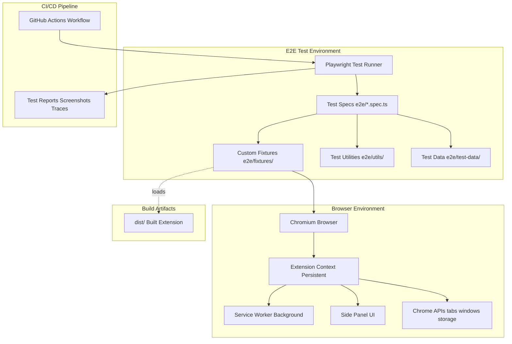
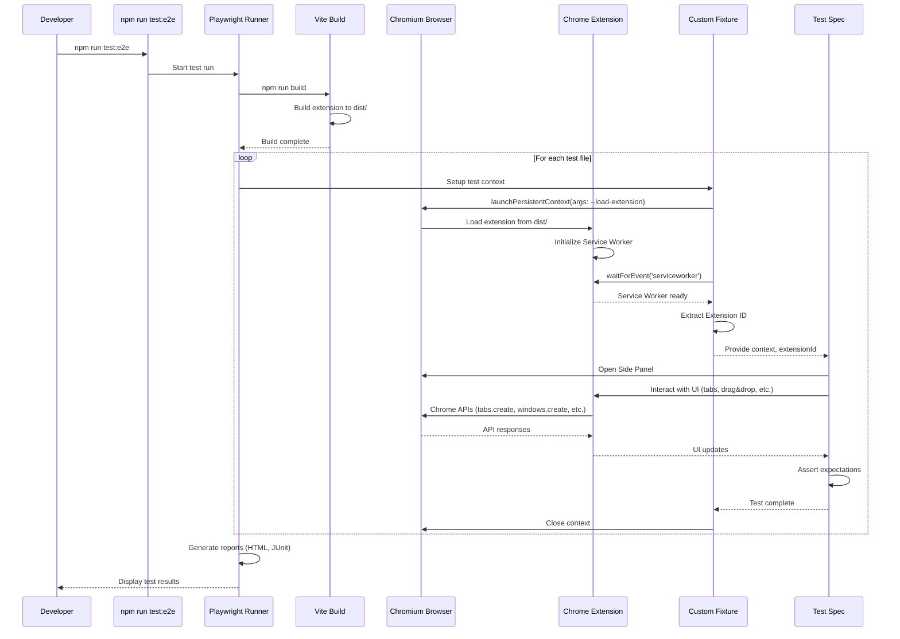
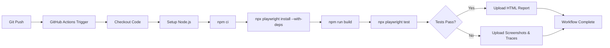

# Technical Design Document

## Overview

本機能は、Vivaldi-TTのChrome拡張機能としての動作を実ブラウザ環境で検証するため、Playwright for Chrome Extensionsを活用した真のE2Eテスト環境を提供します。

**Purpose**: 実ブラウザ上でChrome拡張機能の動作を自動的に検証し、ユーザーが実際に使用する環境での品質を保証するE2Eテストシステムを構築します。

**Users**: テスト開発者およびQAエンジニアが、タブライフサイクル、ドラッグ&ドロップ、ビュー切り替え、グループ機能などのコアユーザーフローを実ブラウザ環境で検証できるようになります。

**Impact**: 現在のVitest + React Testing Library（jsdom環境）による単体・統合テストでは検証できないブラウザAPI統合、Service Worker通信、Side Panel表示など、実環境でのみ発生する不具合を早期に発見できるようになります。

### Goals
- 実ブラウザ環境（Chromium）でChrome拡張機能として動作するE2Eテスト環境を構築する
- Playwright for Chrome ExtensionsによりManifest v3のService Worker、Side Panel、Chrome APIsとの統合を検証する
- CI/CD環境およびローカル実行時にheadlessモードをデフォルトとし、安定した自動テスト実行を実現する
- デバッグ目的でheadedモードでの実行オプションを提供し、開発効率を向上させる
- 既存のVitestテストと明確に棲み分けし、開発者の既存ワークフローを維持する
- テスト失敗時の迅速なデバッグを支援するツール（Inspector、Trace Viewer）を提供する

### Non-Goals
- 既存のVitestテストをPlaywrightに置き換えること（共存戦略）
- パフォーマンステスト専用ツールの導入（Playwrightの基本機能で対応）
- 複数ブラウザ対応（ChromiumのみでVivaldi互換性を保証）
- ビジュアルリグレッションテスト（将来的な拡張として検討可能）

## Architecture

### Existing Architecture Analysis

Vivaldi-TTは以下の既存アーキテクチャを持ちます：

- **Manifest v3 Chrome Extension**: Service Worker + Side Panelで構成
- **Build System**: Vite + @crxjs/vite-plugin（`dist`ディレクトリにビルド成果物を出力）
- **Test Infrastructure**: Vitest + React Testing Library（jsdom環境）
  - 単体テスト: `*.test.ts(x)`
  - 統合テスト: `*.integration.test.tsx`
  - 疑似E2Eテスト: `*.e2e.test.tsx`（jsdom内のコンポーネントテスト）
- **Chrome API Mock**: `src/test/chrome-mock.ts`でChrome APIをモック化

E2Eテスト環境は、既存のVitest環境に影響を与えず、独立したテストランナー（Playwright）として動作する必要があります。

### Architecture Pattern & Boundary Map



**Architecture Integration**:
- **Selected pattern**: Test Fixture Pattern（Playwrightの公式推奨パターン）
- **Domain/feature boundaries**:
  - E2Eテストシステム（`e2e/`）: Playwrightベースの実ブラウザテスト
  - 既存テストシステム（`src/`）: Vitestベースの単体・統合テスト
  - テストランナーレベルで完全に分離し、相互依存なし
- **Existing patterns preserved**:
  - TypeScript strict mode
  - Path alias `@/` for `./src/`
  - ESLint + Prettier code quality standards
- **New components rationale**:
  - Custom Fixtures: 拡張機能ロードとService Worker待機を自動化
  - Test Utilities: Side Panel操作、タブ操作などの共通ヘルパー関数
  - Playwright Config: headless/headed切り替え、タイムアウト、リトライ戦略
- **Steering compliance**:
  - `docs/steering/tech.md`: TypeScript strict mode、テスト種別の明確化
  - `docs/steering/structure.md`: ドメイン別ディレクトリ組織、colocationパターン

### Technology Stack

| Layer | Choice / Version | Role in Feature | Notes |
|-------|------------------|-----------------|-------|
| Test Runner | Playwright ^1.49.0 | E2Eテスト実行、ブラウザ自動化、レポート生成 | 公式Chrome Extensions対応、デフォルトheadlessモード（Requirements 1.4, 6.1） |
| Browser | Chromium (Playwright bundled) | 拡張機能実行環境 | Chrome/Edgeは非対応、Vivaldiと互換性あり、headlessモード対応 |
| Language | TypeScript 5.5+ | テストコード記述 | 既存プロジェクトと同じバージョン、strict mode有効 |
| Build Tool | Vite + @crxjs/vite-plugin | 拡張機能ビルド（テスト前） | 既存ビルドシステムを流用 |
| CI/CD | GitHub Actions | 自動テスト実行、レポート保存 | デフォルトheadlessモード、CI環境変数自動検知（Requirement 6.6） |

**Technology Alignment**:
- Playwrightは公式ドキュメントでManifest v3対応を明記（Service Worker、launchPersistentContext）
- Chromiumバンドル版のみが`--load-extension`フラグをサポート（Chrome/Edgeは非対応）
- Chromiumバンドル版はheadlessモードをデフォルトでサポート、CI/CDおよびローカル実行で安定動作（Requirements 1.4, 6.1対応）
- デバッグ目的でheadedモード実行とブラウザDevToolsアクセスをサポート（Requirements 1.5, 8.5, 8.6対応）
- 既存のTypeScriptビルド環境と統合可能（同じtsconfig.jsonを参照）
- CI環境変数（`CI=true`）を検知して適切な設定を自動適用（Requirement 6.6対応）

## System Flows

### E2Eテスト実行フロー



**Key Decisions**:
- **Pre-build Requirement**: テスト実行前に必ず`npm run build`を実行し、最新の拡張機能を`dist/`にビルド
- **Service Worker Wait Strategy**: `browserContext.waitForEvent('serviceworker')`で確実に起動完了を待機
- **Context Isolation**: 各テストで独立したPersistent Contextを作成し、テスト間干渉を防止
- **Extension ID Extraction**: Service Worker URLから動的に抽出（ビルドごとに変わる可能性に対応）

### CI/CDパイプラインフロー



## Requirements Traceability

| Requirement | Summary | Components | Interfaces | Flows |
|-------------|---------|------------|------------|-------|
| 1 | Playwrightテスト環境のセットアップ | PlaywrightConfig, PackageJSON | playwright.config.ts | - |
| 2 | Chrome拡張機能のロードとテスト実行基盤 | ExtensionFixture, BuildScript | ExtensionContext | E2Eテスト実行フロー |
| 3.1 | タブライフサイクルとツリー構造の基本操作 | TabLifecycleTests | TabTestUtils | E2Eテスト実行フロー |
| 3.2 | ドラッグ&ドロップによるタブの並び替え（同階層） | DragDropTests | DragDropUtils | E2Eテスト実行フロー |
| 3.3 | ドラッグ&ドロップによる階層変更（親子関係の作成） | DragDropTests | DragDropUtils | E2Eテスト実行フロー |
| 3.4 | ドラッグ&ドロップによる複雑なツリー移動 | DragDropTests | DragDropUtils | E2Eテスト実行フロー |
| 3.5 | ドラッグ&ドロップのホバー自動展開 | DragDropTests | DragDropUtils | E2Eテスト実行フロー |
| 3.6 | クロスウィンドウドラッグ&ドロップ | CrossWindowTests | WindowTestUtils | E2Eテスト実行フロー |
| 3.7 | Side Panelの表示とリアルタイム更新 | SidePanelTests | SidePanelUtils | E2Eテスト実行フロー |
| 3.8 | ビュー切り替え機能（All Tabs / Current Window / Groups） | ViewSwitchingTests | ViewTestUtils | E2Eテスト実行フロー |
| 3.9 | グループ機能 | GroupTests | GroupTestUtils | E2Eテスト実行フロー |
| 3.10 | スナップショット機能 | SnapshotTests | SnapshotTestUtils | E2Eテスト実行フロー |
| 3.11 | コンテキストメニュー操作 | ContextMenuTests | ContextMenuUtils | E2Eテスト実行フロー |
| 3.12 | 設定変更とUI/UXカスタマイゼーション | SettingsTests | SettingsTestUtils | E2Eテスト実行フロー |
| 3.13 | 未読インジケータ機能 | UnreadIndicatorTests | TabTestUtils | E2Eテスト実行フロー |
| 3.14 | エラーハンドリングとエッジケース | ErrorHandlingTests | ErrorTestUtils | E2Eテスト実行フロー |
| 4.1 | chrome.tabs API統合 | ChromeAPITests | ChromeAPITestUtils | E2Eテスト実行フロー |
| 4.2 | chrome.windows API統合 | ChromeAPITests | WindowTestUtils | E2Eテスト実行フロー |
| 4.3 | IndexedDB統合 | StorageTests | StorageTestUtils | E2Eテスト実行フロー |
| 4.4 | chrome.storage API統合 | StorageTests | StorageTestUtils | E2Eテスト実行フロー |
| 4.5 | Service Workerとの通信 | ServiceWorkerTests | ServiceWorkerUtils | E2Eテスト実行フロー |
| 5 | テスト構造とファイル組織 | DirectoryStructure, NamingConventions | - | - |
| 6 | CI/CD統合とレポート生成 | GitHubWorkflow, PlaywrightConfig | - | CI/CDパイプラインフロー |
| 7 | 既存テストとの共存と棲み分け | PackageJSON, DirectoryStructure | - | - |
| 8 | デバッグとトラブルシューティング支援 | PlaywrightConfig, DebugScripts | - | - |
| 9 | パフォーマンスと安定性の確保 | PlaywrightConfig, WaitStrategies | - | - |

## Components and Interfaces

### Component Summary

| Component | Domain/Layer | Intent | Req Coverage | Key Dependencies (Criticality) | Contracts |
|-----------|--------------|--------|--------------|-------------------------------|-----------|
| PlaywrightConfig | Configuration | Playwright設定（ブラウザ、タイムアウト、レポート） | 1, 6, 8, 9 | Playwright (P0) | Config |
| ExtensionFixture | Test Infrastructure | 拡張機能ロードとService Worker待機を自動化 | 2 | Playwright (P0), Vite (P0) | Fixture |
| TabTestUtils | Test Utilities | タブ操作の共通ヘルパー関数 | 3.1, 3.13, 4.1 | Playwright Page API (P0) | Service |
| DragDropUtils | Test Utilities | ドラッグ&ドロップ操作のヘルパー関数 | 3.2, 3.3, 3.4, 3.5 | Playwright Locator API (P0) | Service |
| SidePanelUtils | Test Utilities | Side Panel操作のヘルパー関数 | 3.7 | Playwright Page API (P0) | Service |
| WindowTestUtils | Test Utilities | ウィンドウ操作のヘルパー関数 | 3.6, 4.2 | Playwright Context API (P0) | Service |
| ServiceWorkerUtils | Test Utilities | Service Worker通信のヘルパー関数 | 4.5 | Playwright Worker API (P0) | Service |
| TestSpecs | Test Layer | 個別のテストシナリオ実装 | 3.1-3.14, 4.1-4.5 | ExtensionFixture (P0), TestUtils (P0) | - |

### Test Infrastructure

#### ExtensionFixture

| Field | Detail |
|-------|--------|
| Intent | 拡張機能のロード、Service Worker待機、Extension ID抽出を自動化するカスタムフィクスチャ |
| Requirements | 2 |
| Owner / Reviewers | - |

**Responsibilities & Constraints**
- テスト実行前に`dist/`ディレクトリから拡張機能をロード
- Service Workerの起動完了を確実に待機
- Extension IDを動的に抽出してテストコンテキストに提供
- テスト終了後のブラウザコンテキストクリーンアップ

**Dependencies**
- Inbound: TestSpecs — フィクスチャを使用してテスト実行 (P0)
- Outbound: Playwright BrowserContext API — Persistent Context作成 (P0)
- Outbound: Vite Build Artifacts — `dist/`ディレクトリを参照 (P0)
- External: Chromium Browser — 拡張機能実行環境 (P0)

**Contracts**: Fixture [x]

##### Fixture Interface
```typescript
interface ExtensionFixtures {
  // 拡張機能がロードされたブラウザコンテキスト
  extensionContext: BrowserContext;

  // 拡張機能のID（chrome-extension://<extensionId>/...）
  extensionId: string;

  // Service Workerへの参照
  serviceWorker: Worker;

  // Side PanelのPage
  sidePanelPage: Page;
}

// フィクスチャ定義
const test = base.extend<ExtensionFixtures>({
  extensionContext: async ({ }, use) => {
    const pathToExtension = path.join(__dirname, '../dist');
    const headless = process.env.HEADED !== 'true';
    const context = await chromium.launchPersistentContext('', {
      headless,
      channel: 'chromium', // Service Worker動作に必須
      args: [
        headless ? '--headless=new' : '', // 新しいheadlessモードでService Worker起動
        `--disable-extensions-except=${pathToExtension}`,
        `--load-extension=${pathToExtension}`,
      ].filter(Boolean),
    });
    await use(context);
    await context.close();
  },

  extensionId: async ({ extensionContext }, use) => {
    let [serviceWorker] = extensionContext.serviceWorkers();
    if (!serviceWorker) {
      serviceWorker = await extensionContext.waitForEvent('serviceworker');
    }
    const extensionId = serviceWorker.url().split('/')[2];
    await use(extensionId);
  },

  serviceWorker: async ({ extensionContext }, use) => {
    let [serviceWorker] = extensionContext.serviceWorkers();
    if (!serviceWorker) {
      serviceWorker = await extensionContext.waitForEvent('serviceworker');
    }
    await use(serviceWorker);
  },

  sidePanelPage: async ({ extensionContext, extensionId }, use) => {
    const page = await extensionContext.newPage();
    await page.goto(`chrome-extension://${extensionId}/sidepanel.html`);
    await page.waitForLoadState('domcontentloaded');
    await use(page);
  },
});
```

- **Preconditions**: `dist/`ディレクトリにビルド済み拡張機能が存在すること
- **Postconditions**: テスト完了後、ブラウザコンテキストが確実にクローズされること
- **Invariants**: Service Workerが起動完了してからExtension IDを抽出すること

**Implementation Notes**
- Integration: Playwright公式ドキュメントのChrome Extensions例に従う
- Headless Mode Control: デフォルトでheadlessモード実行、`HEADED=true`環境変数でheadedモードに切り替え可能（Requirements 1.4, 1.5対応）
- **Headless Mode Configuration (Critical)**: Chrome拡張機能のService Workerをheadlessモードで動作させるため、以下の設定が必須：
  - `channel: 'chromium'` - Playwrightバンドル版Chromiumを明示的に指定
  - `--headless=new` - 新しいheadlessモード（Chrome 112以降）を使用
  - この組み合わせにより、Manifest v3のService Workerがheadlessモードで正常に起動する
  - **Technical Background**: デフォルトのheadlessモード（`headless: true`のみ）では、Chrome拡張機能のService Workerが起動せず、`waitForEvent('serviceworker')`がタイムアウトする既知の制限がある。`channel: 'chromium'`と`--headless=new`の組み合わせにより、この制限を回避できる。
- Validation: Service Worker起動失敗時は明確なエラーメッセージを出力
- Risks: Service Workerスリープからの復帰遅延 → タイムアウト設定を適切に調整（デフォルト30秒）

#### PlaywrightConfig

| Field | Detail |
|-------|--------|
| Intent | Playwright実行環境の設定（ブラウザ、タイムアウト、レポート、リトライ戦略） |
| Requirements | 1, 6, 8, 9 |

**Responsibilities & Constraints**
- ブラウザ選択（Chromiumのみ）とheadlessモードをデフォルトとする（Requirements 1.4, 6.1対応）
- デバッグ用headedモードの環境変数制御（`HEADED=true`）（Requirement 1.5対応）
- グローバルタイムアウト設定（デフォルト30秒）
- リトライ戦略（CI環境で2回リトライ）
- テストレポート生成（HTML、JUnit XML）
- 失敗時のスクリーンショット・トレース保存

**Dependencies**
- Outbound: Chromium Browser — テスト実行環境 (P0)
- External: CI Environment Variables — headlessモード切り替え (P1)

**Contracts**: Config [x]

##### Config Definition
```typescript
import { defineConfig, devices } from '@playwright/test';

export default defineConfig({
  testDir: './e2e',
  testMatch: '**/*.spec.ts',

  // タイムアウト設定
  timeout: 30000, // 30秒
  expect: {
    timeout: 5000, // アサーションタイムアウト
  },

  // リトライ戦略
  retries: process.env.CI ? 2 : 0,

  // 並列実行設定
  workers: process.env.CI ? 2 : undefined,

  // レポート設定
  reporter: [
    ['html', { outputFolder: 'playwright-report' }],
    ['junit', { outputFile: 'test-results/junit.xml' }],
    ['list'],
  ],

  // 失敗時のアーティファクト保存
  use: {
    trace: 'on-first-retry',
    screenshot: 'only-on-failure',
    video: 'retain-on-failure',
  },

  // プロジェクト設定
  projects: [
    {
      name: 'chromium',
      use: { ...devices['Desktop Chrome'] },
    },
  ],
});
```

- **Preconditions**: Chromiumブラウザがインストールされていること
- **Postconditions**: テスト失敗時、トレースとスクリーンショットが保存されること
- **Invariants**: デフォルトでheadlessモード実行、`HEADED=true`環境変数が設定されている場合のみheadedモードで実行されること（Requirements 1.4, 1.5, 6.1対応）

**Implementation Notes**
- Integration: デフォルトでheadlessモード実行、CI環境変数`CI=true`を検知して適切な設定を自動適用（Requirements 6.1, 6.6対応）
- Debug Mode: `HEADED=true`環境変数または`test:e2e:debug`スクリプトでheadedモード実行、ブラウザDevToolsアクセス可能（Requirements 8.5, 8.6対応）
- Validation: `npx playwright test --config`で設定検証可能
- Risks: タイムアウト設定が短すぎる場合のflakyテスト → 初期値30秒で様子を見て調整

### Test Utilities

#### TabTestUtils

| Field | Detail |
|-------|--------|
| Intent | タブ操作（作成、削除、アクティブ化、検証）の共通ヘルパー関数 |
| Requirements | 3.1, 3.13, 4.1 |

**Responsibilities & Constraints**
- タブの作成、削除、アクティブ化などのChrome API操作をラップ
- Side Panelのツリー表示との同期を検証
- タブタイトル、URL、favicon、未読状態の検証

**Dependencies**
- Inbound: TestSpecs — タブ操作が必要なテストから使用 (P0)
- Outbound: Playwright Page API — DOM操作とアサーション (P0)

**Contracts**: Service [x]

##### Service Interface
```typescript
interface TabTestUtils {
  // タブを作成し、ツリーに表示されるまで待機
  createTab(context: BrowserContext, url: string, parentTabId?: number): Promise<number>;

  // タブを閉じ、ツリーから削除されることを検証
  closeTab(context: BrowserContext, tabId: number): Promise<void>;

  // タブをアクティブ化し、ツリーでハイライトされることを検証
  activateTab(context: BrowserContext, tabId: number): Promise<void>;

  // ツリー内のタブノードを検証
  assertTabInTree(page: Page, tabId: number, expectedTitle: string): Promise<void>;

  // ツリーからタブノードが削除されたことを検証
  assertTabNotInTree(page: Page, tabId: number): Promise<void>;

  // 未読バッジが表示されることを検証
  assertUnreadBadge(page: Page, tabId: number, expectedCount: number): Promise<void>;
}
```

**Implementation Notes**
- Integration: `waitForSelector`で要素の出現を待機、`expect(locator).toBeVisible()`でアサーション
- Validation: タブIDとツリーノードのdata-tab-id属性を紐付けて検証
- Risks: タブ作成からツリー反映までの遅延 → `waitForSelector`で確実に待機

#### DragDropUtils

| Field | Detail |
|-------|--------|
| Intent | ドラッグ&ドロップ操作のシミュレーションとドロップ位置検証 |
| Requirements | 3.2, 3.3, 3.4, 3.5 |

**Responsibilities & Constraints**
- タブノードのドラッグ開始、ホバー、ドロップのシミュレーション
- ドロップインジケータの視覚的フィードバック検証
- ホバー自動展開のタイミング検証

**Dependencies**
- Inbound: TestSpecs — ドラッグ&ドロップテストから使用 (P0)
- Outbound: Playwright Locator API — マウス操作シミュレーション (P0)

**Contracts**: Service [x]

##### Service Interface
```typescript
interface DragDropUtils {
  // タブノードをドラッグ開始
  startDrag(page: Page, sourceTabId: number): Promise<void>;

  // 別のタブノード上にホバー
  hoverOverTab(page: Page, targetTabId: number): Promise<void>;

  // ドロップを実行
  dropTab(page: Page): Promise<void>;

  // 同階層の並び替えを実行
  reorderTabs(page: Page, sourceTabId: number, targetTabId: number, position: 'before' | 'after'): Promise<void>;

  // 親子関係を作成（タブを別のタブの子にする）
  moveTabToParent(page: Page, childTabId: number, parentTabId: number): Promise<void>;

  // ドロップインジケータが表示されることを検証
  assertDropIndicator(page: Page, position: 'before' | 'after' | 'child'): Promise<void>;

  // ホバー自動展開を検証
  assertAutoExpand(page: Page, parentTabId: number, hoverDuration: number): Promise<void>;
}
```

**Implementation Notes**
- Integration: Playwrightの`locator.dragTo()`または低レベルマウスイベント（`mouse.down()`, `mouse.move()`, `mouse.up()`）を使用
- Validation: ドラッグ中のvisual feedbackをスクリーンショット比較またはCSS class検証
- Risks: ドラッグ&ドロップライブラリ（@dnd-kit）との互換性 → 実際の操作をシミュレートすることで対応

#### SidePanelUtils

| Field | Detail |
|-------|--------|
| Intent | Side Panelの表示、リアルタイム更新検証、スクロール操作 |
| Requirements | 3.7 |

**Responsibilities & Constraints**
- Side Panelを開く操作
- ツリーのリアルタイム更新を検証
- 大量タブ時のスクロール操作

**Dependencies**
- Inbound: TestSpecs — Side Panelテストから使用 (P0)
- Outbound: Playwright Page API — ページ操作とアサーション (P0)

**Contracts**: Service [x]

##### Service Interface
```typescript
interface SidePanelUtils {
  // Side Panelを開く
  openSidePanel(context: BrowserContext, extensionId: string): Promise<Page>;

  // ツリーが表示されることを検証
  assertTreeVisible(page: Page): Promise<void>;

  // リアルタイム更新を検証（別タブでタブを作成し、Side Panelで反映を確認）
  assertRealTimeUpdate(sidePanelPage: Page, action: () => Promise<void>): Promise<void>;

  // 大量タブ時のスクロール動作を検証
  assertSmoothScrolling(page: Page, tabCount: number): Promise<void>;
}
```

**Implementation Notes**
- Integration: `chrome-extension://${extensionId}/sidepanel.html`をPage.gotoで開く
- Validation: `waitForSelector('[data-testid="tab-tree"]')`でツリー表示を待機
- Risks: リアルタイム更新の遅延 → タイムアウトを適切に設定（最大5秒）

#### WindowTestUtils

| Field | Detail |
|-------|--------|
| Intent | マルチウィンドウ操作とクロスウィンドウドラッグ&ドロップ検証 |
| Requirements | 3.6, 4.2 |

**Responsibilities & Constraints**
- 新しいウィンドウの作成と管理
- クロスウィンドウドラッグ&ドロップのシミュレーション
- ウィンドウ間のツリー状態同期検証

**Dependencies**
- Inbound: TestSpecs — クロスウィンドウテストから使用 (P0)
- Outbound: Playwright Context API — マルチウィンドウ管理 (P0)

**Contracts**: Service [x]

##### Service Interface
```typescript
interface WindowTestUtils {
  // 新しいウィンドウを作成
  createWindow(context: BrowserContext): Promise<number>;

  // タブを別ウィンドウに移動
  moveTabToWindow(context: BrowserContext, tabId: number, windowId: number): Promise<void>;

  // クロスウィンドウドラッグ&ドロップをシミュレート
  dragTabToWindow(page: Page, tabId: number, targetWindowId: number): Promise<void>;

  // 各ウィンドウのツリー状態が正しく同期されることを検証
  assertWindowTreeSync(context: BrowserContext, windowId: number): Promise<void>;
}
```

**Implementation Notes**
- Integration: Chrome Windows APIを使用してウィンドウ操作、Playwright Contextで複数Pageを管理
- Validation: 各ウィンドウのSide Panelを開いてツリー状態を検証
- Risks: マルチウィンドウテストの複雑性 → ヘルパー関数で抽象化して単純化

#### ServiceWorkerUtils

| Field | Detail |
|-------|--------|
| Intent | Service Workerとの通信、イベント監視、ライフサイクル検証 |
| Requirements | 4.5 |

**Responsibilities & Constraints**
- Service Workerへのメッセージ送信とレスポンス受信
- Service Workerのイベントリスナー検証
- Service Workerのスリープ/復帰検証

**Dependencies**
- Inbound: TestSpecs — Service Worker通信テストから使用 (P0)
- Outbound: Playwright Worker API — Service Worker操作 (P0)

**Contracts**: Service [x]

##### Service Interface
```typescript
interface ServiceWorkerUtils {
  // Service Workerにメッセージを送信
  sendMessageToServiceWorker(worker: Worker, message: Record<string, unknown>): Promise<unknown>;

  // Service Workerからのメッセージを待機
  waitForMessageFromServiceWorker(worker: Worker, expectedType: string): Promise<Record<string, unknown>>;

  // Service Workerのイベントリスナーが登録されていることを検証
  assertEventListenersRegistered(worker: Worker): Promise<void>;

  // Service Workerのスリープ/復帰を検証
  assertServiceWorkerLifecycle(context: BrowserContext): Promise<void>;
}
```

**Implementation Notes**
- Integration: Playwright Worker APIの`worker.evaluate()`でService Worker内のコード実行
- Validation: `chrome.runtime.sendMessage()`と`chrome.runtime.onMessage`のモック検証
- Risks: Service Workerのライフサイクルの複雑性 → タイムアウトとリトライで対応

## Data Models

### Domain Model

E2Eテストシステムは、以下のドメイン概念を扱います：

- **ExtensionContext**: 拡張機能がロードされたブラウザコンテキスト（Persistent Context）
- **ServiceWorker**: Manifest v3のバックグラウンドスクリプト
- **SidePanel**: Vivaldi Side Panel APIで表示されるUIページ
- **TabNode**: ツリー内のタブノード（タブID、親子関係、展開状態を持つ）
- **TestScenario**: 個別のテストシナリオ（ユーザーフロー検証）

これらは既存のアプリケーションドメイン（`src/types/index.ts`の`TabNode`, `TabInfo`等）を再利用しますが、E2Eテスト固有の検証データ（期待値、モックデータ）も定義します。

### Logical Data Model

**Test Data Structure**:
```typescript
// e2e/test-data/tab-tree-fixtures.ts
interface TabTreeFixture {
  // 初期タブツリー状態
  initialTabs: Array<{
    id: number;
    title: string;
    url: string;
    parentId: number | null;
  }>;

  // 期待されるツリー構造
  expectedTree: Array<{
    tabId: number;
    depth: number;
    children: number[];
  }>;
}

// e2e/test-data/drag-drop-scenarios.ts
interface DragDropScenario {
  description: string;
  sourceTabId: number;
  targetTabId: number;
  dropPosition: 'before' | 'after' | 'child';
  expectedResult: {
    sourceParentId: number | null;
    sourceIndex: number;
    targetChildren?: number[];
  };
}
```

**Consistency & Integrity**:
- テストデータは各テストで独立して作成（テスト間の状態共有なし）
- フィクスチャファイルで再利用可能なテストデータパターンを定義
- テスト実行後、ブラウザコンテキストをクローズして状態をクリーンアップ

### Data Contracts & Integration

**API Data Transfer**:
E2EテストはChrome APIs（`chrome.tabs.*`, `chrome.windows.*`, `chrome.storage.*`）を介してデータをやり取りします。これらのAPIレスポンスは型定義（`@types/chrome`）に従います。

**Test Assertion Data**:
```typescript
// テストアサーション用のデータ構造
interface TreeNodeAssertion {
  tabId: number;
  selector: string; // CSSセレクタ（例: `[data-tab-id="123"]`）
  expectedText: string;
  expectedDepth: number;
  expectedExpanded: boolean;
}
```

## Error Handling

### Error Strategy

E2Eテストシステムは、以下のエラーカテゴリを適切にハンドリングします：

1. **Setup Errors**: 拡張機能ロード失敗、Service Worker起動失敗
2. **Test Execution Errors**: タイムアウト、要素未検出、アサーション失敗
3. **Teardown Errors**: ブラウザコンテキストクローズ失敗

### Error Categories and Responses

**Setup Errors**:
- 拡張機能ビルド未実行 → 明確なエラーメッセージ「`dist/`ディレクトリが見つかりません。`npm run build`を実行してください」
- Service Worker起動タイムアウト → 30秒タイムアウト後、詳細ログとService Worker URLを出力
- Extension ID抽出失敗 → Service Worker URLを出力してデバッグ支援

**Test Execution Errors**:
- 要素未検出（`waitForSelector`タイムアウト） → スクリーンショットとDOM状態を保存
- アサーション失敗 → 期待値と実際の値を詳細に出力、トレースファイルを生成
- Chrome API呼び出し失敗 → APIレスポンスとエラーメッセージをログ出力

**Teardown Errors**:
- コンテキストクローズ失敗 → 警告ログを出力（次のテストに影響しないようリトライ）

### Monitoring

- **Test Results**: Playwright HTML Reportで成功/失敗/スキップを可視化
- **CI Integration**: JUnit XMLレポートをGitHub Actionsのsummaryに表示
- **Artifacts**: 失敗時のスクリーンショット、トレース、ビデオをGitHub Actionsでアップロード
- **Logs**: Playwrightのログレベルを環境変数`DEBUG=pw:api`で制御可能

## Testing Strategy

E2Eテストシステム自体のテスト戦略：

### Unit Tests (Optional)
- Test Utilities（`TabTestUtils`, `DragDropUtils`等）の単体テスト
- フィクスチャロジックの単体テスト
- ただし、E2Eテスト実行時に同時に検証されるため、優先度は低い

### Integration Tests (E2E Tests themselves)
- 各ユーザーフロー（3.1-3.14）のE2Eテストシナリオ
- Chrome APIs統合（4.1-4.5）のE2Eテストシナリオ
- これらがメインのテスト対象

### Smoke Tests
- 拡張機能のロードと基本的なSide Panel表示のみを検証する最小限のテスト
- CI/CDの最初のステップとして実行し、基本的な環境問題を早期検出

### Performance Tests
- 大量タブ（100個以上）のレンダリングとスクロール性能を検証（Requirement 3.7）
- テスト実行時間のモニタリング（CI/CDパイプラインの効率維持）

## Optional Sections

### CI/CD Integration

#### GitHub Actions Workflow

```yaml
# .github/workflows/e2e-tests.yml
name: E2E Tests

on:
  push:
    branches: [ main, develop ]
  pull_request:
    branches: [ main ]

jobs:
  e2e:
    timeout-minutes: 20
    runs-on: ubuntu-latest

    steps:
      - name: Checkout code
        uses: actions/checkout@v4

      - name: Setup Node.js
        uses: actions/setup-node@v4
        with:
          node-version: '20'
          cache: 'npm'

      - name: Install dependencies
        run: npm ci

      - name: Install Playwright Browsers
        run: npx playwright install --with-deps chromium

      - name: Build extension
        run: npm run build

      - name: Run E2E tests
        run: npx playwright test
        env:
          CI: true

      - name: Upload test results
        if: failure()
        uses: actions/upload-artifact@v4
        with:
          name: playwright-report
          path: playwright-report/
          retention-days: 7

      - name: Upload test traces
        if: failure()
        uses: actions/upload-artifact@v4
        with:
          name: playwright-traces
          path: test-results/
          retention-days: 7
```

**Key Points**:
- デフォルトでheadlessモード実行、`CI=true`環境変数を検知して適切な設定を自動適用（Requirements 6.1, 6.6対応）
- `npm ci`で依存関係の確実なインストール
- `npx playwright install --with-deps chromium`でChromiumとシステム依存関係をインストール
- 失敗時のみレポートとトレースをアーティファクトとして保存（7日間保持）

### Performance & Scalability

**Target Metrics**:
- E2Eテスト全体の実行時間: 10分以内（CI/CDパイプライン効率維持）
- 個別テストの実行時間: 30秒以内（タイムアウト設定）
- 大量タブ（100個）のレンダリング時間: 3秒以内（Requirement 3.7）

**Scaling Approaches**:
- 並列テスト実行（`workers: 2`でCI環境最適化）
- 重要なユーザーフローに絞ったテストシナリオ（すべてのエッジケースを網羅しない）
- Smoke Testsとフルテストスイートの分離

**Optimization Techniques**:
- フィクスチャでの拡張機能ロード時間の最小化（Persistent Context再利用）
- 不要なwait処理の削減（Playwrightの自動待機機能を活用）
- テストデータの軽量化（最小限のタブ数でシナリオ検証）

### Migration Strategy

本機能は新規追加のため、マイグレーション戦略は不要です。ただし、既存のVitestテストとの共存のため、以下の段階的導入を推奨します：

**Phase 1: 基盤構築**
- Playwrightインストールと設定ファイル作成
- ExtensionFixtureの実装
- Smoke Testの作成（拡張機能ロードと基本表示のみ）

**Phase 2: コアシナリオ実装**
- タブライフサイクル（3.1）
- ドラッグ&ドロップ基本操作（3.2, 3.3）
- Side Panel表示（3.7）

**Phase 3: 高度なシナリオ実装**
- クロスウィンドウ（3.6）
- ビュー切り替え（3.8）
- グループ機能（3.9）
- Chrome APIs統合（4.1-4.5）

**Phase 4: CI/CD統合**
- GitHub Actionsワークフロー追加
- レポート生成とアーティファクトアップロード

**Validation Checkpoints**:
- Phase 1完了: Smoke Testが成功すること
- Phase 2完了: コアシナリオのE2Eテストが成功すること
- Phase 3完了: 全E2Eテストが成功すること
- Phase 4完了: CI/CD環境で自動テストが実行されること

## Supporting References

### Package.json Scripts

```json
{
  "scripts": {
    "test:e2e": "playwright test",
    "test:e2e:ui": "playwright test --ui",
    "test:e2e:debug": "HEADED=true playwright test --debug",
    "test:e2e:report": "playwright show-report",
    "test:all": "npm test && npm run test:e2e"
  }
}
```

**Script Descriptions**:
- `test:e2e`: デフォルトでheadlessモード実行（CI/CDおよびローカル実行、Requirements 1.4, 6.1対応）
- `test:e2e:ui`: Playwright UI Modeで対話的にテスト実行
- `test:e2e:debug`: headedモードでデバッグ実行、ブラウザDevToolsアクセス可能（Requirements 8.5, 8.6対応）
- `test:e2e:report`: HTML形式のテストレポートを表示
- `test:all`: VitestテストとPlaywrightテストの両方を順次実行

### Directory Structure

```
vivaldi-tt/
├── e2e/
│   ├── fixtures/
│   │   └── extension.ts          # ExtensionFixture定義
│   ├── utils/
│   │   ├── tab-utils.ts          # TabTestUtils
│   │   ├── drag-drop-utils.ts    # DragDropUtils
│   │   ├── side-panel-utils.ts   # SidePanelUtils
│   │   ├── window-utils.ts       # WindowTestUtils
│   │   └── service-worker-utils.ts # ServiceWorkerUtils
│   ├── test-data/
│   │   ├── tab-tree-fixtures.ts  # テストデータフィクスチャ
│   │   └── drag-drop-scenarios.ts # ドラッグ&ドロップシナリオ
│   ├── tab-lifecycle.spec.ts     # Requirement 3.1
│   ├── drag-drop.spec.ts         # Requirements 3.2-3.5
│   ├── cross-window.spec.ts      # Requirement 3.6
│   ├── side-panel.spec.ts        # Requirement 3.7
│   ├── view-switching.spec.ts    # Requirement 3.8
│   ├── groups.spec.ts            # Requirement 3.9
│   ├── snapshots.spec.ts         # Requirement 3.10
│   ├── context-menu.spec.ts      # Requirement 3.11
│   ├── settings.spec.ts          # Requirement 3.12
│   ├── unread-indicator.spec.ts  # Requirement 3.13
│   ├── error-handling.spec.ts    # Requirement 3.14
│   ├── chrome-api-tabs.spec.ts   # Requirement 4.1
│   ├── chrome-api-windows.spec.ts # Requirement 4.2
│   ├── indexeddb.spec.ts         # Requirement 4.3
│   ├── chrome-storage.spec.ts    # Requirement 4.4
│   └── service-worker.spec.ts    # Requirement 4.5
├── playwright.config.ts          # Playwright設定
├── package.json                  # npm scripts追加
└── .github/
    └── workflows/
        └── e2e-tests.yml         # GitHub Actions workflow
```

### TypeScript Configuration Extension

`tsconfig.json`に以下を追加してE2Eテストをカバー：

```json
{
  "include": ["src/**/*", "e2e/**/*"],
  "exclude": ["node_modules", "dist", "playwright-report", "test-results"]
}
```
