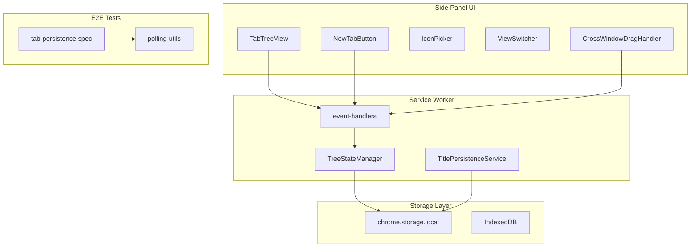
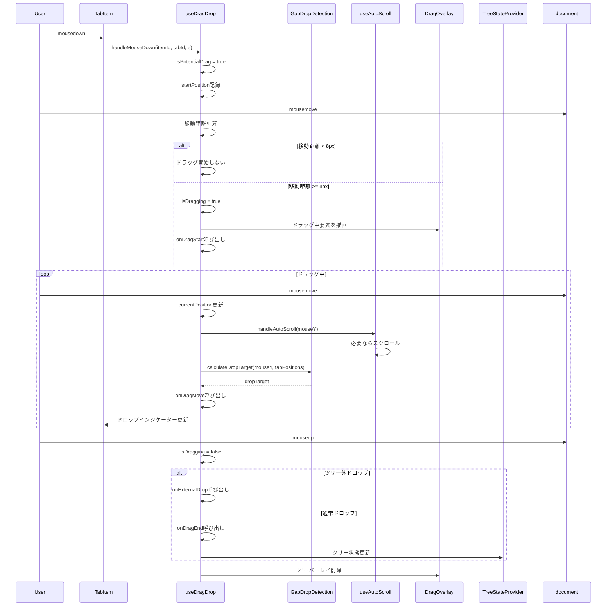
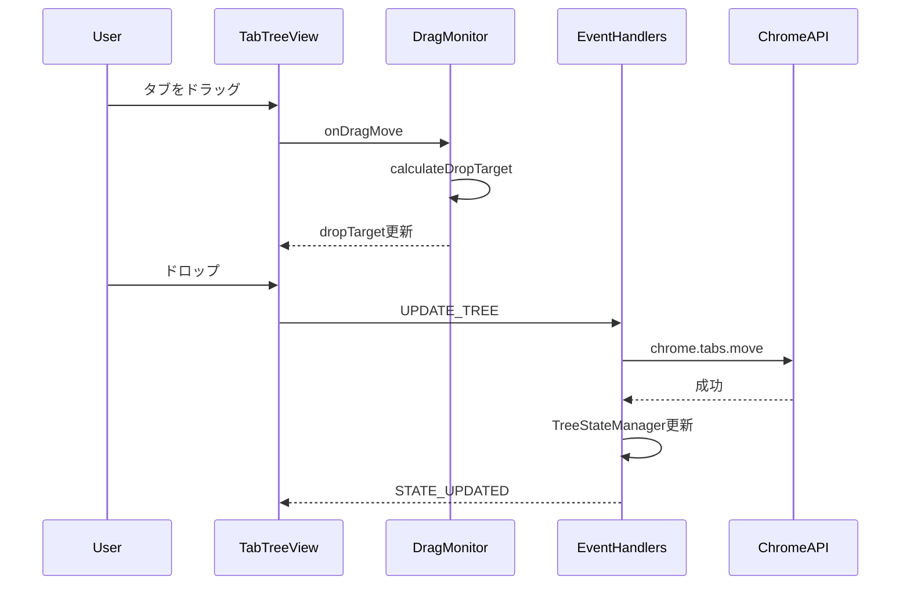
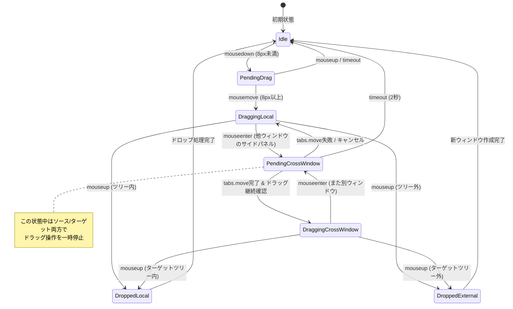
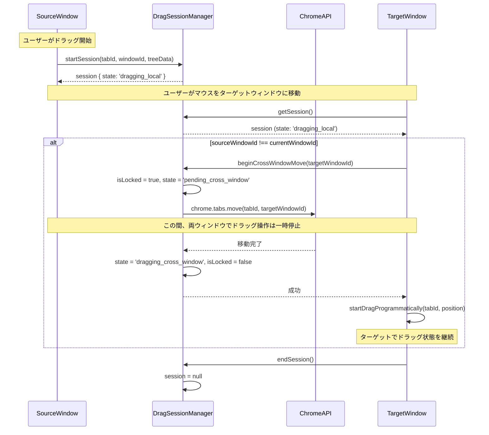
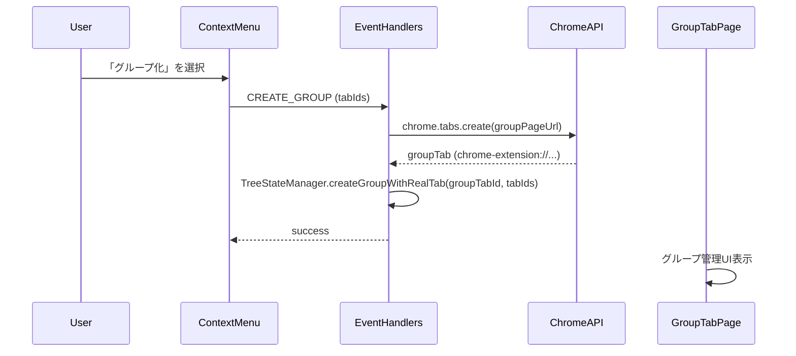

# Technical Design Document

## Overview

**Purpose**: このドキュメントは、Vivaldi-TT（ツリー型タブマネージャー）拡張機能における複数のバグ修正および機能改善の技術設計を定義します。

**Users**: Vivaldiブラウザユーザーがタブ管理、ドラッグ&ドロップ操作、ビュー管理、グループ化機能を使用する際の品質向上を目的とします。

**Impact**: 既存のUI/UXの改善、E2Eテストの安定化、ドラッグ&ドロップ動作の修正を行います。

### Goals
- E2Eテストスイートの100%安定化（フレーキーテスト排除）
- ドラッグ&ドロップ操作の正確性向上
- UI/UX改善（新規タブボタン、未読インジケーター、アイコン選択など）
- タブ位置設定の正確な動作保証

### Non-Goals
- 新規大規模機能の追加
- アーキテクチャの大幅な変更
- パフォーマンス最適化（本スコープ外）
- **タッチイベント対応**: touchstart/touchmove/touchendによるタッチ操作は今回スコープ外。マウス操作（mousedown/mousemove/mouseup）のみをサポート

### 段階的移行フェーズ（dnd-kit → 自前実装）

リスク軽減のため、dnd-kitから自前実装への移行は以下の3フェーズに分割して段階的に実施します。各フェーズ完了時にE2Eテストで動作確認を行い、問題があれば次フェーズに進む前に修正します。

#### Phase 1: 基盤実装とTabTreeView移行

**目的**: 自前D&D実装の基盤を構築し、最も使用頻度の高いTabTreeViewで検証

**実装内容**:
1. `useDragDrop`フックの新規実装（垂直ドラッグのみ）
2. `useAutoScroll`フックの新規実装
3. `DragOverlay`コンポーネントの新規実装
4. `TabTreeView.tsx`をdnd-kitから自前実装に移行

**影響を受けるE2Eテスト（Phase 1で修正）**:
- `e2e/utils/drag-drop-utils.ts`（共通ユーティリティ）
- `e2e/drag-drop-reorder.spec.ts`
- `e2e/drag-drop-insert.spec.ts`
- `e2e/drag-drop-hierarchy.spec.ts`
- `e2e/drag-drop-complex.spec.ts`
- `e2e/drag-drop-external.spec.ts`
- `e2e/drag-drop-placeholder.spec.ts`
- `e2e/drag-drop-hover.spec.ts`
- `e2e/drag-drop-scroll.spec.ts`
- `e2e/gap-drop-accuracy.spec.ts`

**完了条件**: 上記E2Eテストが`--repeat-each=10`で100%パス

#### Phase 2: PinnedTabsSection移行

**目的**: 水平ドラッグに対応し、ピン留めタブセクションを移行

**実装内容**:
1. `useDragDrop`フックに水平ドラッグモードを追加（`direction: 'horizontal'`オプション）
2. `PinnedTabsSection.tsx`をdnd-kitから自前実装に移行

**影響を受けるE2Eテスト（Phase 2で修正）**:
- ピン留めタブ関連のテスト（存在する場合）

**完了条件**: ピン留めタブのD&D操作がE2Eテストで検証済み

#### Phase 3: TabTreeViewWithGroups移行とdnd-kit完全削除

**目的**: 残りのコンポーネントを移行し、dnd-kitを完全に削除

**実装内容**:
1. `TabTreeViewWithGroups.tsx`をdnd-kitから自前実装に移行
2. `DragSessionManager`の実装（クロスウィンドウドラッグ用）
3. `useCrossWindowDrag`フックの実装
4. dnd-kitライブラリ（@dnd-kit/core, @dnd-kit/sortable, @dnd-kit/utilities）の削除
5. `DragDropProvider.tsx`の削除（未使用または自前実装に統合済み）

**影響を受けるE2Eテスト（Phase 3で修正）**:
- `e2e/cross-window-drag-drop.spec.ts`
- `e2e/cross-window-drag-indicator.spec.ts`
- `e2e/drag-drop-improvements.spec.ts`
- `e2e/drag-drop-child-independent.spec.ts`
- `e2e/drag-tab-size-stability.spec.ts`

**完了条件**:
- 全E2Eテストが`--repeat-each=10`で100%パス
- `package.json`からdnd-kit関連パッケージが削除済み
- dnd-kit関連のインポートがコードベースに存在しない

#### フェーズ間のE2Eテスト戦略

dnd-kitから自前実装への移行中、dnd-kitと自前実装が混在する中間状態が発生します。この期間中のE2Eテストの実行方針を以下に定義します。

**フェーズ間の依存関係**:

```mermaid
graph LR
    subgraph Phase1[Phase 1: TabTreeView移行]
        P1_impl[自前D&D基盤実装]
        P1_TabTree[TabTreeView移行]
        P1_E2E[D&D関連E2Eテスト修正]
    end

    subgraph Phase2[Phase 2: PinnedTabsSection移行]
        P2_horizontal[水平ドラッグ対応]
        P2_Pinned[PinnedTabsSection移行]
        P2_E2E[ピン留めE2Eテスト修正]
    end

    subgraph Phase3[Phase 3: 完全移行]
        P3_Groups[TabTreeViewWithGroups移行]
        P3_CrossWindow[クロスウィンドウ実装]
        P3_Remove[dnd-kit完全削除]
        P3_E2E[全E2E最終検証]
    end

    P1_impl --> P1_TabTree --> P1_E2E
    P1_E2E --> P2_horizontal --> P2_Pinned --> P2_E2E
    P2_E2E --> P3_Groups --> P3_CrossWindow --> P3_Remove --> P3_E2E
```



**テスト分離戦略**:

| フェーズ | 対象コンポーネント | 実行するE2Eテスト | スキップするE2Eテスト | CI設定 |
|---------|------------------|------------------|---------------------|--------|
| **Phase 1進行中** | TabTreeView | `drag-drop-*.spec.ts`（修正済み） | `cross-window-*.spec.ts` | `--grep-invert "cross-window"` |
| **Phase 1完了** | TabTreeView | 上記全て | なし（Phase 1対象のみ） | - |
| **Phase 2進行中** | PinnedTabsSection | Phase 1 + ピン留め関連 | `cross-window-*.spec.ts` | `--grep-invert "cross-window"` |
| **Phase 2完了** | PinnedTabsSection | 上記全て | なし（Phase 1-2対象のみ） | - |
| **Phase 3進行中** | TabTreeViewWithGroups | 段階的に有効化 | 移行中のテスト | 個別指定 |
| **Phase 3完了** | 全コンポーネント | **全テスト** | **なし** | フルスイート |

**中間状態でのCI設定例**:

```yaml
# Phase 1完了時のCI設定
e2e-phase1:
  script: |
    npx playwright test \
      --grep-invert "cross-window|pinned-tabs" \
      --repeat-each=10

# Phase 2完了時のCI設定
e2e-phase2:
  script: |
    npx playwright test \
      --grep-invert "cross-window" \
      --repeat-each=10

# Phase 3完了時のCI設定（最終）
e2e-final:
  script: |
    npx playwright test --repeat-each=10
```

**スキップ理由の明示**:

中間状態でテストをスキップする場合、テストファイル内にスキップ理由を明記すること：

```typescript
// Phase 1-2では一時的にスキップ（Phase 3で修正予定）
// 理由: TabTreeViewWithGroupsがまだdnd-kit依存のため
test.skip('クロスウィンドウドラッグでタブが移動すること', async () => {
  // ...
});
```

**フェーズ完了チェックリスト**:

| チェック項目 | Phase 1 | Phase 2 | Phase 3 |
|-------------|---------|---------|---------|
| 対象コンポーネントの自前D&D実装完了 | ☐ | ☐ | ☐ |
| 対象E2Eテストが`--repeat-each=10`で100%パス | ☐ | ☐ | ☐ |
| スキップ中テストのスキップ理由が明記されている | ☐ | ☐ | N/A |
| 次フェーズで修正予定のテスト一覧が文書化されている | ☐ | ☐ | N/A |
| dnd-kit関連コードが対象コンポーネントから削除済み | ☐ | ☐ | ☐ |
| 全E2Eテストがパス（Phase 3のみ） | N/A | N/A | ☐ |

## Architecture

### Existing Architecture Analysis

現在のアーキテクチャ:
- **Service Worker**: バックグラウンドでタブイベントを監視、ツリー状態を管理
- **Side Panel UI**: Reactベースのユーザーインターフェース
- **Storage Layer**: IndexedDBとchrome.storage.localによるデータ永続化

**変更方針**:
- **dnd-kit削除**: 既存のdnd-kitライブラリを削除し、自前のドラッグ&ドロップ実装に切り替え
  - 理由: dnd-kitにはプログラマティックにドラッグを開始するAPIがなく、クロスウィンドウでのドラッグ状態継続が実現できないため
  - 既存のGapDropDetection.tsのドロップ位置計算ロジックは流用

修正対象の主要コンポーネント:
- `src/sidepanel/components/TabTreeView.tsx`: ツリービュー表示とD&D（自前実装に切り替え）
- `src/sidepanel/components/PinnedTabsSection.tsx`: ピン留めタブセクション（自前D&D実装に切り替え）
- `src/sidepanel/components/TabTreeViewWithGroups.tsx`: グループ付きツリービュー（自前D&D実装に切り替え）
- `src/sidepanel/providers/DragDropProvider.tsx`: 削除（自前実装に統合）
- `src/sidepanel/components/NewTabButton.tsx`: 新規タブボタン
- `src/sidepanel/components/IconPicker.tsx`: アイコン選択UI
- `src/sidepanel/hooks/useDragDrop.ts`: 新規作成（自前D&D実装）
- `src/sidepanel/hooks/useAutoScroll.ts`: 新規作成（自動スクロール実装）
- `src/background/event-handlers.ts`: タブイベントハンドリング
- `e2e/tab-persistence.spec.ts`: フレーキーテスト

### dnd-kit依存機能の詳細分析

現在dnd-kitに依存している機能を完全に特定し、それぞれの置き換え方針を定義する。

#### 依存ファイル一覧

| ファイル | dnd-kit使用箇所 | 置き換え方針 |
|---------|----------------|-------------|
| TabTreeView.tsx | DndContext, SortableContext, useSortable, useDndMonitor, sensors, closestCenter, CSS.Translate, autoScroll | 自前useDragDropフック |
| PinnedTabsSection.tsx | DndContext, SortableContext, useSortable, horizontalListSortingStrategy, CSS.Translate | 自前useDragDropフック（水平対応） |
| TabTreeViewWithGroups.tsx | DndContext, SortableContext, useSortable, sensors, closestCenter, CSS.Translate | 自前useDragDropフック |
| DragDropProvider.tsx | DndContext, PointerSensor, KeyboardSensor | 削除（未使用または統合） |

#### dnd-kitが提供する機能と自前実装での置き換え

| dnd-kit機能 | 説明 | 自前実装方針 |
|------------|------|-------------|
| **DndContext** | ドラッグ&ドロップのReactコンテキスト | useDragDropフック内で状態管理 |
| **SortableContext** | ソート可能アイテムのリスト管理 | 不要（自前でアイテム順序管理） |
| **useSortable** | 各アイテムのドラッグ状態と属性 | useDragDropフックで提供 |
| **useDndMonitor** | ドラッグイベントの監視 | useDragDropフック内でイベントハンドリング |
| **MouseSensor** | マウスでのドラッグ検知（8px移動で開始） | mousedown/mousemoveイベントで実装 |
| **TouchSensor** | タッチでのドラッグ検知（250ms遅延） | **スコープ外**（将来実装） |
| **KeyboardSensor** | キーボードでのドラッグ | **スコープ外**（将来実装） |
| **closestCenter** | 衝突検出アルゴリズム | GapDropDetection.tsの拡張で対応 |
| **CSS.Translate.toString** | transform計算 | 自前でtranslate3d計算 |
| **autoScroll** | ドラッグ中の自動スクロール | useAutoScrollフックで実装 |
| **horizontalListSortingStrategy** | 水平方向のソート戦略 | useDragDropフックで水平モード対応 |
| **DragOverlay** | ドラッグ中の要素オーバーレイ | ReactPortalで実装 |

### Architecture Pattern & Boundary Map



**Architecture Integration**:
- Selected pattern: 既存のService Worker + React UI構成を維持
- Domain/feature boundaries: UI層とバックグラウンド層の分離を維持
- Existing patterns preserved: Provider Pattern、Message Passing
- New components rationale: 既存コンポーネントの修正のみ、新規コンポーネント追加なし
- Steering compliance: TypeScript strict mode、anyの使用禁止、E2Eテスト必須

### Technology Stack

| Layer | Choice / Version | Role in Feature | Notes |
|-------|------------------|-----------------|-------|
| Frontend | React 18 | UI コンポーネント修正 | 既存 |
| D&D | 自前実装 | ドラッグ&ドロップ制御 | dnd-kit削除、mousedown/mousemove/mouseupベース |
| E2E Testing | Playwright | テスト安定化 | ポーリング戦略最適化 |
| Runtime | Chrome Extensions API | タブ/ウィンドウ操作 | 既存 |

### 自前ドラッグ&ドロップ実装設計

**Requirement 3.1対応**: dnd-kitを削除し、自前のD&D実装に切り替え

#### 移行Before/After比較（TabTreeView.tsxの例）

**現状のdnd-kit実装（Before）**:

```tsx
// TabTreeView.tsx - 現状のdnd-kit使用箇所

// 1. インポート
import { useSortable, SortableContext } from '@dnd-kit/sortable';
import { CSS } from '@dnd-kit/utilities';
import {
  DndContext, closestCenter, MouseSensor, TouchSensor, KeyboardSensor,
  useSensor, useSensors, useDndMonitor,
} from '@dnd-kit/core';

// 2. センサー設定
const mouseSensor = useSensor(MouseSensor, {
  activationConstraint: { distance: 8 },  // 8px移動でドラッグ開始
});
const touchSensor = useSensor(TouchSensor, {
  activationConstraint: { delay: 250, tolerance: 5 },
});
const sensors = useSensors(mouseSensor, touchSensor, keyboardSensor);

// 3. SortableTreeNodeItem内でuseSortableを使用
const SortableTreeNodeItem: React.FC<Props> = ({ node, ... }) => {
  const {
    attributes,   // ドラッグハンドル属性
    listeners,    // mousedown/touchstartリスナー
    setNodeRef,   // 要素参照
    transform,    // 移動量
    isDragging,   // ドラッグ中フラグ
  } = useSortable({ id: node.id, disabled: !isDraggable });

  const style = {
    transform: CSS.Translate.toString(transform),
    opacity: isDragging ? 0.5 : 1,
  };

  return (
    <div ref={setNodeRef} style={style} {...attributes} {...listeners}>
      {/* ノード内容 */}
    </div>
  );
};

// 4. ツリー全体をDndContext + SortableContextでラップ
return (
  <DndContext
    sensors={sensors}
    collisionDetection={closestCenter}
    onDragStart={handleDragStart}
    onDragEnd={handleDragEnd}
    autoScroll={AUTO_SCROLL_CONFIG}
  >
    <SortableContext items={allNodeIds}>
      {content}
    </SortableContext>
  </DndContext>
);
```

**自前実装への移行（After）**:

```tsx
// TabTreeView.tsx - 自前D&D実装への移行

// 1. インポート（dnd-kit削除）
import { useDragDrop } from '../hooks/useDragDrop';
import { useAutoScroll } from '../hooks/useAutoScroll';
import { DragOverlay } from './DragOverlay';
// GapDropDetection.tsは既存のまま流用

// 2. useDragDropフックを使用（センサー設定は内部に統合）
const {
  dragState,
  getItemProps,
  getDragOverlayStyle,
} = useDragDrop({
  containerRef,
  items: allNodeIds.map(id => ({ id, tabId: getTabIdFromNodeId(id) })),
  activationDistance: 8,  // 8px移動でドラッグ開始
  direction: 'vertical',
  onDragStart: handleDragStart,
  onDragEnd: handleDragEnd,
  onExternalDrop: handleExternalDrop,
});

// 3. useAutoScrollフックを使用（スクロール制限対応）
const { handleAutoScroll, stopAutoScroll } = useAutoScroll(containerRef, {
  clampToContent: true,  // コンテンツ範囲内に制限（Requirement 3対応）
});

// 4. TreeNodeItem内でgetItemPropsを使用
const TreeNodeItem: React.FC<Props> = ({ node, ... }) => {
  // useSortableの代わりにgetItemPropsを使用
  const itemProps = getItemProps(node.id, node.tabId);
  const isDragging = dragState.draggedItemId === node.id;

  return (
    <div
      data-testid={`tree-node-${node.tabId}`}
      className={`... ${isDragging ? 'opacity-50' : ''}`}
      {...itemProps}  // onMouseDown, onTouchStart, styleを適用
    >
      {/* ノード内容 */}
    </div>
  );
};

// 5. DndContext/SortableContext不要、DragOverlayを使用
return (
  <div ref={containerRef} data-testid="tab-tree-view">
    {content}

    {/* ドラッグ中の要素をポータルで描画 */}
    <DragOverlay
      isDragging={dragState.isDragging}
      position={dragState.currentPosition}
      offset={dragState.offset}
    >
      {dragState.draggedItemId && (
        <TreeNodeItem node={getNodeById(dragState.draggedItemId)} />
      )}
    </DragOverlay>
  </div>
);
```

**移行チェックリスト**:

| 既存dnd-kit | 自前実装 | 確認 |
|------------|---------|------|
| `useSortable` | `getItemProps()` | ☐ |
| `CSS.Translate.toString()` | `style.transform` in `getItemProps` | ☐ |
| `DndContext` | 削除（useDragDropが内部管理） | ☐ |
| `SortableContext` | 削除（itemsオプションで渡す） | ☐ |
| `useDndMonitor` | useDragDropのコールバック | ☐ |
| `autoScroll` prop | `useAutoScroll`フック | ☐ |
| `MouseSensor/TouchSensor` | useDragDrop内部実装 | ☐ |
| `dnd-kit DragOverlay` | `DragOverlay`コンポーネント（自前） | ☐ |

**重要: dnd-kit互換性は一切残さない**

技術的負債を回避するため、dnd-kitの互換性レイヤーは設けません。dnd-kit固有の属性・セレクタ（`data-dnd-kit-*`等）は完全に削除され、それらに依存したE2Eテストは全て書き直しとなります。

#### E2Eテスト書き直し計画

**重要: テストは「修正」ではなく「書き直し」**

dnd-kit削除に伴い、既存のE2Eテストはコードを修正するのではなく、**テストがテストしたかったシナリオの内容を新しい実装に合わせて書き直す**方針とします。

**理由**:
- dnd-kit固有の属性・セレクタ（`data-dnd-kit-*`、`aria-pressed`、`role="button"`等）は完全に削除される
- 自前D&D実装では異なるDOM構造・属性・イベントフローとなる
- 既存テストのセレクタや待機条件を部分的に修正するより、シナリオを新実装に合わせて再設計する方が保守性が高い

**書き直しが必要なテストファイル一覧**:

| ファイル | テストシナリオ（書き直し対象） |
|---------|---------------------------|
| `e2e/utils/drag-drop-utils.ts` | ドラッグ操作ヘルパー（自前D&D用に再実装） |
| `e2e/drag-drop-reorder.spec.ts` | タブの並び替え操作 |
| `e2e/drag-drop-insert.spec.ts` | タブの挿入位置 |
| `e2e/drag-drop-hierarchy.spec.ts` | 親子関係の変更 |
| `e2e/drag-drop-complex.spec.ts` | 複雑なD&Dシナリオ |
| `e2e/drag-drop-external.spec.ts` | ツリー外へのドロップ |
| `e2e/drag-drop-placeholder.spec.ts` | ドロップインジケーター表示 |
| `e2e/drag-drop-hover.spec.ts` | ホバー時の挙動 |
| `e2e/drag-drop-scroll.spec.ts` | ドラッグ中のスクロール |
| `e2e/drag-drop-improvements.spec.ts` | D&D改善機能 |
| `e2e/drag-drop-child-independent.spec.ts` | 子タブの独立操作 |
| `e2e/drag-tab-size-stability.spec.ts` | ドラッグ中のタブサイズ安定性 |
| `e2e/gap-drop-accuracy.spec.ts` | タブ間ドロップ精度 |
| `e2e/cross-window-drag-drop.spec.ts` | クロスウィンドウD&D |
| `e2e/cross-window-drag-indicator.spec.ts` | クロスウィンドウインジケーター |

**書き直し方針**:
1. `e2e/utils/drag-drop-utils.ts`を最初に書き直す（他のテストが依存）
   - 自前D&D実装用のドラッグ開始/移動/ドロップヘルパー関数を新規作成
   - dnd-kit固有のセレクタは使用しない
2. 各テストファイルについて、テストしたいシナリオを抽出
3. 新しいヘルパー関数を使用してシナリオを再実装
4. 書き直し後は`--repeat-each=10`で安定性を検証
5. dnd-kit関連のコードは一切残さない（技術的負債の回避）

#### タスク生成時の検討事項: useDragDropの責務分離

**背景**: `useDragDrop`フックは以下の多くの責務を持つ設計となっています：
- マウスイベント処理（mousedown/mousemove/mouseup）
- ドラッグ開始検知（8px移動判定）
- 垂直/水平方向のドラッグ対応
- ドロップ位置計算（GapDropDetection連携）
- 自動スクロール連携（useAutoScroll）
- クロスウィンドウドラッグ開始（startDragProgrammatically）
- ドラッグアウト判定（コンテナ外検知）

**検討ポイント**: タスク生成時に以下の構成を検討すること：

| 選択肢 | 構成 | メリット | デメリット |
|-------|------|---------|-----------|
| A: 現状維持 | useDragDrop（統合フック） | 使用側のシンプルさ | フック内部が複雑化 |
| B: 責務分離 | useDragCore + useAutoScroll + useCrossWindowDrag | テスト・保守が容易 | 使用側で複数フック管理が必要 |

**推奨**: Phase 1実装時にまずOption Aで進め、複雑さが顕在化した場合にOption Bへリファクタリングする。Phase 1完了時点で評価を行い、必要に応じてPhase 2の前にリファクタリングタスクを追加する。

#### 責務分離の判断基準（Phase 1完了時に評価）

Phase 1完了時点で以下の基準に基づいて責務分離の必要性を判断する：

| 指標 | 閾値 | 超過時の対応 |
|-----|------|-------------|
| **行数** | 400行超 | 責務分離を検討 |
| **循環的複雑度** | 15超（関数単位） | 関数分割を実施 |
| **依存関数数** | 8個超 | 責務ごとにフック分離 |
| **テストケース数** | 30超（1フック対象） | テスト対象ごとにフック分離 |

**評価手順**:
1. Phase 1完了後、`useDragDrop.ts`のコードメトリクスを計測
2. 上記閾値を超過する場合、Phase 2開始前にリファクタリングタスクを追加
3. 分離する場合のモジュール構成：
   - `useDragCore.ts`: マウスイベント処理、ドラッグ開始検知
   - `useDropTarget.ts`: ドロップ位置計算（GapDropDetection連携）
   - `useAutoScroll.ts`: 自動スクロール（既存設計通り）
   - `useCrossWindowDrag.ts`: クロスウィンドウドラッグ（既存設計通り）

#### 基本アーキテクチャ

```typescript
// src/sidepanel/hooks/useDragDrop.ts - メインカスタムフック

/** ドラッグ状態 */
interface DragState {
  /** ドラッグ中かどうか */
  isDragging: boolean;
  /** ドラッグ準備中（mousedownからドラッグ開始までの間） */
  isPotentialDrag: boolean;
  /** ドラッグ中のアイテムID（タブID or グループID） */
  draggedItemId: string | null;
  /** ドラッグ中のタブID（実際のchrome.tabs.Tab.id） */
  draggedTabId: number | null;
  /** ドラッグ開始位置（スクリーン座標） */
  startPosition: { x: number; y: number };
  /** 現在のマウス位置（スクリーン座標） */
  currentPosition: { x: number; y: number };
  /** ドラッグ開始からの移動量 */
  delta: { x: number; y: number };
  /** 現在のドロップターゲット */
  dropTarget: DropTarget | null;
  /** ドラッグ中の要素のオフセット（要素内でのクリック位置） */
  offset: { x: number; y: number };
}

/** useDragDropフックのオプション */
interface UseDragDropOptions {
  /** ドラッグ開始までの移動距離（デフォルト: 8px） */
  activationDistance?: number;
  /** ドラッグ方向（vertical: 縦方向、horizontal: 横方向） */
  direction?: 'vertical' | 'horizontal';
  /** コンテナ要素のref */
  containerRef: RefObject<HTMLElement>;
  /** アイテムリスト（ドロップ位置計算用） */
  items: Array<{ id: string; tabId: number }>;
  /** ドラッグ開始コールバック */
  onDragStart?: (itemId: string, tabId: number) => void;
  /** ドラッグ移動コールバック */
  onDragMove?: (position: { x: number; y: number }, dropTarget: DropTarget | null) => void;
  /** ドラッグ終了コールバック */
  onDragEnd?: (itemId: string, dropTarget: DropTarget | null) => void;
  /** ドラッグキャンセルコールバック */
  onDragCancel?: () => void;
  /** 外部ドロップ（ツリー外へのドラッグ）コールバック */
  onExternalDrop?: (tabId: number) => void;
}

/** useDragDropフックの戻り値 */
interface UseDragDropReturn {
  /** 現在のドラッグ状態 */
  dragState: DragState;
  /** アイテムに適用するprops（マウス操作のみ、タッチはスコープ外） */
  getItemProps: (itemId: string, tabId: number) => {
    onMouseDown: (e: React.MouseEvent) => void;
    style: React.CSSProperties;
    'data-dragging': boolean;
  };
  /** ドラッグ中の要素のスタイル（transform含む） */
  getDragOverlayStyle: () => React.CSSProperties | null;
  /** プログラマティックにドラッグを開始（クロスウィンドウ用） */
  startDragProgrammatically: (itemId: string, tabId: number, position: { x: number; y: number }) => void;
  /** ドラッグをキャンセル */
  cancelDrag: () => void;
}
```

#### イベントフローの詳細



#### 自動スクロール実装（useAutoScrollフック）

```typescript
// src/sidepanel/hooks/useAutoScroll.ts

interface UseAutoScrollOptions {
  /** スクロール開始しきい値（端からの距離、px） */
  threshold?: number;
  /** スクロール速度（px/frame） */
  speed?: number;
  /** スクロール間隔（ms） */
  interval?: number;
  /** スクロール可能範囲を超えないようにする */
  clampToContent?: boolean;
}

interface UseAutoScrollReturn {
  /** スクロール処理を実行（requestAnimationFrame内で呼び出す） */
  handleAutoScroll: (mouseY: number, containerRect: DOMRect) => void;
  /** スクロールを停止 */
  stopAutoScroll: () => void;
}

function useAutoScroll(
  containerRef: RefObject<HTMLElement>,
  options: UseAutoScrollOptions = {}
): UseAutoScrollReturn {
  const {
    threshold = 50,    // 端から50pxでスクロール開始
    speed = 8,         // フレームあたり8pxスクロール
    interval = 16,     // 約60fps
    clampToContent = true,  // コンテンツ範囲内に制限
  } = options;

  const animationFrameRef = useRef<number | null>(null);

  const handleAutoScroll = useCallback((mouseY: number, containerRect: DOMRect) => {
    const container = containerRef.current;
    if (!container) return;

    const scrollTop = container.scrollTop;
    const maxScroll = container.scrollHeight - container.clientHeight;

    // 上端近く → 上スクロール
    if (mouseY - containerRect.top < threshold && scrollTop > 0) {
      const newScrollTop = Math.max(0, scrollTop - speed);
      container.scrollTop = newScrollTop;
    }
    // 下端近く → 下スクロール
    else if (containerRect.bottom - mouseY < threshold) {
      if (clampToContent) {
        // スクロール可能範囲内に制限（Requirement 3対応）
        const newScrollTop = Math.min(maxScroll, scrollTop + speed);
        container.scrollTop = newScrollTop;
      } else {
        container.scrollTop = scrollTop + speed;
      }
    }
  }, [containerRef, threshold, speed, clampToContent]);

  const stopAutoScroll = useCallback(() => {
    if (animationFrameRef.current) {
      cancelAnimationFrame(animationFrameRef.current);
      animationFrameRef.current = null;
    }
  }, []);

  return { handleAutoScroll, stopAutoScroll };
}
```

#### ドラッグオーバーレイ実装

```typescript
// src/sidepanel/components/DragOverlay.tsx

interface DragOverlayProps {
  /** ドラッグ中かどうか */
  isDragging: boolean;
  /** ドラッグ中の要素の内容 */
  children: React.ReactNode;
  /** 現在のマウス位置 */
  position: { x: number; y: number };
  /** 要素内でのクリック位置オフセット */
  offset: { x: number; y: number };
}

/**
 * ドラッグ中の要素をReactPortalでbody直下に描画
 * これによりコンテナのoverflow:hiddenに影響されない
 */
const DragOverlay: React.FC<DragOverlayProps> = ({
  isDragging,
  children,
  position,
  offset,
}) => {
  if (!isDragging) return null;

  return createPortal(
    <div
      data-testid="drag-overlay"
      className="fixed pointer-events-none z-50"
      style={{
        transform: `translate3d(${position.x - offset.x}px, ${position.y - offset.y}px, 0)`,
        willChange: 'transform',
      }}
    >
      <div className="opacity-80 shadow-lg">
        {children}
      </div>
    </div>,
    document.body
  );
};
```

#### ピン留めタブ用の水平ドラッグ対応

```typescript
// useDragDropフック内での水平モード対応

const handleMouseMove = useCallback((e: MouseEvent) => {
  if (!dragStateRef.current.isPotentialDrag && !dragStateRef.current.isDragging) return;

  const currentPosition = { x: e.clientX, y: e.clientY };
  const delta = {
    x: currentPosition.x - dragStateRef.current.startPosition.x,
    y: currentPosition.y - dragStateRef.current.startPosition.y,
  };

  // 方向に応じた移動距離計算
  const distance = options.direction === 'horizontal'
    ? Math.abs(delta.x)  // 水平方向の移動距離
    : Math.sqrt(delta.x ** 2 + delta.y ** 2);  // 垂直方向（斜め含む）

  if (dragStateRef.current.isPotentialDrag && distance >= activationDistance) {
    // ドラッグ開始
    setDragState(prev => ({ ...prev, isDragging: true, isPotentialDrag: false }));
    options.onDragStart?.(dragStateRef.current.draggedItemId!, dragStateRef.current.draggedTabId!);
  }

  if (dragStateRef.current.isDragging) {
    // ドロップターゲット計算（水平 vs 垂直で異なるロジック）
    const dropTarget = options.direction === 'horizontal'
      ? calculateHorizontalDropTarget(currentPosition.x, tabPositions)
      : calculateDropTarget(currentPosition.y, tabPositions);

    setDragState(prev => ({ ...prev, currentPosition, delta, dropTarget }));
    options.onDragMove?.(currentPosition, dropTarget);
  }
}, [options, activationDistance]);
```

#### クロスウィンドウドラッグ対応（プログラマティックドラッグ開始）

```typescript
/**
 * 別ウィンドウからのドラッグ継続
 * dnd-kitでは不可能だったプログラマティックなドラッグ開始を実現
 */
const startDragProgrammatically = useCallback((
  itemId: string,
  tabId: number,
  position: { x: number; y: number }
) => {
  // 即座にドラッグ状態を開始（8px移動待機をスキップ）
  setDragState({
    isDragging: true,
    isPotentialDrag: false,
    draggedItemId: itemId,
    draggedTabId: tabId,
    startPosition: position,
    currentPosition: position,
    delta: { x: 0, y: 0 },
    dropTarget: null,
    offset: { x: 0, y: 0 },  // ウィンドウ間移動時はオフセットなし
  });

  // グローバルイベントリスナーを設定
  document.addEventListener('mousemove', handleMouseMove);
  document.addEventListener('mouseup', handleMouseUp);

  options.onDragStart?.(itemId, tabId);
}, [handleMouseMove, handleMouseUp, options]);

## System Flows

### タブ間ドロップフロー



### クロスウィンドウドラッグフロー

**注意**: Requirements 6.4-6.6で追加されたシームレスなウィンドウ間移動UXを実現するための詳細設計

#### タイミング問題の原因分析

クロスウィンドウドラッグで発生するタイミング問題の根本原因を理解する。

**1. 非同期APIの連鎖による遅延**

```
ソースウィンドウ                Service Worker              ターゲットウィンドウ
     |                              |                              |
     |-- SET_DRAG_STATE ----------->|                              |
     |   (非同期: ~1-5ms)           |                              |
     |                              |                              |
     |           ...マウス移動...                                    |
     |                              |                              |
     |                              |<-- GET_DRAG_STATE -----------|
     |                              |   (非同期: ~1-5ms)           |
     |                              |                              |
     |                              |-- chrome.tabs.move --------->|
     |                              |   (非同期: ~10-50ms)         |
     |                              |                              |
     |<-- tabs.onMoved -------------|-- tabs.onMoved ------------->|
     |   (非同期、順序保証なし)      |   (非同期、順序保証なし)     |
```

**問題点**:
- `chrome.tabs.move`は非同期で、完了タイミングが不確定
- `tabs.onMoved`イベントはソースとターゲット両方に届くが、順序が保証されない
- ドラッグ状態の更新とタブ移動の完了が競合する可能性

**2. 状態の不整合が発生するシナリオ**

| シナリオ | 発生条件 | 症状 |
|---------|---------|------|
| 二重ドラッグ | tabs.moveが完了前にドラッグ状態を再開 | 2つのウィンドウで同時にドラッグ状態 |
| 消失タブ | ソースでタブ削除後、ターゲットでのドラッグ開始前に状態クリア | ドラッグがキャンセルされる |
| ゴーストタブ | tabs.onMovedがターゲットより先にソースに届く | ソースのUIからタブが消えるがターゲットに現れない |
| 状態リーク | ドラッグ中にウィンドウが閉じられる | Service Workerにドラッグ状態が残り続ける |

#### 解決策：状態マシンによる排他制御

**ドラッグセッション状態マシン**:



**Service Workerで管理するドラッグセッション**:

```typescript
// src/background/drag-session.ts

interface DragSession {
  /** セッションID（一意識別子） */
  sessionId: string;
  /** ドラッグ中のタブID */
  tabId: number;
  /** 現在のセッション状態 */
  state: DragSessionState;
  /** ドラッグを開始したウィンドウID */
  sourceWindowId: number;
  /** 現在のウィンドウID（クロスウィンドウ移動後は変わる） */
  currentWindowId: number;
  /** セッション開始タイムスタンプ */
  startedAt: number;
  /** 最終更新タイムスタンプ */
  updatedAt: number;
  /** タブのツリーデータ（サブツリー含む） */
  treeData: TabNode[];
  /** ロック状態（tabs.move中はtrue） */
  isLocked: boolean;
}

type DragSessionState =
  | 'idle'
  | 'pending_drag'
  | 'dragging_local'
  | 'pending_cross_window'
  | 'dragging_cross_window'
  | 'dropped_local'
  | 'dropped_external';

/** セッション操作のエラー */
type DragSessionError =
  | 'SESSION_NOT_FOUND'
  | 'SESSION_LOCKED'
  | 'INVALID_STATE_TRANSITION'
  | 'TAB_NOT_FOUND'
  | 'WINDOW_NOT_FOUND'
  | 'TIMEOUT';
```

**状態遷移の実装**:

```typescript
// src/background/drag-session-manager.ts

class DragSessionManager {
  private session: DragSession | null = null;
  private readonly SESSION_TIMEOUT_MS = 10000;  // 10秒でタイムアウト
  private readonly CROSS_WINDOW_TIMEOUT_MS = 2000;  // クロスウィンドウ移動は2秒

  /**
   * ドラッグセッションを開始
   */
  async startSession(tabId: number, windowId: number, treeData: TabNode[]): Promise<DragSession> {
    // 既存セッションがあれば終了
    if (this.session) {
      await this.endSession('SESSION_REPLACED');
    }

    this.session = {
      sessionId: crypto.randomUUID(),
      tabId,
      state: 'dragging_local',
      sourceWindowId: windowId,
      currentWindowId: windowId,
      startedAt: Date.now(),
      updatedAt: Date.now(),
      treeData,
      isLocked: false,
    };

    return this.session;
  }

  /**
   * クロスウィンドウ移動を開始（排他制御付き）
   */
  async beginCrossWindowMove(targetWindowId: number): Promise<void> {
    if (!this.session) throw new Error('SESSION_NOT_FOUND');
    if (this.session.isLocked) throw new Error('SESSION_LOCKED');

    // 状態遷移の検証
    if (this.session.state !== 'dragging_local' && this.session.state !== 'dragging_cross_window') {
      throw new Error('INVALID_STATE_TRANSITION');
    }

    // ロックを取得
    this.session.isLocked = true;
    this.session.state = 'pending_cross_window';
    this.session.updatedAt = Date.now();

    try {
      // タブを移動（実際のChrome API呼び出し）
      await chrome.tabs.move(this.session.tabId, {
        windowId: targetWindowId,
        index: -1,  // 末尾に追加
      });

      // 移動成功：状態更新
      this.session.currentWindowId = targetWindowId;
      this.session.state = 'dragging_cross_window';
    } catch (error) {
      // 移動失敗：元の状態に戻す
      this.session.state = 'dragging_local';
      throw error;
    } finally {
      // ロック解除
      this.session.isLocked = false;
      this.session.updatedAt = Date.now();
    }
  }

  /**
   * セッション情報を取得（ロック中は待機）
   */
  async getSession(maxWaitMs: number = 500): Promise<DragSession | null> {
    const startTime = Date.now();

    while (this.session?.isLocked) {
      if (Date.now() - startTime > maxWaitMs) {
        return null;  // タイムアウト
      }
      await new Promise(resolve => setTimeout(resolve, 50));
    }

    return this.session;
  }

  /**
   * セッション終了
   */
  async endSession(reason: string = 'COMPLETED'): Promise<void> {
    if (this.session) {
      console.log(`[DragSession] Ended: ${this.session.sessionId}, reason: ${reason}`);
      this.session = null;
    }
  }
}
```

#### シーケンス図（タイミング問題対策済み）



#### エラーリカバリー

**タイムアウト処理**:

```typescript
// セッションのタイムアウト監視
setInterval(() => {
  if (this.session) {
    const elapsed = Date.now() - this.session.updatedAt;

    // pending_cross_window状態が長すぎる
    if (this.session.state === 'pending_cross_window' && elapsed > CROSS_WINDOW_TIMEOUT_MS) {
      console.warn('[DragSession] Cross-window move timeout, reverting to local drag');
      this.session.state = 'dragging_local';
      this.session.isLocked = false;
    }

    // 全体のタイムアウト
    if (elapsed > SESSION_TIMEOUT_MS) {
      console.warn('[DragSession] Session timeout, ending session');
      this.endSession('TIMEOUT');
    }
  }
}, 500);
```

**ウィンドウクローズ時のクリーンアップ**:

```typescript
chrome.windows.onRemoved.addListener((windowId) => {
  if (this.session && this.session.currentWindowId === windowId) {
    console.log('[DragSession] Window closed during drag, ending session');
    this.endSession('WINDOW_CLOSED');
  }
});
```

#### Edge Case対応

クロスウィンドウドラッグで発生しうるEdge Caseと対応方針を定義する。

| Edge Case | 発生条件 | 期待動作 | 実装方針 |
|-----------|---------|---------|---------|
| **Service Worker非アクティブ化** | ドラッグ中にService Workerがアイドルタイムアウト | ドラッグをキャンセルし、タブは元の位置に戻る | UI側でセッション取得失敗時にドラッグをキャンセル |
| **3ウィンドウ連続移動** | A→B→Cと連続でウィンドウ間を移動 | 各移動で正しくtabs.moveが実行され、最終的にCでドロップ | `pending_cross_window`→`dragging_cross_window`→`pending_cross_window`の遷移を許可 |
| **ドラッグ中タブ削除** | ドラッグ中のタブが別の手段（キーボードショートカット等）で閉じられる | ドラッグをキャンセル、オーバーレイを削除 | `tabs.onRemoved`でセッション終了をトリガー |
| **ドラッグ中ウィンドウ削除** | ドラッグ中にソース/ターゲットウィンドウが閉じられる | ドラッグをキャンセル | `windows.onRemoved`でセッション終了をトリガー |
| **ネットワーク遅延** | chrome.tabs.moveが長時間完了しない | 2秒タイムアウト後にドラッグをキャンセル | `CROSS_WINDOW_TIMEOUT_MS`でタイムアウト処理 |

**Edge Case 1: Service Worker非アクティブ化への対応**

エラー発生の可能性は低いため、エラー時はサイレントにドラッグをキャンセルします（ユーザーへの通知は不要）。

```typescript
// UI側: セッション取得失敗時の処理（サイレントキャンセル）
const handleMouseEnter = useCallback(async (e: MouseEvent) => {
  try {
    const session = await chrome.runtime.sendMessage({ type: 'GET_DRAG_SESSION' });

    if (!session) {
      // Service Workerが非アクティブまたはセッションなし
      // サイレントにドラッグをキャンセル（通知なし）
      cancelDrag();
      return;
    }

    // 正常処理...
  } catch (error) {
    // Service Worker接続エラー: サイレントにキャンセル
    // エラーログのみ記録（ユーザー通知なし）
    console.error('[CrossWindowDrag] Service Worker connection failed:', error);
    cancelDrag();
  }
}, [cancelDrag]);

// Service Worker側: 定期的なkeep-alive（必須）
// ドラッグセッション中はService Workerを維持するため、alarmを使用
class DragSessionManager {
  private keepAliveAlarmName = 'drag-session-keep-alive';

  async startSession(tabId: number, windowId: number, treeData: TabNode[]): Promise<DragSession> {
    // ... セッション開始処理 ...

    // keep-aliveアラームを開始（必須）
    chrome.alarms.create(this.keepAliveAlarmName, { periodInMinutes: 0.4 });  // 24秒間隔

    return this.session;
  }

  async endSession(reason: string = 'COMPLETED'): Promise<void> {
    if (this.session) {
      // keep-aliveアラームをクリア
      chrome.alarms.clear(this.keepAliveAlarmName);
      this.session = null;
    }
  }
}

// アラームハンドラ（Service Worker起動時に登録）
chrome.alarms.onAlarm.addListener((alarm) => {
  if (alarm.name === 'drag-session-keep-alive') {
    // セッションが存在する間はService Workerを維持
    // このリスナーが呼ばれるだけでService Workerが起動状態を維持
    console.log('[DragSession] Keep-alive ping');
  }
});
```

**重要: keep-alive実装は必須条件**

Service WorkerはManifest V3で約30秒のアイドルタイムアウトで非アクティブ化されます。クロスウィンドウドラッグ中にService Workerが停止するとセッション情報が失われるため、`chrome.alarms`によるkeep-aliveは**必須実装**です。

- ドラッグセッション開始時にalarmを作成
- ドラッグセッション終了時にalarmをクリア
- alarm間隔は24秒（30秒タイムアウトより短く設定）

**注意**: エラー時のユーザー通知は実装しません。新たな通知の仕組みが必要となり、エラー発生確率に対してコストが見合わないためです。

**Edge Case 2: 3ウィンドウ連続移動への対応**

```typescript
// DragSessionManagerの状態遷移を拡張
async beginCrossWindowMove(targetWindowId: number): Promise<void> {
  if (!this.session) throw new Error('SESSION_NOT_FOUND');
  if (this.session.isLocked) throw new Error('SESSION_LOCKED');

  // dragging_cross_windowからpending_cross_windowへの遷移を許可
  const validStates: DragSessionState[] = ['dragging_local', 'dragging_cross_window'];
  if (!validStates.includes(this.session.state)) {
    throw new Error('INVALID_STATE_TRANSITION');
  }

  // 同一ウィンドウへの移動はスキップ
  if (this.session.currentWindowId === targetWindowId) {
    return;
  }

  // 以降は既存のロジック...
}
```

**Edge Case 3: ドラッグ中タブ削除への対応**

```typescript
// Service Worker: tabs.onRemovedでセッション監視
chrome.tabs.onRemoved.addListener((tabId) => {
  if (this.session && this.session.tabId === tabId) {
    console.warn('[DragSession] Dragged tab was removed, ending session');
    this.endSession('TAB_REMOVED');

    // 全ウィンドウのサイドパネルに通知
    chrome.runtime.sendMessage({ type: 'DRAG_SESSION_CANCELLED', reason: 'TAB_REMOVED' });
  }
});

// UI側: キャンセル通知の受信
chrome.runtime.onMessage.addListener((message) => {
  if (message.type === 'DRAG_SESSION_CANCELLED') {
    // ドラッグ状態をリセット
    setDragState(initialDragState);
    // オーバーレイを削除
  }
});
```

**E2Eテストで検証すべきEdge Case**:

1. **Service Worker再起動**: ドラッグ中にService Workerを強制再起動し、ドラッグがキャンセルされることを確認
2. **3ウィンドウ移動**: A→B→Cと移動し、最終的にCでドロップできることを確認
3. **タブ削除**: ドラッグ中にキーボードショートカット（Ctrl+W）でタブを閉じ、エラーが発生しないことを確認
4. **ウィンドウ削除**: ドラッグ中にウィンドウを閉じ、エラーが発生しないことを確認

#### UI側の実装（ターゲットウィンドウ）

```typescript
// src/sidepanel/hooks/useCrossWindowDrag.ts

function useCrossWindowDrag(
  containerRef: RefObject<HTMLElement>,
  onDragReceived: (tabId: number, position: { x: number; y: number }) => void
) {
  const currentWindowIdRef = useRef<number | null>(null);

  useEffect(() => {
    // 現在のウィンドウIDを取得
    chrome.windows.getCurrent().then(window => {
      currentWindowIdRef.current = window.id ?? null;
    });
  }, []);

  const handleMouseEnter = useCallback(async (e: MouseEvent) => {
    // Service Workerからドラッグセッションを取得
    const session = await chrome.runtime.sendMessage({ type: 'GET_DRAG_SESSION' });

    if (!session || session.state === 'idle') return;

    // 別ウィンドウからのドラッグかチェック
    if (session.currentWindowId === currentWindowIdRef.current) return;

    try {
      // クロスウィンドウ移動を開始
      await chrome.runtime.sendMessage({
        type: 'BEGIN_CROSS_WINDOW_MOVE',
        targetWindowId: currentWindowIdRef.current,
      });

      // 移動成功：ドラッグ状態を継続
      onDragReceived(session.tabId, { x: e.clientX, y: e.clientY });
    } catch (error) {
      console.error('[CrossWindowDrag] Failed to move tab:', error);
      // エラー時は何もしない（ソースウィンドウでドラッグ継続）
    }
  }, [onDragReceived]);

  useEffect(() => {
    const container = containerRef.current;
    if (!container) return;

    container.addEventListener('mouseenter', handleMouseEnter);
    return () => container.removeEventListener('mouseenter', handleMouseEnter);
  }, [containerRef, handleMouseEnter]);
}

### グループタブ作成フロー

**設計方針**（Requirement 5.3, 5.6, 5.7対応）:
- グループタブは**実際のブラウザタブ**として作成する（仮想タブIDは使用しない）
- `chrome.tabs.create()`でグループ専用ページを開き、実際のタブIDを取得
- ツリー内では通常のタブと同様に管理（特別な仮想ID不要）
- **同期的処理**: グループ作成は軽量な処理のため、同期的に実行する（順序保証のための特別な仕組みは不要）

**現状からの変更点**:
- 現状: `TreeStateManager.createGroupFromTabs()`が仮想タブID（負の数値）を使用
- 変更後: `chrome.tabs.create()`で実タブを作成し、そのタブIDを使用

**処理フロー**:
1. `chrome.tabs.create()`でグループタブを作成（await）
2. 作成されたタブIDを使用してツリー状態を更新
3. 選択されていたタブを新しいグループタブの子として設定

グループ作成は単一のchrome.tabs.create()とツリー状態更新で完結する軽量な処理のため、イベントブロックやペンディングキューは不要です。

#### レースコンディション対策

グループタブ作成時、以下のタイミング問題が発生する可能性があります：

**問題**: グループタブが作成された直後にGroupTabPageがロードされ、`GET_GROUP_INFO`を送信するが、ツリー状態にグループ情報がまだ反映されていない場合がある。

**原因分析**:
```
chrome.tabs.create() → タブ作成完了 → GroupTabPage ロード
                                              ↓
                        TreeStateManager.createGroupWithRealTab() → ツリー状態更新
```

タブ作成完了とツリー状態更新は非同期で、GroupTabPageのロードがツリー状態更新より先に完了する場合がある。

**解決策1: タブをバックグラウンドで作成し、ツリー状態更新後にアクティブ化**

```typescript
// event-handlers.ts - CREATE_GROUP処理
case 'CREATE_GROUP': {
  const { tabIds } = message;

  // 1. グループタブをバックグラウンドで作成（active: false）
  const groupTab = await chrome.tabs.create({
    url: `chrome-extension://${chrome.runtime.id}/group.html?groupId=${groupId}`,
    active: false,  // まだアクティブにしない
    windowId: currentWindowId,
  });

  // 2. ツリー状態を更新（グループ情報を登録）
  await treeStateManager.createGroupWithRealTab(groupTab.id, tabIds);

  // 3. ツリー状態更新完了を待ってからアクティブ化
  await chrome.tabs.update(groupTab.id, { active: true });

  sendResponse({ success: true, groupId, groupTabId: groupTab.id });
  return true;
}
```

**解決策2: GroupTabPage側でのリトライ強化**（解決策1と併用）

GroupTabPageは既にリトライロジックを持っていますが、初回ロード時のレースコンディションに対応するため、初期遅延を追加します：

```typescript
// GroupPage.tsx - 初期ロード時の遅延
const initAndStartPolling = async () => {
  // 初回は少し待ってからフェッチ（ツリー状態更新完了を待つ）
  await new Promise(resolve => setTimeout(resolve, 100));

  let success = await fetchGroupInfo();
  // ... 既存のリトライロジック
};
```

**推奨**: 解決策1を優先的に実装し、解決策2はフォールバックとして維持する。

**Requirements 5.3-5.6を満たすための実装**:



**グループタブ専用ページ（新規作成が必要）**:
- ファイル: `src/group/group.html`, `src/group/GroupPage.tsx`, `src/group/index.tsx`
- URL: `chrome-extension://{extensionId}/group.html?groupId={groupId}`
- 機能: グループ名表示、子タブリスト表示

**グループ解除について**:
- 専用の「グループ解除」操作は不要
- ツリー型タブとしてグループが実装されているため、親タブ（グループタブ）を閉じることでグループ化が自然に解除される
- 子タブは親を失い、ルートレベルまたは祖父タブの子として再配置される

**GroupTabPage UI設計**:

**設計方針（Requirement 5.8-5.10対応）**:
- ポーリングによりツリー状態の更新を監視し、子タブリストを逐一更新
- グループ情報取得中はローディング表示を行う
- グループ情報が取得できない場合はエラー/リトライUIを表示

```tsx
// src/group/GroupPage.tsx

interface GroupInfo {
  groupName: string;
  childTabs: TabInfo[];
}

type LoadingState = 'loading' | 'loaded' | 'error';

const POLLING_INTERVAL_MS = 1000;  // 1秒間隔でポーリング
const MAX_RETRY_COUNT = 5;         // 最大リトライ回数

const GroupPage: React.FC = () => {
  const [groupInfo, setGroupInfo] = useState<GroupInfo | null>(null);
  const [loadingState, setLoadingState] = useState<LoadingState>('loading');
  const [retryCount, setRetryCount] = useState(0);

  // URLからgroupIdを取得
  const params = new URLSearchParams(window.location.search);
  const groupId = params.get('groupId');

  // グループ情報を取得する関数
  const fetchGroupInfo = useCallback(async (): Promise<boolean> => {
    if (!groupId) return false;

    try {
      const response = await chrome.runtime.sendMessage({
        type: 'GET_GROUP_INFO',
        groupId,
      });

      if (response && response.groupName !== undefined) {
        setGroupInfo({
          groupName: response.groupName,
          childTabs: response.childTabs || [],
        });
        setLoadingState('loaded');
        return true;
      }
      return false;
    } catch (error) {
      console.error('[GroupPage] Failed to fetch group info:', error);
      return false;
    }
  }, [groupId]);

  // 初期ロードとポーリング
  useEffect(() => {
    let isActive = true;
    let pollingTimer: ReturnType<typeof setInterval> | null = null;

    const initAndStartPolling = async () => {
      // 初期ロード（リトライ付き）
      let success = await fetchGroupInfo();
      let attempts = 1;

      while (!success && attempts < MAX_RETRY_COUNT && isActive) {
        await new Promise(resolve => setTimeout(resolve, 500));
        success = await fetchGroupInfo();
        attempts++;
      }

      if (!success && isActive) {
        setLoadingState('error');
        setRetryCount(attempts);
        return;
      }

      // ポーリング開始（ツリー状態の変更を監視）
      pollingTimer = setInterval(() => {
        if (isActive) {
          fetchGroupInfo();
        }
      }, POLLING_INTERVAL_MS);
    };

    initAndStartPolling();

    // ツリー更新メッセージの監視（即時反映用）
    const handleMessage = (message: { type: string; groupId?: string }) => {
      if (message.type === 'GROUP_UPDATED' && message.groupId === groupId) {
        fetchGroupInfo();
      }
    };
    chrome.runtime.onMessage.addListener(handleMessage);

    return () => {
      isActive = false;
      if (pollingTimer) {
        clearInterval(pollingTimer);
      }
      chrome.runtime.onMessage.removeListener(handleMessage);
    };
  }, [groupId, fetchGroupInfo]);

  // 手動リトライハンドラ
  const handleRetry = useCallback(() => {
    setLoadingState('loading');
    setRetryCount(0);
    fetchGroupInfo().then(success => {
      if (!success) {
        setLoadingState('error');
      }
    });
  }, [fetchGroupInfo]);

  // ローディング表示
  if (loadingState === 'loading') {
    return (
      <div className="p-4 bg-neutral-900 min-h-screen text-neutral-100 flex items-center justify-center">
        <div className="text-center">
          <div className="animate-spin rounded-full h-8 w-8 border-b-2 border-neutral-100 mx-auto mb-4" />
          <p className="text-neutral-400">グループ情報を読み込み中...</p>
        </div>
      </div>
    );
  }

  // エラー表示
  if (loadingState === 'error') {
    return (
      <div className="p-4 bg-neutral-900 min-h-screen text-neutral-100 flex items-center justify-center">
        <div className="text-center">
          <p className="text-red-400 mb-4">グループ情報の取得に失敗しました</p>
          <p className="text-neutral-500 text-sm mb-4">
            リトライ回数: {retryCount}/{MAX_RETRY_COUNT}
          </p>
          <button
            onClick={handleRetry}
            className="px-4 py-2 bg-neutral-700 hover:bg-neutral-600 rounded text-neutral-100"
          >
            再試行
          </button>
        </div>
      </div>
    );
  }

  // 通常表示
  return (
    <div className="p-4 bg-neutral-900 min-h-screen text-neutral-100">
      {/* グループ名（h1要素） */}
      <h1 className="text-2xl font-bold mb-4">
        {groupInfo?.groupName || 'グループ'}
      </h1>

      {/* 子タブリスト */}
      <ul className="space-y-2">
        {groupInfo?.childTabs.map((tab) => (
          <li
            key={tab.id}
            className="flex items-center gap-2 p-2 bg-neutral-800 rounded hover:bg-neutral-700 cursor-pointer"
            onClick={() => chrome.tabs.update(tab.id, { active: true })}
          >
            {tab.favIconUrl && (
              
            )}
            <span className="truncate">{tab.title}</span>
          </li>
        ))}
        {(!groupInfo?.childTabs || groupInfo.childTabs.length === 0) && (
          <li className="text-neutral-500">子タブがありません</li>
        )}
      </ul>
    </div>
  );
};
```

#### エラーメッセージとリカバリーパス

GroupTabPageで発生しうるエラーシナリオと、それぞれの具体的なエラーメッセージ・リカバリーパスを定義します。

**エラーシナリオ一覧**:

| シナリオ | 原因 | エラーメッセージ | リカバリーパス |
|---------|------|----------------|---------------|
| **groupIdパラメータなし** | URLにgroupIdが含まれていない | 「グループIDが指定されていません」 | タブを閉じるボタンを表示 |
| **グループ情報取得失敗** | ツリー状態にグループが存在しない | 「グループ情報の取得に失敗しました」 | 再試行ボタン + タブを閉じるボタン |
| **Service Worker接続エラー** | Service Workerが非アクティブ | 「拡張機能との接続に失敗しました」 | 再試行ボタン + 拡張機能の再読み込み案内 |
| **グループが削除された** | ポーリング中にグループタブが閉じられた | 「このグループは既に削除されています」 | タブを閉じるボタンのみ |
| **最大リトライ超過** | 5回リトライしても取得できない | 「グループ情報の取得に失敗しました（リトライ上限）」 | 再試行ボタン + タブを閉じるボタン |

**エラー状態の詳細実装**:

```typescript
// エラー種別の定義
type ErrorType =
  | 'MISSING_GROUP_ID'
  | 'GROUP_NOT_FOUND'
  | 'SERVICE_WORKER_ERROR'
  | 'GROUP_DELETED'
  | 'MAX_RETRY_EXCEEDED';

interface ErrorState {
  type: ErrorType;
  message: string;
  canRetry: boolean;
  showCloseButton: boolean;
}

const ERROR_STATES: Record<ErrorType, ErrorState> = {
  MISSING_GROUP_ID: {
    type: 'MISSING_GROUP_ID',
    message: 'グループIDが指定されていません',
    canRetry: false,
    showCloseButton: true,
  },
  GROUP_NOT_FOUND: {
    type: 'GROUP_NOT_FOUND',
    message: 'グループ情報の取得に失敗しました',
    canRetry: true,
    showCloseButton: true,
  },
  SERVICE_WORKER_ERROR: {
    type: 'SERVICE_WORKER_ERROR',
    message: '拡張機能との接続に失敗しました。拡張機能を再読み込みしてください。',
    canRetry: true,
    showCloseButton: true,
  },
  GROUP_DELETED: {
    type: 'GROUP_DELETED',
    message: 'このグループは既に削除されています',
    canRetry: false,
    showCloseButton: true,
  },
  MAX_RETRY_EXCEEDED: {
    type: 'MAX_RETRY_EXCEEDED',
    message: 'グループ情報の取得に失敗しました（リトライ上限に達しました）',
    canRetry: true,
    showCloseButton: true,
  },
};

// エラー表示コンポーネント
const ErrorDisplay: React.FC<{ error: ErrorState; onRetry: () => void }> = ({ error, onRetry }) => (
  <div className="p-4 bg-neutral-900 min-h-screen text-neutral-100 flex items-center justify-center">
    <div className="text-center max-w-md">
      <div className="text-red-400 text-4xl mb-4">⚠️</div>
      <p className="text-red-400 mb-4">{error.message}</p>

      <div className="flex gap-2 justify-center">
        {error.canRetry && (
          <button
            onClick={onRetry}
            className="px-4 py-2 bg-neutral-700 hover:bg-neutral-600 rounded text-neutral-100"
          >
            再試行
          </button>
        )}
        {error.showCloseButton && (
          <button
            onClick={() => window.close()}
            className="px-4 py-2 bg-neutral-800 hover:bg-neutral-700 rounded text-neutral-100"
          >
            タブを閉じる
          </button>
        )}
      </div>

      {error.type === 'SERVICE_WORKER_ERROR' && (
        <p className="text-neutral-500 text-sm mt-4">
          問題が解決しない場合は、ブラウザの拡張機能ページで
          Vivaldi-TTを再読み込みしてください。
        </p>
      )}
    </div>
  </div>
);
```

**group.html エントリーポイント**:

```html
<!-- src/group/group.html -->
<!DOCTYPE html>
<html lang="ja">
<head>
  <meta charset="UTF-8" />
  <meta name="viewport" content="width=device-width, initial-scale=1.0" />
  <title>グループ</title>
</head>
<body>
  <div id="root"></div>
  <script type="module" src="./index.tsx"></script>
</body>
</html>
```

**index.tsx エントリーポイント**:

```tsx
// src/group/index.tsx
import React from 'react';
import { createRoot } from 'react-dom/client';
import GroupPage from './GroupPage';
import '../index.css';  // Tailwind CSSを読み込み

const container = document.getElementById('root');
if (container) {
  const root = createRoot(container);
  root.render(<GroupPage />);
}
```

**実装変更点**:

1. **TreeStateManager.createGroupFromTabs()の変更**:
   - 仮想タブIDではなく、`chrome.tabs.create()`で実際のブラウザタブを作成
   - グループタブのURLは`chrome-extension://${chrome.runtime.id}/group.html?groupId=${groupId}`

2. **manifest.jsonの変更**:
   ```json
   {
     "web_accessible_resources": [
       {
         "resources": ["group.html"],
         "matches": ["<all_urls>"]
       }
     ]
   }
   ```

3. **vite.config.tsの変更**:
   ```typescript
   // vite.config.ts
   export default defineConfig({
     build: {
       rollupOptions: {
         input: {
           sidepanel: 'src/sidepanel/index.html',
           settings: 'src/settings/index.html',
           group: 'src/group/group.html',  // 追加
         },
       },
     },
   });
   ```

4. **Service Worker側のメッセージハンドラ追加**:
   ```typescript
   // src/background/event-handlers.ts
   case 'GET_GROUP_INFO': {
     const { groupId } = message;
     const groupNode = treeStateManager.getNodeById(groupId);
     if (groupNode) {
       const childTabs = groupNode.children.map(child => ({
         id: child.tabId,
         title: child.title,
         favIconUrl: child.favIconUrl,
       }));
       sendResponse({
         groupName: groupNode.title || 'グループ',
         childTabs,
       });
     }
     return true;  // 非同期レスポンス
   }
   ```

### タブ位置ロジック詳細設計

**Requirements 17の実装詳細**:

**現状の判定ロジック** (`event-handlers.ts:handleTabCreated`):
```typescript
if (tab.openerTabId) {
  // リンククリックから開かれたタブ → newTabPositionFromLink
} else {
  // 手動で開かれたタブ → newTabPositionManual
}
```

**課題と解決策**:

| シナリオ | 現状の判定 | 正しい判定 | 対策 |
|---------|-----------|-----------|------|
| リンククリック | openerTabId有 → FromLink | ✓正しい | 変更不要 |
| 新規タブボタン | openerTabId無 → Manual | ✓正しい | 変更不要 |
| 設定画面を開く | openerTabId有 → FromLink | ✗ Manual | URL判定を追加 |
| アドレスバーから入力 | openerTabId無 → Manual | ✓正しい | 変更不要 |
| ブックマークから開く | openerTabId無 → Manual | ✓正しい | 変更不要 |
| 拡張機能APIから作成 | openerTabId有/無 | 要検証 | pendingTabParents使用 |

**追加判定ロジック**（Requirement 17.6-17.7対応）:
```typescript
// 設定画面やシステムページはManual扱い
const isSystemPage = (url: string): boolean => {
  return url.startsWith('chrome://') ||
         url.startsWith('chrome-extension://') ||
         url.startsWith('vivaldi://') ||
         url.startsWith('about:');
};

// 判定ロジック
if (tab.openerTabId && !isSystemPage(tab.url || '')) {
  newTabPosition = settings.newTabPositionFromLink || 'child';
} else {
  newTabPosition = settings.newTabPositionManual || 'end';
}
```

**デフォルト設定値**:
- `newTabPositionFromLink`: `'child'`（リンククリック → 元のタブの子）
- `newTabPositionManual`: `'end'`（手動 → リストの最後）
- `newTabPosition`（後方互換用）: 削除予定

### システムページタイトル表示ロジック

**Requirement 17.1対応**: タイトルがURLのままの場合のみフレンドリー名に置き換え

```typescript
/**
 * タイトルがURL形式かどうかを判定
 * PDFなど、file://でも正しいタイトルが設定されている場合がある
 */
const isTitleUrlFormat = (title: string): boolean => {
  // スキーム://で始まる場合はURL形式とみなす
  return /^[a-zA-Z][a-zA-Z0-9+.-]*:\/\//.test(title);
};

/**
 * システムURLのフレンドリー名マッピング
 */
const SYSTEM_URL_FRIENDLY_NAMES: Record<string, string> = {
  'chrome://settings': '設定',
  'chrome://extensions': '拡張機能',
  'chrome://history': '履歴',
  'chrome://downloads': 'ダウンロード',
  'chrome://bookmarks': 'ブックマーク',
  'vivaldi://settings': '設定',
  'vivaldi://extensions': '拡張機能',
  'chrome://vivaldi-webui/startpage': 'スタートページ',
  'chrome://newtab': '新しいタブ',
  'about:blank': '空白ページ',
};

/**
 * タブタイトルを取得（必要に応じてフレンドリー名に置換）
 */
const getDisplayTitle = (tab: { title?: string; url?: string }): string => {
  const title = tab.title || '';
  const url = tab.url || '';

  // タイトルがURL形式でない場合はそのまま表示（例：PDFファイル名）
  if (!isTitleUrlFormat(title)) {
    return title;
  }

  // タイトルがURL形式の場合、フレンドリー名があれば使用
  for (const [urlPattern, friendlyName] of Object.entries(SYSTEM_URL_FRIENDLY_NAMES)) {
    if (url.startsWith(urlPattern)) {
      return friendlyName;
    }
  }

  // file://の場合はファイル名を抽出
  if (url.startsWith('file://') && isTitleUrlFormat(title)) {
    const filename = url.split('/').pop() || title;
    return decodeURIComponent(filename);
  }

  // それ以外はそのまま
  return title;
};
```

## Requirements Traceability

| Requirement | Summary | Components | Interfaces | Flows |
|-------------|---------|------------|------------|-------|
| 1 | E2Eテスト安定化 | tab-persistence.spec.ts, polling-utils.ts | waitForCondition | - |
| 2 | タブ間ドロップ位置修正 | TabTreeView, GapDropDetection, event-handlers, useDragDrop | handleDragEnd, UPDATE_TREE | タブ間ドロップフロー |
| 3 | ドラッグ時スクロール制限 | TabTreeView, useDragDrop, useAutoScroll | handleAutoScroll, clampToContent | - |
| 3.1 | dnd-kit削除と自前D&D | TabTreeView, PinnedTabsSection, TabTreeViewWithGroups, useDragDrop(新規), useAutoScroll(新規), DragOverlay(新規) | DragState, UseDragDropOptions, getItemProps, startDragProgrammatically | 自前D&Dイベントフロー |
| 3.2 | E2Eテスト修正 | 全D&D関連E2Eテスト, drag-drop-utils.ts | - | - |
| 4 | ドラッグアウト判定修正 | useDragDrop, TabTreeView | onExternalDrop, isInsideContainer | - |
| 5 | タブグループ化修正（実タブ） | event-handlers, TreeStateManager, GroupTabPage(新規), group.html(新規), GroupPage.tsx(新規) | CREATE_GROUP, chrome.tabs.create | グループタブ作成フロー |
| 6 | クロスウィンドウドラッグ | useCrossWindowDrag(新規), DragSessionManager(新規), useDragDrop | DragSession, beginCrossWindowMove, getSession, startDragProgrammatically | クロスウィンドウドラッグフロー |
| 7 | 空ウィンドウ自動クローズ | event-handlers, DragSessionManager | chrome.windows.remove | - |
| 8 | 新規タブボタン簡素化 | NewTabButton | - | - |
| 9 | ビューアイコン即時反映 | IconPicker, ViewEditModal | onSelect | - |
| 10 | ビューへの新規タブ追加 | event-handlers | getCurrentViewId | - |
| 11 | 新規タブタイトル修正 | TreeNode | getDisplayTitle | - |
| 12 | 新規タブURL修正 | NewTabButton | chrome.tabs.create | - |
| 13 | 未読インジケーター位置 | TreeNode, TabTreeView | - | - |
| 14 | ファビコン永続化復元 | TitlePersistenceService, TreeStateProvider | tab_favicons | - |
| 15 | 選択状態自動解除 | TreeStateProvider, TabTreeView | clearSelection | - |
| 16 | タブ複製配置修正 | event-handlers, useMenuActions | chrome.tabs.duplicate | - |
| 17 | 新規タブ位置設定修正 | event-handlers | isSystemPage, newTabPositionManual, newTabPositionFromLink | - |
| 17.1 | システムページタイトル表示 | TreeNode, getDisplayTitle | isTitleUrlFormat, SYSTEM_URL_FRIENDLY_NAMES | - |
| 18 | E2Eテスト品質基準 | 全E2Eテスト | polling-utils | - |

### 新規コンポーネント一覧（dnd-kit削除に伴う追加）

| コンポーネント | パス | 責務 | 関連Requirements |
|---------------|------|------|-----------------|
| useDragDrop | src/sidepanel/hooks/useDragDrop.ts | 自前D&D操作の中核フック | 2, 3, 3.1, 4 |
| useAutoScroll | src/sidepanel/hooks/useAutoScroll.ts | ドラッグ中の自動スクロール制御 | 3, 3.1 |
| DragOverlay | src/sidepanel/components/DragOverlay.tsx | ドラッグ中要素のオーバーレイ表示 | 3.1 |
| useCrossWindowDrag | src/sidepanel/hooks/useCrossWindowDrag.ts | クロスウィンドウドラッグの検知と処理 | 6 |
| DragSessionManager | src/background/drag-session-manager.ts | Service Workerでのドラッグセッション管理 | 6 |
| DragSession | src/background/drag-session.ts | ドラッグセッションの型定義 | 6 |
| GroupTabPage | src/group/GroupPage.tsx | グループタブ専用ページ | 5 |
| group.html | src/group/group.html | グループタブのエントリーポイント | 5 |

### 削除対象コンポーネント

| コンポーネント | パス | 削除理由 |
|---------------|------|---------|
| DragDropProvider | src/sidepanel/providers/DragDropProvider.tsx | dnd-kit依存、useDragDropに統合 |
| @dnd-kit/core | package.json | 自前実装に置き換え |
| @dnd-kit/sortable | package.json | 自前実装に置き換え |
| @dnd-kit/utilities | package.json | 自前実装に置き換え |
| dnd-kit-sortable-tree | package.json | 未使用または自前実装に置き換え |

## Components and Interfaces

### Component Summary

| Component | Domain/Layer | Intent | Req Coverage | Key Dependencies | Contracts |
|-----------|--------------|--------|--------------|------------------|-----------|
| TabTreeView | UI | ツリービューの表示とD&D操作 | 2, 3, 3.1, 4, 13 | useDragDrop (P0), useAutoScroll (P0), DragOverlay (P0) | State |
| PinnedTabsSection | UI | ピン留めタブの表示とD&D | 3.1 | useDragDrop (P0) | State |
| TabTreeViewWithGroups | UI | グループ付きツリービュー | 3.1 | useDragDrop (P0) | State |
| useDragDrop | UI/Hook | 自前D&D操作の中核 | 2, 3, 3.1, 4, 6 | GapDropDetection (P0), useAutoScroll (P0) | Service |
| useAutoScroll | UI/Hook | ドラッグ中の自動スクロール | 3, 3.1 | - | Service |
| DragOverlay | UI | ドラッグ中要素のオーバーレイ表示 | 3.1 | ReactDOM.createPortal (P0) | - |
| useCrossWindowDrag | UI/Hook | クロスウィンドウドラッグ検知 | 6 | DragSessionManager (P0), useDragDrop (P0) | Service |
| NewTabButton | UI | 新規タブ作成ボタン | 8, 12 | chrome.tabs (P0) | - |
| IconPicker | UI | アイコン選択UI | 9 | ViewEditModal (P1) | Service |
| DragSessionManager | Background | ドラッグセッション管理 | 6, 7 | chrome.tabs (P0), chrome.windows (P0) | Service |
| event-handlers | Background | タブイベント処理 | 5, 6, 7, 10, 16, 17, 17.1 | TreeStateManager (P0), DragSessionManager (P0), chrome API (P0) | Service, Event |
| TreeStateManager | Background | ツリー状態管理 | 5 | StorageService (P0) | State |
| GroupTabPage | UI | グループタブ専用ページ | 5 | chrome.storage (P0), chrome.runtime (P0) | - |
| polling-utils | E2E | ポーリング待機ユーティリティ | 1, 18 | Playwright (P0) | Service |
| tab-persistence.spec | E2E | タイトル永続化テスト | 1 | polling-utils (P0) | - |

### UI Layer

#### TabTreeView

| Field | Detail |
|-------|--------|
| Intent | ツリービューの表示とドラッグ&ドロップ操作を管理 |
| Requirements | 2, 3, 3.1, 4, 13 |

**Responsibilities & Constraints**
- ドラッグ&ドロップ操作の処理とビジュアルフィードバック
- ドロップ位置の正確な計算とツリー状態への反映
- スクロール範囲の制限（自前実装によるスクロール可能範囲内への制限）

**Dependencies**
- Inbound: SidePanelRoot — ツリーノード/タブ情報の提供 (P0)
- Outbound: event-handlers — UPDATE_TREEメッセージ送信 (P0)
- Internal: useDragDrop — 自前D&D機能 (P0)
- Internal: GapDropDetection — ドロップ位置計算 (P0)

**Contracts**: State [ ✓ ]

##### State Management
- dropTarget: 現在のドロップターゲット情報
- globalIsDragging: ドラッグ中フラグ
- isOutsideTreeRef: ツリー外ドラッグ状態
- dragState: 自前D&D実装のドラッグ状態（useDragDropフック経由）

**Implementation Notes**
- Integration: useDragDropフック内でcontainerRectを正確に取得し、サイドパネル境界を使用
- Validation: ドロップ位置計算時にコンテナ境界チェックを追加
- Risks: なし（自前実装によりdnd-kitの制約から解放）

#### useDragDrop（新規）

| Field | Detail |
|-------|--------|
| Intent | 自前ドラッグ&ドロップ操作の管理（dnd-kit置き換え） |
| Requirements | 2, 3, 3.1, 4, 6 |

**Responsibilities & Constraints**
- mousedown/mousemove/mouseupイベントによるD&D操作（タッチイベントはスコープ外）
- 8px移動検知によるドラッグ開始（誤操作防止）
- useAutoScrollフックと連携した自動スクロール
- クロスウィンドウでのドラッグ状態継続（startDragProgrammatically）
- 水平/垂直両方向のドラッグに対応（direction option）

**Dependencies**
- Internal: GapDropDetection — ドロップ位置計算 (P0)
- Internal: useAutoScroll — 自動スクロール (P0)
- External: DragSessionManager — クロスウィンドウ状態共有 (P0)

**Contracts**: Service [ ✓ ]

##### Service Interface
```typescript
interface UseDragDropReturn {
  /** 現在のドラッグ状態 */
  dragState: DragState;
  /** アイテムに適用するprops（mousedownのみ、タッチはスコープ外） */
  getItemProps: (itemId: string, tabId: number) => DragItemProps;
  /** ドラッグ中の要素のスタイル（transform含む） */
  getDragOverlayStyle: () => React.CSSProperties | null;
  /** プログラマティックにドラッグを開始（クロスウィンドウ用） */
  startDragProgrammatically: (itemId: string, tabId: number, position: Position) => void;
  /** ドラッグをキャンセル */
  cancelDrag: () => void;
}
```
- Preconditions: containerRefが有効な要素を参照していること
- Postconditions: ドラッグ終了後、状態がリセットされること
- Invariants: 同時に1つのアイテムのみドラッグ可能

**Implementation Notes**
- Integration: TabTreeView, PinnedTabsSection, TabTreeViewWithGroupsで使用
- Validation: ドラッグ開始前に8px移動を確認、コンテナ境界チェック
- Risks: なし（マウス操作のみサポートのため、タッチイベントとの競合なし）

##### Unit Test Strategy

useDragDropフックの単体テスト（Vitest + React Testing Library）を実装する。

**テストファイル**: `src/sidepanel/hooks/useDragDrop.test.ts`

**テストカテゴリと必須テストケース**:

| カテゴリ | テストケース | 検証内容 |
|---------|-------------|---------|
| **ドラッグ開始** | mousedownで即座にドラッグ開始しない | isPotentialDrag=true, isDragging=false |
| | 8px未満の移動ではドラッグ開始しない | isDragging=false のまま |
| | 8px以上の移動でドラッグ開始 | isDragging=true, onDragStart呼び出し |
| **ドラッグ中** | currentPositionが更新される | dragState.currentPosition検証 |
| | deltaが正しく計算される | dragState.delta検証 |
| | onDragMoveが呼び出される | コールバック呼び出し検証 |
| **ドラッグ終了** | mouseupでドラッグ終了 | isDragging=false, onDragEnd呼び出し |
| | 状態がリセットされる | dragState初期状態検証 |
| **ドラッグキャンセル** | cancelDrag()で状態リセット | isDragging=false, onDragCancel呼び出し |
| **プログラマティック開始** | startDragProgrammaticallyで即座にドラッグ開始 | isPotentialDrag=false, isDragging=true |
| **水平/垂直モード** | direction='vertical'で垂直方向の移動距離計算 | 斜め移動時の距離計算検証 |
| | direction='horizontal'で水平方向の移動距離計算 | X軸移動のみ考慮検証 |
| **境界検出** | コンテナ外へのドラッグでonExternalDrop呼び出し | コールバック検証 |

**モック戦略**:
```typescript
// DOMRect/getBoundingClientRectのモック
const mockContainerRef = {
  current: {
    getBoundingClientRect: () => ({
      top: 0, left: 0, bottom: 500, right: 300,
      width: 300, height: 500, x: 0, y: 0, toJSON: () => {}
    }),
    scrollTop: 0,
    scrollHeight: 1000,
    clientHeight: 500,
  }
};

// イベントのシミュレーション
const simulateMouseDown = (element: HTMLElement, clientX: number, clientY: number) => {
  fireEvent.mouseDown(element, { clientX, clientY });
};
```

**テスト実行コマンド**:
```bash
npm test -- src/sidepanel/hooks/useDragDrop.test.ts
```

#### useAutoScroll（新規）

| Field | Detail |
|-------|--------|
| Intent | ドラッグ中の自動スクロール制御 |
| Requirements | 3, 3.1 |

**Responsibilities & Constraints**
- ドラッグ中にマウスが端に近づいたら自動スクロール
- スクロール可能範囲内のみスクロール（clampToContent: true）
- requestAnimationFrameによるスムーズなスクロール

**Dependencies**
- None

**Contracts**: Service [ ✓ ]

##### Service Interface
```typescript
interface UseAutoScrollReturn {
  /** スクロール処理を実行 */
  handleAutoScroll: (mouseY: number, containerRect: DOMRect) => void;
  /** スクロールを停止 */
  stopAutoScroll: () => void;
}
```
- Preconditions: containerRefが有効なスクロール可能要素を参照
- Postconditions: スクロール位置が更新される
- Invariants: スクロール位置は0〜maxScrollの範囲内

**Implementation Notes**
- Integration: useDragDropフック内で使用
- Validation: scrollHeight > clientHeightの場合のみスクロール
- Risks: なし

#### DragOverlay（新規）

| Field | Detail |
|-------|--------|
| Intent | ドラッグ中の要素をオーバーレイ表示 |
| Requirements | 3.1 |

**Responsibilities & Constraints**
- ReactDOM.createPortalでbody直下に描画
- pointer-events: noneでマウスイベントを透過
- transformでマウス位置に追従

**Dependencies**
- External: ReactDOM.createPortal — ポータル描画 (P0)

**Implementation Notes**
- Integration: TabTreeViewで使用、ドラッグ中の要素をクローン
- Validation: isDraggingがfalseの場合はnullを返す
- Risks: ポータル先がdocument.bodyのため、スタイルの継承に注意

#### useCrossWindowDrag（新規）

| Field | Detail |
|-------|--------|
| Intent | クロスウィンドウドラッグの検知と処理 |
| Requirements | 6 |

**Responsibilities & Constraints**
- mouseenterイベントでドラッグセッションをチェック
- 別ウィンドウからのドラッグの場合、タブ移動を実行
- 移動完了後、useDragDrop.startDragProgrammaticallyでドラッグ継続

**Dependencies**
- External: DragSessionManager — セッション管理 (P0)
- Internal: useDragDrop — ドラッグ状態継続 (P0)

**Contracts**: Service [ ✓ ]

##### Service Interface
```typescript
// コールバックベースのインターフェース
function useCrossWindowDrag(
  containerRef: RefObject<HTMLElement>,
  onDragReceived: (tabId: number, position: Position) => void
): void;
```
- Preconditions: DragSessionManagerがService Workerで動作中
- Postconditions: タブがターゲットウィンドウに移動し、ドラッグ状態が継続
- Invariants: セッションロック中は処理をスキップ

**Implementation Notes**
- Integration: サイドパネルのルートコンポーネントで使用
- Validation: currentWindowId !== session.currentWindowIdの確認
- Risks: タイミング問題（DragSessionManagerのロック機構で対処）

#### DragSessionManager（新規 - Background Layer）

| Field | Detail |
|-------|--------|
| Intent | Service Workerでのドラッグセッション管理 |
| Requirements | 6, 7 |

**Responsibilities & Constraints**
- ドラッグセッションの作成・更新・終了
- クロスウィンドウ移動時のロック機構
- タイムアウトによるセッションクリーンアップ
- ウィンドウクローズ時のセッション終了

**Dependencies**
- External: chrome.tabs — タブ移動 (P0)
- External: chrome.windows — ウィンドウ監視 (P0)

**Contracts**: Service [ ✓ ]

##### Service Interface
```typescript
class DragSessionManager {
  /** セッション開始 */
  startSession(tabId: number, windowId: number, treeData: TabNode[]): Promise<DragSession>;
  /** クロスウィンドウ移動開始（ロック付き） */
  beginCrossWindowMove(targetWindowId: number): Promise<void>;
  /** セッション取得（ロック中は待機） */
  getSession(maxWaitMs?: number): Promise<DragSession | null>;
  /** セッション終了 */
  endSession(reason?: string): Promise<void>;
}
```
- Preconditions: Service Workerがアクティブ
- Postconditions: セッション状態が正しく遷移
- Invariants: 同時に1つのセッションのみ存在

**Implementation Notes**
- Integration: event-handlers.tsでメッセージハンドラとして登録
- Validation: 状態遷移の検証、タブ/ウィンドウの存在確認
- Risks: Service Workerの非アクティブ化（alarmで定期的に起動）

#### NewTabButton

| Field | Detail |
|-------|--------|
| Intent | 新規タブ作成ボタンの表示と動作 |
| Requirements | 8, 12 |

**Responsibilities & Constraints**
- 「+」アイコンのみの表示
- Vivaldiスタートページ（chrome://vivaldi-webui/startpage）を開く

**Dependencies**
- External: chrome.tabs API — タブ作成 (P0)

**Implementation Notes**
- Integration: chrome.tabs.createにurl引数を追加
- Validation: なし
- Risks: なし（軽微な変更）

#### IconPicker

| Field | Detail |
|-------|--------|
| Intent | ビューアイコンの選択UI |
| Requirements | 9 |

**Responsibilities & Constraints**
- アイコン選択時の即時反映
- Selectボタン不要の即時確定

**Dependencies**
- Inbound: ViewEditModal — 現在のアイコン/コールバック提供 (P1)

**Contracts**: Service [ ✓ ]

##### Service Interface
```typescript
interface IconPickerService {
  onSelect: (iconName: string) => void;
}
```
- Preconditions: なし
- Postconditions: 選択されたアイコンが即座に親コンポーネントに通知される
- Invariants: アイコン選択状態は常に最新

**Implementation Notes**
- Integration: handleIconSelect内でonSelectを即座に呼び出す
- Validation: 選択されたアイコン名の妥当性チェック
- Risks: UX変更によるユーザー混乱（軽微）

#### CrossWindowDragHandler

| Field | Detail |
|-------|--------|
| Intent | 別ウィンドウからのドラッグ検知と処理 |
| Requirements | 6 |

**Responsibilities & Constraints**
- Service Worker経由のドラッグ状態共有
- ドラッグインの検知とタブ移動

**Dependencies**
- Outbound: ServiceWorker — SET_DRAG_STATE, GET_DRAG_STATE (P0)
- External: chrome.tabs API — タブ移動 (P0)

**Contracts**: Service [ ✓ ]

##### Service Interface
```typescript
interface CrossWindowDragService {
  setDragState(tabId: number, treeData: TabNode[], sourceWindowId: number): Promise<void>;
  getDragState(): Promise<DragState | null>;
  clearDragState(): Promise<void>;
}
```

**Implementation Notes**
- Integration: mouseover/mouseenterイベントでドラッグ状態をチェック
- Validation: sourceWindowIdと現在のwindowIdの比較
- Risks: タイミング問題によるドラッグ状態の不整合

#### GroupTabPage（新規）

| Field | Detail |
|-------|--------|
| Intent | グループタブ用の拡張機能専用ページ |
| Requirements | 5 |

**Responsibilities & Constraints**
- グループ名をh1要素で表示
- 子タブをリスト（ul/li）で表示（クリックでタブをアクティブ化）
- `chrome-extension://`スキームのURLで動作
- グループ解除は不要（親タブを閉じることで自然に解除）

**Dependencies**
- External: chrome.runtime — Service Workerとのメッセージ送受信 (P0)

**Implementation Notes**
- Integration: Viteのマルチエントリーポイントとして設定
- Validation: groupIdパラメータの存在チェック、存在しない場合はエラー表示
- Risks: グループタブが閉じられた後のページ状態（通常はタブごと閉じられる）

**新規ファイル**:
- `src/group/group.html`: エントリーポイントHTML
- `src/group/GroupPage.tsx`: Reactコンポーネント
- `src/group/index.tsx`: エントリーポイント

### Background Layer

#### event-handlers

| Field | Detail |
|-------|--------|
| Intent | Chromeタブイベントの処理とツリー状態更新 |
| Requirements | 5, 6, 7, 10, 16, 17 |

**Responsibilities & Constraints**
- タブ作成/削除/移動イベントの処理
- グループ化機能の実装
- 新規タブ位置ルールの適用
- 空ウィンドウの自動クローズ

**Dependencies**
- Inbound: chrome.tabs events — タブイベント (P0)
- Outbound: TreeStateManager — ツリー状態更新 (P0)
- External: chrome.tabs/windows API (P0)

**Contracts**: Service [ ✓ ] / Event [ ✓ ]

##### Service Interface
```typescript
interface TabEventHandlers {
  handleTabCreated(tab: chrome.tabs.Tab): Promise<void>;
  handleCreateGroup(tabIds: number[]): Promise<{ groupId: string }>;
}
```

##### Event Contract
- Published events: STATE_UPDATED
- Subscribed events: tabs.onCreated, tabs.onRemoved, tabs.onMoved, tabs.onUpdated
- Ordering / delivery guarantees: イベント順序は保証されない、冪等性が必要

**Implementation Notes**
- Integration: handleCreateWindowWithSubtree後に空ウィンドウチェックを追加
- Validation: タブID/ウィンドウIDの存在確認
- Risks: 非同期処理のタイミング問題

### E2E Testing Layer

#### polling-utils

| Field | Detail |
|-------|--------|
| Intent | E2Eテスト用のポーリング待機ユーティリティ |
| Requirements | 1, 18 |

**Responsibilities & Constraints**
- 条件が満たされるまでのポーリング待機
- 固定時間待機の代替として使用

**Dependencies**
- External: Playwright — テストフレームワーク (P0)

**Contracts**: Service [ ✓ ]

##### Service Interface
```typescript
interface PollingUtils {
  waitForCondition(
    conditionFn: () => Promise<boolean> | boolean,
    options?: PollingOptions
  ): Promise<void>;

  waitForTabInTreeState(
    context: BrowserContext,
    tabId: number,
    options?: PollingOptions
  ): Promise<void>;
}
```

**Implementation Notes**
- Integration: 既存のポーリング関数を活用
- Validation: タイムアウト時のエラーメッセージ明確化
- Risks: 過度に短いintervalによるCPU負荷

#### tab-persistence.spec

| Field | Detail |
|-------|--------|
| Intent | タイトル永続化機能のE2Eテスト |
| Requirements | 1 |

**Responsibilities & Constraints**
- フレーキーでないテストの実装
- --repeat-each=10で100%パス

**Dependencies**
- Inbound: polling-utils — 待機ユーティリティ (P0)

**Implementation Notes**
- Integration: waitForConditionの使用を最適化
- Validation: ネットワーク依存の削減
- Risks: 外部サイト（example.com）への依存

## Data Models

### Domain Model

修正対象のデータモデルに変更なし。既存のTabNode、View、Group、UserSettingsを使用。

### Logical Data Model

#### tab_favicons ストレージ

```typescript
type TabFaviconsMap = Record<number, string>;  // tabId -> favIconUrl
```

- ブラウザ再起動後のファビコン復元に使用
- TitlePersistenceServiceまたは新規サービスで管理

## Error Handling

### Error Strategy

- **ドラッグ操作失敗**: ドラッグをキャンセルし、元の位置に戻す
- **タブ移動失敗**: エラーログを記録し、ユーザーに通知しない（バックグラウンド処理）
- **ストレージ操作失敗**: リトライロジックで対応

### Monitoring

- E2Eテストで全ケースをカバー
- console.errorでエラーログを記録

## Testing Strategy

### Unit Tests
- GapDropDetection: ドロップ位置計算の正確性
- getDisplayTitle: タイトル表示ロジック
- getCurrentViewId: ビューID取得ロジック

### Integration Tests
- TabTreeView + DragMonitor: ドラッグ&ドロップ連携
- IconPicker + ViewEditModal: アイコン選択反映

### E2E Tests
- tab-persistence.spec.ts: タイトル永続化（フレーキー修正）
- drag-drop-reorder.spec.ts: タブ間ドロップ位置
- cross-window-drag-drop.spec.ts: クロスウィンドウドラッグ
- tab-grouping.spec.ts: グループ化機能
- view-switching.spec.ts: ビュー切り替えと新規タブ追加

### E2Eテスト修正（dnd-kit削除に伴う）

**Requirement 3.2対応**: 自前D&D実装への移行に伴い、以下の既存E2Eテストを修正する必要があります。

**修正順序**:
1. `e2e/utils/drag-drop-utils.ts` - 他のテストが依存するユーティリティを最初に修正
2. 各テストファイルを順次修正

**修正後の検証**:
- 各テストファイルは修正後に`--repeat-each=10`で安定性を検証
- dnd-kit固有のコードが残っていないことを確認

### E2E品質基準
- 新規追加テストは`--repeat-each=10`で10回連続成功必須
- 固定時間待機（waitForTimeout）禁止
- ポーリングユーティリティ（polling-utils.ts）を活用
- dnd-kit互換性コードは一切残さない（技術的負債の回避）
