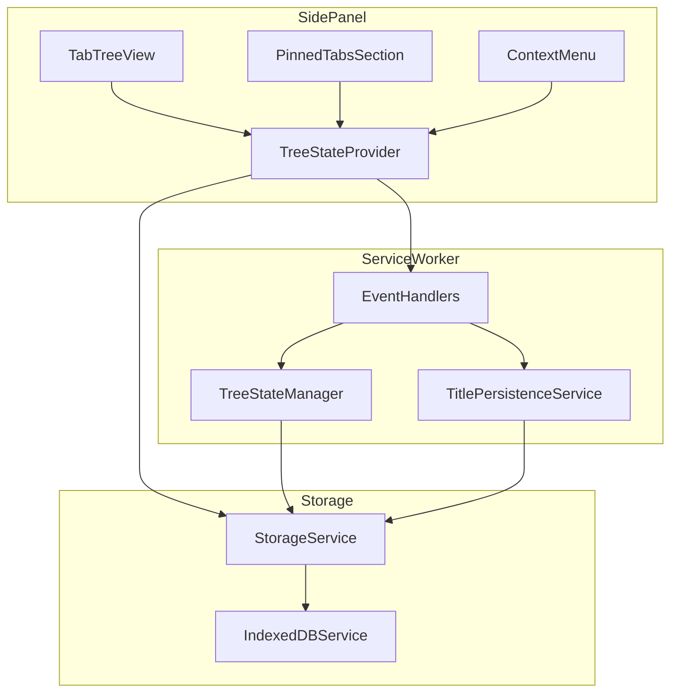

# Technical Design Document

## Overview

**Purpose**: 本設計は、Vivaldi-TT拡張機能における複数のバグ修正と機能改善を実現する。タブ状態の永続化・復元、ドラッグ＆ドロップ操作、UI表示の一貫性、および複数ウィンドウ対応に関する問題を解決し、ユーザー体験を向上させる。

**Users**: Vivaldiブラウザユーザーが、ツリー型タブマネージャーを使用して効率的にタブを管理する。

**Impact**: 既存のTreeStateProvider、TabTreeView、PinnedTabsSection、およびService Workerのイベントハンドラに修正を加える。

### Goals
- ブラウザ再起動後のタブ状態（タイトル、ファビコン、ツリー構造）の正確な復元
- ドラッグ＆ドロップ操作の正確性と直感的な操作感の実現
- 設定で指定したフォントサイズの全UI要素への反映
- 各ウィンドウで独立したタブツリーの表示
- 全修正に対するE2Eテストによるリグレッション防止

### Non-Goals
- パフォーマンス最適化（今回のスコープ外）
- 他ブラウザ（Chrome、Firefox等）への対応

## Architecture

### Existing Architecture Analysis

現行アーキテクチャは以下の構成:
- **Service Worker** (`/src/background/`): タブイベント処理、ツリー同期、永続化
- **Side Panel UI** (`/src/sidepanel/`): React + dnd-kitによるツリー表示
- **Storage Layer** (`/src/storage/`): IndexedDB + chrome.storage.local

今回の修正は既存アーキテクチャを維持し、各レイヤー内のバグを修正する。

### Architecture Pattern & Boundary Map



**Architecture Integration**:
- Selected pattern: 既存のProvider + Service Worker パターンを維持
- Domain/feature boundaries: UI層とバックグラウンド層の分離を維持
- Existing patterns preserved: React Context、Chrome Messaging、Storage抽象化
- New components rationale: 新規コンポーネントは追加しない（既存コンポーネントの修正のみ）
- Steering compliance: tech.md、structure.mdに準拠

### Technology Stack

| Layer | Choice / Version | Role in Feature | Notes |
|-------|------------------|-----------------|-------|
| Frontend | React 18 + TypeScript 5.5+ | ツリービュー、設定パネル | strict mode維持 |
| DnD | @dnd-kit/core | ドラッグ＆ドロップ操作 | カスタムドロップ検知追加 |
| Backend | Chrome Extensions API (MV3) | タブ操作、ウィンドウ管理 | chrome.tabs, chrome.windows |
| Data | chrome.storage.local | タブ状態永続化 | ファビコン永続化追加 |
| Testing | Playwright | E2Eテスト | フレーキーテスト回避必須 |

## Requirements Traceability

| Requirement | Summary | Components | Interfaces | Flows |
|-------------|---------|------------|------------|-------|
| 1.1 | タブ状態の正確な復元 | TreeStateProvider, StorageService | loadTreeState, loadTabInfoMap | 起動時復元フロー |
| 1.2 | 余分なLoadingタブ防止 | TreeStateProvider | handleTabUpdated | ステータス監視フロー |
| 1.3, 1.4 | タイトル/ファビコン永続化 | TitlePersistenceService, StorageService | saveTitle, saveFavIcon | 更新時永続化フロー |
| 1.5 | 不整合データ削除 | TreeStateProvider | syncWithBrowserTabs | 整合性チェックフロー |
| 2.1 | フォントサイズ反映 | TabTreeView, ThemeProvider | CSS変数 | - |
| 2.2 | スタートページタイトル | TabTreeView | getDisplayTitle | - |
| 3.1, 3.2 | 休止タブのグレーアウト | TabTreeView | discarded判定 | - |
| 4.1, 4.2 | テキスト選択禁止 | TabTreeView | CSS select-none | - |
| 5.1-5.4 | アクティブタブハイライト | TabTreeView, PinnedTabsSection | activeTabId | アクティブ切替フロー |
| 6.1-6.3 | プレースホルダー表示 | TabTreeView, GapDropDetection | calculateDropTarget | ドラッグ中フロー |
| 7.1, 7.2 | ドロップ処理 | TreeStateProvider | handleSiblingDrop | ドロップ後同期フロー |
| 8.1-8.3 | スクロール制限 | TabTreeView | autoScroll設定 | - |
| 9.1-9.4 | ツリー外ドロップ | TabTreeView | isOutsideTree判定 | 外部ドロップフロー |
| 10.1-10.4 | ピン留めタブ並び替え | PinnedTabsSection | ピン留めDnD | ピン留め順序変更フロー |
| 11.1-11.4 | グループ化機能 | ContextMenu, TreeStateManager | createGroupFromTabs, addToGroup | グループ操作フロー |
| 12.1-12.3 | 複数ウィンドウ対応 | TreeStateProvider | loadCurrentWindowId | ウィンドウフィルタフロー |

## Components and Interfaces

### Summary

| Component | Domain/Layer | Intent | Req Coverage | Key Dependencies | Contracts |
|-----------|--------------|--------|--------------|------------------|-----------|
| TreeStateProvider | UI/Provider | タブツリー状態管理 | 1.1-1.5, 7.1-7.2, 12.1-12.3 | StorageService (P0), chrome.tabs (P0) | State |
| TabTreeView | UI/Component | ツリー表示・DnD | 2.1-2.2, 3.1-3.2, 4.1-4.2, 5.1-5.4, 6.1-6.3, 8.1-8.3, 9.1-9.4 | TreeStateProvider (P0), dnd-kit (P0) | - |
| PinnedTabsSection | UI/Component | ピン留めタブ表示 | 5.1-5.4, 10.1-10.4 | TreeStateProvider (P0), dnd-kit (P1) | - |
| GapDropDetection | UI/Utility | ドロップ位置計算 | 6.1-6.3 | - | Service |
| StorageService | Storage | 永続化抽象化 | 1.3, 1.4 | chrome.storage.local (P0) | Service |
| EventHandlers | Background | タブイベント処理 | 1.2, 11.1-11.4 | TreeStateManager (P0), TitlePersistenceService (P0) | Event |
| ContextMenu | UI/Component | コンテキストメニュー | 11.1-11.4 | useMenuActions (P0) | - |

### UI Layer

#### TreeStateProvider

| Field | Detail |
|-------|--------|
| Intent | タブツリー状態の管理、ストレージ同期、ウィンドウフィルタリング |
| Requirements | 1.1, 1.2, 1.5, 7.1, 7.2, 12.1, 12.2, 12.3 |

**Responsibilities & Constraints**
- タブツリー状態のReact Context提供
- chrome.storage.localとの同期
- ウィンドウIDベースのタブフィルタリング
- ブラウザタブとの整合性維持

**Dependencies**
- Inbound: TabTreeView, PinnedTabsSection — 状態取得 (P0)
- Outbound: StorageService — 永続化 (P0)
- External: chrome.tabs, chrome.windows — タブ/ウィンドウ操作 (P0)

**Contracts**: State [x]

##### State Management

```typescript
interface TreeStateContextValue {
  treeState: TreeState | null;
  tabInfoMap: TabInfoMap;
  activeTabId: number | null;
  currentWindowId: number | null;
  pinnedTabIds: number[];
  groups: Record<string, Group>;

  // 修正が必要なメソッド
  handleSiblingDrop: (params: SiblingDropParams) => void;
  addTabToGroup: (nodeId: string, groupId: string) => void;
}

interface ExtendedTabInfo {
  id: number;
  title: string;
  url: string;
  favIconUrl: string | undefined;
  status: 'loading' | 'complete';
  isPinned: boolean;
  windowId: number;
  discarded: boolean; // 追加: 休止タブフラグ
}
```

- State model: React useState + useCallback
- Persistence: chrome.storage.local
- Concurrency: isLocalUpdateRefフラグで競合回避

**Implementation Notes**
- Integration: `loadCurrentWindowId()`で`chrome.windows.getCurrent()`を呼び出すよう修正
- Validation: handleTabUpdatedに`changeInfo.status`条件を追加
- Risks: 複数ウィンドウ間での状態競合

#### TabTreeView

| Field | Detail |
|-------|--------|
| Intent | ツリービューの表示、ドラッグ＆ドロップ操作の処理 |
| Requirements | 2.1, 2.2, 3.1, 3.2, 4.1, 4.2, 5.1, 5.2, 5.3, 5.4, 6.1, 6.2, 6.3, 8.1, 8.2, 8.3, 9.1, 9.2, 9.3, 9.4 |

**Responsibilities & Constraints**
- タブノードのレンダリング
- dnd-kitによるドラッグ＆ドロップ
- プレースホルダー表示
- ツリー外ドロップ検知
- フォントサイズ・休止タブスタイルの適用

**Dependencies**
- Inbound: SidePanelRoot — 親コンポーネント (P0)
- Outbound: TreeStateProvider — 状態取得・更新 (P0)
- External: @dnd-kit/core — DnD機能 (P0)

**Implementation Notes**
- Integration:
  - `text-sm`クラスを削除し、CSS変数`var(--font-size)`を使用
  - `select-none`クラスをタブノード要素に追加
  - `getDisplayTitle()`ロジックを適用してスタートページタイトルを修正
  - discardedタブにグレーアウトスタイルを適用
- Validation:
  - isOutsideTree状態を追加し、onDragMoveでマウス位置を追跡
  - autoScroll設定を調整してスクロール範囲を制限
- Risks: dnd-kitのバージョン更新による破壊的変更

#### PinnedTabsSection

| Field | Detail |
|-------|--------|
| Intent | ピン留めタブの表示と並び替え |
| Requirements | 5.1, 5.2, 5.3, 5.4, 10.1, 10.2, 10.3, 10.4 |

**Responsibilities & Constraints**
- ピン留めタブのファビコン表示
- アクティブタブのハイライト
- ドラッグ＆ドロップによる並び替え
- ピン留めセクション内のみでのドロップ制限

**Dependencies**
- Inbound: SidePanelRoot — 親コンポーネント (P0)
- Outbound: TreeStateProvider — 状態取得 (P0)
- External: @dnd-kit/sortable — ソート機能 (P1)

**Implementation Notes**
- Integration:
  - `activeTabId` propを追加し、アクティブ時のスタイル（`bg-gray-600`）を適用
  - dnd-kitのSortableContextを追加してドラッグ並び替えを有効化
  - ドロップ時に`chrome.tabs.move()`でブラウザタブ順序を同期
- Validation: ピン留めセクション外へのドロップを禁止
- Risks: ピン留めタブ数が多い場合のレイアウト崩れ

#### ContextMenu

| Field | Detail |
|-------|--------|
| Intent | タブ操作のコンテキストメニュー表示 |
| Requirements | 11.3, 11.4 |

**Responsibilities & Constraints**
- グループ化メニュー項目の表示
- グループ選択サブメニューの表示
- メニューアクションの実行

**Dependencies**
- Inbound: TabTreeView, PinnedTabsSection — コンテキストメニュー表示 (P0)
- Outbound: useMenuActions — アクション実行 (P0)

**Implementation Notes**
- Integration: 「グループに追加」選択時にグループ一覧サブメニューを表示
- Validation: 利用可能なグループがない場合はメニュー項目を無効化
- Risks: グループ数が多い場合のサブメニュー表示

### Utility Layer

#### GapDropDetection

| Field | Detail |
|-------|--------|
| Intent | ドロップ位置の計算とプレースホルダー位置の決定 |
| Requirements | 6.1, 6.2, 6.3 |

**Contracts**: Service [x]

##### Service Interface

```typescript
interface DropTarget {
  type: DropTargetType;
  targetNodeId?: string;
  gapIndex?: number;
  adjacentDepths?: AdjacentDepths;
}

function calculateDropTarget(
  mouseY: number,
  tabPositions: TabPosition[],
  gapThresholdRatio?: number
): DropTarget;
```

- Preconditions: tabPositionsが空でないこと
- Postconditions: 有効なDropTargetを返す（typeがNoneの場合もある）
- Invariants: gapIndexは0〜tabPositions.length

**Implementation Notes**
- Integration: スクロールオフセットを考慮したマウスY座標計算に修正
- Validation: コンテナ境界外の場合はNoneを返す
- Risks: スクロール中の計算精度

### Storage Layer

#### StorageService

| Field | Detail |
|-------|--------|
| Intent | chrome.storage.localの型安全なラッパー |
| Requirements | 1.3, 1.4 |

**Contracts**: Service [x]

##### Service Interface

```typescript
// 追加するストレージキー
const STORAGE_KEYS = {
  // ... 既存キー
  TAB_FAVICONS: 'tab_favicons', // 追加: ファビコン永続化
} as const;

interface StorageService {
  get<K extends keyof StorageSchema>(key: K): Promise<StorageSchema[K] | null>;
  set<K extends keyof StorageSchema>(key: K, value: StorageSchema[K]): Promise<void>;
}
```

- Preconditions: キーはSTORAGE_KEYSに定義されていること
- Postconditions: 値が永続化されること
- Invariants: 型安全性を維持

**Implementation Notes**
- Integration: TAB_FAVICONSキーを追加し、ファビコン永続化を実装
- Validation: ファビコンURLの妥当性チェック
- Risks: ストレージ容量超過（大量タブ環境）

### Background Layer

#### EventHandlers

| Field | Detail |
|-------|--------|
| Intent | Service Workerでのタブイベント処理 |
| Requirements | 1.2, 11.1, 11.2 |

**Contracts**: Event [x]

##### Event Contract

- Published events:
  - `STATE_UPDATED`: ツリー状態更新通知
  - `TAB_CREATED`: タブ作成通知
  - `TAB_REMOVED`: タブ削除通知
- Subscribed events:
  - `chrome.tabs.onCreated`
  - `chrome.tabs.onRemoved`
  - `chrome.tabs.onUpdated`
  - `CREATE_GROUP`: グループ作成リクエスト
  - `ADD_TO_GROUP`: グループ追加リクエスト
- Ordering / delivery guarantees: 非同期、順序保証なし

**Implementation Notes**
- Integration: handleCreateGroupのレスポンス処理を確認し、UI更新を確実に行う
- Validation: グループIDの存在確認
- Risks: メッセージの欠落

## Data Models

### Domain Model

**Entities**:
- `TabNode`: ツリーノード（タブまたはグループ）
- `Group`: タブグループ
- `TreeState`: ツリー全体の状態

**Value Objects**:
- `ExtendedTabInfo`: タブの詳細情報（discarded追加）
- `DropTarget`: ドロップ位置情報

**Business Rules**:
- ピン留めタブは通常タブセクションにドロップ不可
- グループノードは負のtabIdを持つ
- 各ウィンドウは独立したタブツリーを持つ

### Logical Data Model

**ストレージ構造の変更**:

```typescript
// chrome.storage.local スキーマ
interface StorageSchema {
  tree_state: TreeState;
  user_settings: UserSettings;
  unread_tabs: number[];
  groups: Record<string, Group>;
  tab_titles: Record<number, string>;
  tab_favicons: Record<number, string>; // 追加
}
```

**インデックス**:
- `tab_titles`: tabIdをキーとする
- `tab_favicons`: tabIdをキーとする

## Error Handling

### Error Strategy

- **ストレージ読み込みエラー**: デフォルト値を使用し、警告ログを出力
- **タブ操作エラー**: ユーザーに通知せず、コンソールログのみ
- **ウィンドウ取得エラー**: currentWindowIdをnullのまま維持（全タブ表示にフォールバック）

### Error Categories and Responses

- **User Errors (4xx)**: 該当なし（ユーザー入力エラーはない）
- **System Errors (5xx)**:
  - Chrome API呼び出し失敗 → リトライ後、エラーログ
  - ストレージ操作失敗 → インメモリ状態を維持
- **Business Logic Errors (422)**:
  - 循環参照検出 → 操作をキャンセル
  - 不正なドロップ位置 → 操作を無視

## Testing Strategy

### Unit Tests
- `GapDropDetection.test.ts`: ドロップ位置計算のエッジケース
- `StorageService.test.ts`: ファビコン永続化の追加テスト
- `TreeNode.test.tsx`: getDisplayTitle関数のテスト拡張

### Integration Tests
- `FontCustomization.integration.test.tsx`: タブタイトルへのフォントサイズ反映
- `TreeStateProvider.test.tsx`: ウィンドウIDフィルタリング

### E2E Tests

**Requirement 1: タブ状態の永続化と復元**
- `tab-persistence.spec.ts`: タブ数・タイトル・ファビコンの復元検証
- `loading-tab-cleanup.spec.ts`: 余分なLoadingタブが生成されないことの検証

**Requirement 2-4: UI表示**
- `font-size.spec.ts`: フォントサイズ設定の反映
- `discarded-tab.spec.ts`: 休止タブのグレーアウト表示
- `text-selection.spec.ts`: テキスト選択禁止の検証

**Requirement 5: アクティブタブハイライト**
- `active-tab-highlight.spec.ts`: 通常タブとピン留めタブのハイライト切替

**Requirement 6-9: ドラッグ＆ドロップ**
- `drag-drop-placeholder.spec.ts`: プレースホルダー表示位置
- `drag-drop-insert.spec.ts`: ドロップ位置への挿入
- `drag-drop-scroll.spec.ts`: スクロール制限
- `drag-drop-external.spec.ts`: ツリー外ドロップで新ウィンドウ作成

**Requirement 10: ピン留めタブ並び替え**
- `pinned-tab-reorder.spec.ts`: ピン留めタブのドラッグ並び替え

**Requirement 11: グループ化機能**
- `tab-grouping.spec.ts`: 複数タブのグループ化、グループへの追加

**Requirement 12: 複数ウィンドウ対応**
- `multi-window.spec.ts`: 各ウィンドウでの独立したタブツリー表示

### テスト品質基準
- 固定時間待機（`waitForTimeout`）禁止
- ポーリングユーティリティ（`e2e/utils/polling-utils.ts`）を使用
- 10回以上の繰り返し実行で100%通過を確認
