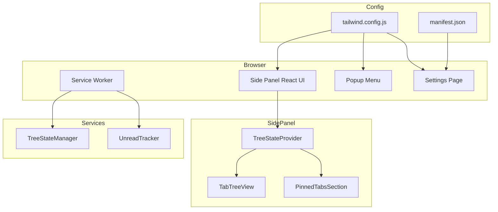

# Design Document: tab-tree-bugfixes

## Overview

**Purpose**: 本機能は、Vivaldi-TT拡張機能の動作確認で発見された14件の問題を修正し、UIの品質向上とユーザー体験の改善を実現する。

**Users**: Vivaldi-TTユーザーは、無彩色の落ち着いたUI、正確なドラッグ＆ドロップ操作、ウィンドウごとの独立したタブツリーを利用できる。

**Impact**: 既存のUIスタイル、ドラッグ＆ドロップロジック、複数ウィンドウ対応のアーキテクチャに変更を加える。

### Goals

- スキップされている全テストを修正または削除し、テスト品質を保証する
- UIの背景色を無彩色に変更し、視覚的にニュートラルなインターフェースを提供する
- ドラッグ＆ドロップ操作の判定ロジックを修正し、直感的な操作を実現する
- 各ウィンドウでそのウィンドウのタブのみを表示する複数ウィンドウ対応を実装する

### Non-Goals

- 新規機能の追加（バグ修正・改善のみ）
- パフォーマンス最適化（必要最小限の変更に留める）
- UIデザインの大幅な変更

---

## Architecture

### Existing Architecture Analysis

**現在のアーキテクチャパターン**:
- Chrome Extension Manifest V3アーキテクチャ
- Service Worker（Background）とSide Panel（React UI）の分離
- React Contextによるグローバル状態管理（TreeStateProvider, ThemeProvider）

**変更対象の主要コンポーネント**:
- `tailwind.config.js` - カラーパレット設定
- `TabTreeView.tsx` - タブノードUI、ドロップ判定
- `TreeStateProvider.tsx` - windowIdフィルタリング追加
- `service-worker.ts` - 初期化ロジック改善
- `manifest.json` - options_page設定追加

**維持するパターン**:
- Provider Patternによる状態管理
- Service WorkerとUI間のメッセージングパターン
- @dnd-kitによるドラッグ＆ドロップ

### Architecture Pattern & Boundary Map



**Architecture Integration**:
- Selected pattern: 既存アーキテクチャ維持（修正のみ）
- Domain boundaries: UI層、Service層、Config層の分離を維持
- Existing patterns preserved: Provider Pattern, Message Passing
- New components rationale: 新規コンポーネントなし（既存修正のみ）
- Steering compliance: tech.mdのTypeScript strict mode、テスト必須要件を遵守

### Technology Stack

| Layer | Choice / Version | Role in Feature | Notes |
|-------|------------------|-----------------|-------|
| Frontend | React 18 + TypeScript 5.5+ | UI修正、状態管理拡張 | 既存スタック維持 |
| Styling | Tailwind CSS 3 | カラーパレット変更 | gray→neutral上書き |
| DnD | @dnd-kit | ドロップ判定修正 | 既存ライブラリ |
| Runtime | Chrome Extensions API MV3 | windowId取得、options_page | 既存API使用 |
| Testing | Vitest + Playwright | テスト修正・追加 | 既存ツール |

---

## Requirements Traceability

| Requirement | Summary | Components | Interfaces | Flows |
|-------------|---------|------------|------------|-------|
| 1.1, 1.2, 1.3 | テスト品質改善 | E2Eテストファイル | - | テスト実行 |
| 2.1, 2.2 | 背景色無彩色化 | tailwind.config.js | - | ビルド時適用 |
| 3.1, 3.2 | アクティブタブ枠線削除 | TabTreeView | - | レンダリング |
| 4.1, 4.2, 4.3 | ゴーストタブ削除 | service-worker, TreeStateManager | cleanupStaleNodes | 起動時クリーンアップ |
| 5.1, 5.2 | 未読インジケーター修正 | service-worker, UnreadTracker | markAsUnread | 起動時初期化 |
| 6.1, 6.2 | 閉じるボタン右端固定 | TabTreeView | - | レンダリング |
| 7.1, 7.2 | ホバー時サイズ安定化 | TabTreeView | - | レンダリング |
| 8.1, 8.2, 8.3 | ドロップ判定修正 | TabTreeView, GapDropDetection | calculateDropTarget | ドラッグ操作 |
| 9.1, 9.2 | ドラッグ中タブサイズ固定 | TabTreeView | - | ドラッグ操作 |
| 10.1, 10.2 | ピン留めタブ表示分離 | TabTreeView, SidePanelRoot | - | レンダリング |
| 11.1, 11.2 | 設定画面起動修正 | manifest.json | openOptionsPage | 設定画面起動 |
| 12.1, 12.2 | 水平スクロール禁止 | SidePanelRoot | - | レンダリング |
| 13.1, 13.2 | ツリー外ドロップ新規ウィンドウ | TabTreeView, event-handlers | createNewWindow | ドラッグ操作 |
| 14.1, 14.2, 14.3 | 複数ウィンドウ対応 | TreeStateProvider | getWindowId | フィルタリング |

---

## Components and Interfaces

### Component Summary

| Component | Domain/Layer | Intent | Req Coverage | Key Dependencies | Contracts |
|-----------|--------------|--------|--------------|------------------|-----------|
| tailwind.config.js | Config | カラーパレット上書き | 2.1, 2.2 | tailwindcss (P0) | - |
| TabTreeView | UI | タブノード表示・ドラッグ | 3.1, 3.2, 6.1, 6.2, 7.1, 7.2, 8.1-8.3, 9.1, 9.2, 10.1, 13.1, 13.2 | @dnd-kit (P0) | State |
| TreeStateProvider | UI/Provider | 状態管理・windowIdフィルタ | 14.1, 14.2, 14.3 | Chrome API (P0) | State |
| service-worker.ts | Background | 初期化・クリーンアップ | 4.1-4.3, 5.1, 5.2 | TreeStateManager (P0) | Service |
| manifest.json | Config | 拡張機能設定 | 11.1, 11.2 | - | - |
| SidePanelRoot | UI | ルートコンテナ | 10.2, 12.1, 12.2 | - | - |
| E2Eテストファイル | Testing | テスト品質 | 1.1, 1.2, 1.3 | Playwright (P0) | - |

---

### Config Layer

#### tailwind.config.js

| Field | Detail |
|-------|--------|
| Intent | Tailwind CSSのgrayパレットをneutralで上書きし、無彩色UIを実現 |
| Requirements | 2.1, 2.2 |

**Responsibilities & Constraints**
- `gray`パレットを`neutral`の値で上書き
- 全UIコンポーネントに自動適用

**Dependencies**
- External: tailwindcss/colors — カラー定義取得 (P0)

**Contracts**: State [ ]

**Implementation Notes**
- Integration: ビルド時に自動適用、コード変更不要
- Validation: ビルド後のCSS出力を目視確認
- Risks: 将来青みのあるgrayが必要になった場合は個別対応が必要

```javascript
// tailwind.config.js
import colors from 'tailwindcss/colors';

export default {
  content: [
    "./sidepanel.html",
    "./src/**/*.{js,ts,jsx,tsx}",
  ],
  theme: {
    extend: {
      colors: {
        gray: colors.neutral,
      },
    },
  },
  plugins: [],
}
```

---

### UI Layer

#### TabTreeView

| Field | Detail |
|-------|--------|
| Intent | タブノードの表示、ドラッグ＆ドロップ操作、コンテキストメニュー |
| Requirements | 3.1, 3.2, 6.1, 6.2, 7.1, 7.2, 8.1, 8.2, 8.3, 9.1, 9.2, 10.1, 13.1, 13.2 |

**Responsibilities & Constraints**
- タブノードのレンダリングとスタイリング
- ドロップターゲット判定とインジケーター表示
- ピン留めタブのフィルタリング
- ツリー外ドロップの検出と新規ウィンドウ作成

**Dependencies**
- Inbound: TreeStateProvider — ツリー状態提供 (P0)
- External: @dnd-kit — ドラッグ＆ドロップ機能 (P0)

**Contracts**: State [x]

##### State Management

**変更点**:

1. **アクティブタブ枠線削除 (3.1, 3.2)**
```typescript
// Before
className={`... ${isSelected ? 'ring-2 ring-blue-400' : ''}`}

// After
className={`... ${isSelected ? 'bg-neutral-500' : ''}`}
```

2. **閉じるボタン右端固定・サイズ安定化 (6.1, 6.2, 7.1, 7.2)**
```typescript
// Before
<div className="flex-1 flex items-center min-w-0">
  <span className="text-sm truncate">{title}</span>
  {isHovered && <CloseButton onClose={handleCloseClick} />}
</div>

// After
<div className="flex-1 flex items-center justify-between min-w-0">
  <span className="text-sm truncate flex-1">{title}</span>
  <div className={`flex-shrink-0 ${isHovered ? 'visible' : 'invisible'}`}>
    <CloseButton onClose={handleCloseClick} />
  </div>
</div>
```

3. **ピン留めタブフィルタリング (10.1)**
```typescript
// ノードビルド時にピン留めタブを除外
const buildTree = (): TabNode[] => {
  // pinnedTabIdsに含まれるタブを除外
  const filteredNodes = Object.entries(treeState.nodes)
    .filter(([_, node]) => !pinnedTabIds.includes(node.tabId));
  // ...
};
```

4. **ツリー外ドロップ検出 (13.1, 13.2)**
```typescript
// DndContext onDragEnd
const handleDragEnd = (event: DragEndEvent) => {
  const { active, over } = event;

  // ドロップ先がない = ツリー外ドロップ
  if (!over) {
    const tabId = active.id;
    chrome.runtime.sendMessage({
      type: 'CREATE_NEW_WINDOW',
      payload: { tabId }
    });
    return;
  }
  // 通常のドロップ処理
};
```

**Implementation Notes**
- Integration: 既存コンポーネントの修正、新規コンポーネント追加なし
- Validation: E2Eテストでホバー動作、ドラッグ操作を検証
- Risks: ドロップ判定ロジックの修正は既存E2Eテストに影響する可能性

---

#### TreeStateProvider

| Field | Detail |
|-------|--------|
| Intent | タブツリー状態の管理とReact Contextでの提供 |
| Requirements | 14.1, 14.2, 14.3 |

**Responsibilities & Constraints**
- ツリー状態のロードと保存
- 現在のウィンドウIDの追跡
- windowIdによるタブフィルタリング

**Dependencies**
- External: Chrome Extensions API (chrome.windows) — windowId取得 (P0)
- Outbound: TabTreeView — フィルタ済みタブ提供 (P0)

**Contracts**: State [x]

##### State Management

**追加する状態**:
```typescript
interface TreeStateContextValue {
  // 既存の状態...

  /** 現在のウィンドウID */
  currentWindowId: number | null;
}
```

**windowId取得ロジック**:
```typescript
// サイドパネル起動時にウィンドウIDを取得
useEffect(() => {
  const getCurrentWindowId = async () => {
    const window = await chrome.windows.getCurrent();
    setCurrentWindowId(window.id ?? null);
  };
  getCurrentWindowId();
}, []);
```

**タブフィルタリング**:
```typescript
// tabInfoMapをwindowIdでフィルタリング
const filteredTabInfoMap = useMemo(() => {
  if (currentWindowId === null) return tabInfoMap;

  return Object.fromEntries(
    Object.entries(tabInfoMap).filter(
      ([_, info]) => info.windowId === currentWindowId
    )
  );
}, [tabInfoMap, currentWindowId]);
```

**タブ情報の拡張**:
```typescript
interface ExtendedTabInfo {
  // 既存のプロパティ...
  windowId: number;
}

// loadTabInfoMapでwindowIdを含める
const loadTabInfoMap = useCallback(async () => {
  const tabs = await chrome.tabs.query({});
  const newTabInfoMap: TabInfoMap = {};
  for (const tab of tabs) {
    if (tab.id !== undefined) {
      newTabInfoMap[tab.id] = {
        // 既存のプロパティ...
        windowId: tab.windowId,
      };
    }
  }
  setTabInfoMap(newTabInfoMap);
}, []);
```

**Implementation Notes**
- Integration: 既存のTreeStateProviderを拡張
- Validation: 複数ウィンドウでのE2Eテストを追加
- Risks: タブ移動時のwindowId更新が正しく反映されるか確認が必要

---

### Background Layer

#### service-worker.ts

| Field | Detail |
|-------|--------|
| Intent | 拡張機能の初期化、タブイベント処理、クリーンアップ |
| Requirements | 4.1, 4.2, 4.3, 5.1, 5.2 |

**Responsibilities & Constraints**
- ブラウザ起動時のゴーストタブクリーンアップ
- 復元タブの未読状態初期化

**Dependencies**
- Outbound: TreeStateManager — ツリー状態管理 (P0)
- Outbound: UnreadTracker — 未読状態管理 (P0)

**Contracts**: Service [x]

##### Service Interface

**改善する初期化フロー**:
```typescript
// 起動時の初期化
(async () => {
  try {
    // 1. ストレージからツリー状態をロード
    await testTreeStateManager.loadState();

    // 2. ストレージの未読状態をクリア（復元タブに未読を付けない）
    await testUnreadTracker.clear();

    // 3. 古いタブデータをクリーンアップ
    await cleanupStaleTabData();

    // 4. Chromeタブと同期
    await testTreeStateManager.syncWithChromeTabs();

    // 5. 起動完了をマーク（以降の新規タブには未読を付ける）
    testUnreadTracker.setInitialLoadComplete();
  } catch (_error) {
    // エラーハンドリング
  }
})();
```

**Implementation Notes**
- Integration: 既存の初期化フローを修正
- Validation: ブラウザ起動時のゴーストタブ・未読状態をE2Eテストで確認
- Risks: 初期化順序の変更が既存機能に影響する可能性

---

#### manifest.json

| Field | Detail |
|-------|--------|
| Intent | Chrome拡張機能の設定定義 |
| Requirements | 11.1, 11.2 |

**Responsibilities & Constraints**
- options_pageの設定追加

**Dependencies**
- なし

**Contracts**: なし

**変更内容**:
```json
{
  "manifest_version": 3,
  "name": "Vivaldi-TT",
  "version": "1.0.0",
  "description": "Tree-style tab manager for Vivaldi browser",
  "permissions": [
    "sidePanel",
    "tabs",
    "storage",
    "unlimitedStorage",
    "alarms"
  ],
  "options_page": "settings.html",
  "side_panel": {
    "default_path": "sidepanel.html"
  },
  "background": {
    "service_worker": "src/background/service-worker.ts",
    "type": "module"
  },
  "action": {
    "default_title": "Vivaldi-TT",
    "default_popup": "popup.html"
  }
}
```

**Implementation Notes**
- Integration: 設定追加のみ、コード変更不要
- Validation: ポップアップメニューから設定画面が開くことを確認
- Risks: なし

---

#### SidePanelRoot

| Field | Detail |
|-------|--------|
| Intent | サイドパネルのルートコンテナ |
| Requirements | 10.2, 12.1, 12.2 |

**Responsibilities & Constraints**
- 水平スクロールの禁止
- PinnedTabsSectionの配置

**Contracts**: なし

**変更内容**:
```typescript
// 水平スクロール禁止
<div className="flex-1 overflow-y-auto overflow-x-hidden custom-scrollbar">
  <TabTreeView ... />
</div>
```

**Implementation Notes**
- Integration: CSSクラスの変更のみ
- Validation: ドラッグ時に水平スクロールが発生しないことを確認

---

### Testing Layer

#### E2Eテストファイル

| Field | Detail |
|-------|--------|
| Intent | テスト品質の改善 |
| Requirements | 1.1, 1.2, 1.3 |

**対応内容**:

1. **headless-mode.spec.ts** - Headedモード専用テストはスキップ維持（CI安定性のため）
2. **popup-menu.spec.ts** - options_page設定後にスキップ解除
3. **pinned-tabs.spec.ts** - ピン留めタブフィルタリング実装後にスキップ解除
4. **ViewSwitching.integration.test.tsx** - 削除されたUI関連テストを削除

**tech.mdルールの遵守**:
- `test.skip()`でスキップしてコードを残すことは禁止
- 不要なテストは完全削除

---

## Data Models

### Domain Model

**既存のデータ構造への影響**:

```typescript
// ExtendedTabInfo（拡張）
interface ExtendedTabInfo {
  id: number;
  title: string;
  url: string;
  favIconUrl?: string;
  status: 'loading' | 'complete';
  isPinned: boolean;
  windowId: number;  // 追加
}
```

**ストレージ構造への影響**: なし（フィルタリングのみで対応）

---

## Error Handling

### Error Strategy

- **ゴーストタブクリーンアップ失敗**: サイレントログ、拡張機能の動作継続
- **windowId取得失敗**: nullを設定し、フィルタリングをスキップ（全タブ表示）
- **ドロップ判定エラー**: フォールバックとしてドロップをキャンセル

---

## Testing Strategy

### Unit Tests
- `tailwind.config.js`: ビルド出力のカラー値確認
- `TreeStateProvider`: windowIdフィルタリングロジック
- `TabTreeView`: CloseButton表示制御ロジック

### Integration Tests
- ピン留めタブのツリー非表示
- ドロップ判定の境界ケース
- 複数ウィンドウでのタブ表示分離

### E2E Tests
- 設定画面の起動（popup-menu.spec.ts）
- ピン留めタブの表示分離（pinned-tabs.spec.ts）
- ドラッグ＆ドロップ操作（drag-drop-reorder.spec.ts）
- 複数ウィンドウでのタブツリー表示（新規追加）

### Performance
- 複数ウィンドウでのフィルタリングパフォーマンス（useMemoによる最適化確認）

---

## Optional Sections

### Migration Strategy

**移行不要**: 既存データ構造の変更なし。UIの変更はビルド後即座に適用される。

**ユーザー影響**:
- カラーパレット変更: 即座に反映
- 複数ウィンドウ対応: 新規ウィンドウを開くと自動適用
