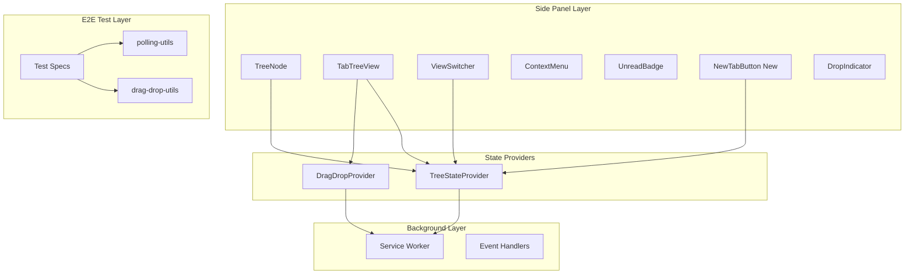
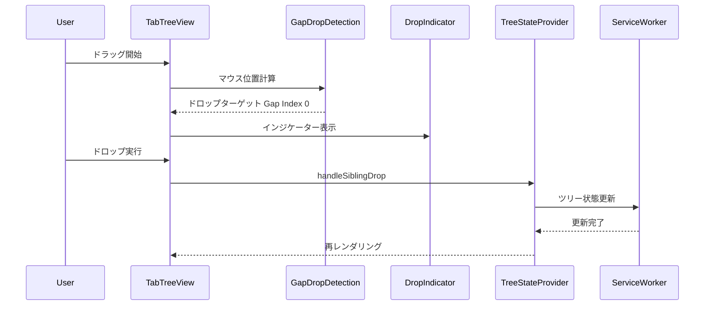
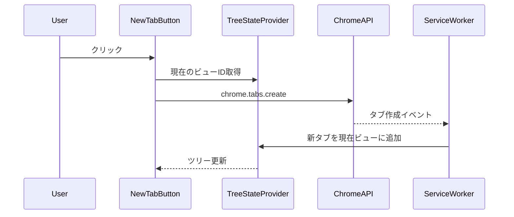

# Design Document

## Overview

**Purpose**: 本設計はVivaldi-TT拡張機能の12の問題点を包括的に修正し、E2Eテストの安定性とユーザー体験を向上させる。

**Users**: Vivaldi-TTを使用するすべてのユーザーと、E2Eテストを実行する開発者。

**Impact**: 既存のタブツリー機能の信頼性向上、UIの一貫性改善、テストスイートの安定化。

### Goals
- E2Eテストのフレーキー問題を解消し、CI/CDパイプラインの信頼性を確保
- ドラッグ&ドロップ操作の精度と安定性を向上
- UIコンポーネントの表示・動作を仕様通りに修正
- 不足機能（タブグループ化、新規タブボタン、クロスウィンドウドラッグ）を完成

### Non-Goals
- 新規アーキテクチャの導入
- パフォーマンス最適化（既存パフォーマンスで問題ない範囲）
- 設定画面のUI変更

## Architecture

### Existing Architecture Analysis

現在のVivaldi-TTは以下のアーキテクチャで構成:
- **Service Worker** (`src/background/`): タブイベント監視、ツリー状態管理
- **Side Panel UI** (`src/sidepanel/`): React + @dnd-kitによるタブツリー表示
- **Storage Layer** (`src/storage/`): IndexedDBによるデータ永続化

本修正は既存アーキテクチャを維持しつつ、以下の領域を拡張・修正:
- E2Eテスト安定化（`e2e/`）
- ドラッグ&ドロップ精度向上（`src/sidepanel/components/`）
- UI表示修正（`src/sidepanel/components/`）

### Architecture Pattern & Boundary Map



**Architecture Integration**:
- Selected pattern: React Context Pattern（状態管理）+ @dnd-kit（ドラッグ&ドロップ）
- Domain/feature boundaries: UI Layer / State Layer / Background Layer の3層分離を維持
- Existing patterns preserved: TreeStateProvider、DragDropProvider、Service Worker通信
- New components rationale: NewTabButtonコンポーネントを追加（Requirement 8）
- Steering compliance: TypeScript strict mode、@dnd-kit使用、Playwright E2Eテスト

### Technology Stack

| Layer | Choice / Version | Role in Feature | Notes |
|-------|------------------|-----------------|-------|
| Frontend | React 18 | タブツリーUI | 既存 |
| Drag&Drop | @dnd-kit ^6.1.0 | ドラッグ&ドロップ機能 | 既存 |
| E2E Testing | Playwright | E2Eテスト実行 | 既存 |
| Runtime | Chrome Extensions Manifest V3 | 拡張機能基盤 | 既存 |

## System Flows

### ドラッグ&ドロップ: Gapドロップフロー



### 新規タブ追加フロー



## Requirements Traceability

| Requirement | Summary | Components | Interfaces | Flows |
|-------------|---------|------------|------------|-------|
| 1.1-1.4 | E2Eテストフレーキー修正 | polling-utils, TestSpecs | waitForCondition | - |
| 2.1-2.3 | ビュータブカウント正確性 | ViewSwitcher, TreeStateProvider | viewTabCounts | - |
| 3.1-3.3 | タブ間隙間ドロップ精度 | GapDropDetection, DropIndicator, TabTreeView | handleSiblingDrop | Gapドロップフロー |
| 4.1-4.3 | ドラッグ中タブサイズ安定 | TabTreeView, TreeNode | CSS styles | - |
| 5.1-5.3 | ドラッグ時スクロール制限 | TabTreeView | scrollHandler | - |
| 6.1-6.4 | タブグループ化機能 | ContextMenu, useMenuActions, TreeStateProvider | handleGroup | - |
| 7.1-7.3 | クロスウィンドウドラッグ | CrossWindowDragHandler, useCrossWindowDrag | Service Worker messages | - |
| 8.1-8.4 | 新規タブ追加ボタン | NewTabButton, TabTreeView | onNewTab | 新規タブ追加フロー |
| 9.1-9.3 | 新規タブタイトル正確性 | TreeNode | getDisplayTitle | - |
| 10.1-10.3 | ビューへの新規タブ追加 | TreeStateProvider, ServiceWorker | currentViewId | 新規タブ追加フロー |
| 11.1-11.4 | 未読インジケーター位置 | UnreadBadge, TreeNode | CSS layout | - |
| 12.1-12.4 | ピン留めタブ並び替え同期 | PinnedTabsSection, TreeStateProvider | handlePinnedTabReorder | - |

## Components and Interfaces

| Component | Domain/Layer | Intent | Req Coverage | Key Dependencies | Contracts |
|-----------|--------------|--------|--------------|------------------|-----------|
| polling-utils | E2E | ポーリング待機ユーティリティ | 1.1-1.4 | Playwright (P0) | - |
| ViewSwitcher | UI | ビュー切り替えとタブカウント表示 | 2.1-2.3 | TreeStateProvider (P0) | State |
| GapDropDetection | UI/Logic | ドロップ位置計算 | 3.1-3.3 | - | Service |
| DropIndicator | UI | ドロップ位置インジケーター | 3.1-3.3 | GapDropDetection (P0) | - |
| TabTreeView | UI | タブツリー表示とDnD処理 | 3, 4, 5, 8 | TreeStateProvider (P0), DragDropProvider (P0) | State |
| TreeNode | UI | 個別タブノード表示 | 4, 9, 11 | UnreadBadge (P1) | - |
| ContextMenu | UI | 右クリックメニュー | 6 | useMenuActions (P0) | - |
| CrossWindowDragHandler | UI | クロスウィンドウドラッグ統合 | 7 | useCrossWindowDrag (P0), ServiceWorker (P0) | Service |
| NewTabButton | UI | 新規タブ追加ボタン | 8 | TreeStateProvider (P0) | - |
| UnreadBadge | UI | 未読インジケーター | 11 | - | - |
| PinnedTabsSection | UI | ピン留めタブセクション | 12 | TreeStateProvider (P0) | - |

### E2E Test Layer

#### polling-utils (修正)

| Field | Detail |
|-------|--------|
| Intent | E2Eテストの状態待機をポーリングで安定化 |
| Requirements | 1.1, 1.2, 1.3, 1.4 |

**Responsibilities & Constraints**
- 固定時間待機を排除し、ポーリングで状態確定を待機
- テスト失敗時の明確なエラーメッセージ提供
- `--repeat-each=10`で10回連続成功を保証

**Dependencies**
- Inbound: TestSpecs — ポーリング関数呼び出し (P0)
- External: Playwright — テストフレームワーク (P0)

**Contracts**: Service [x]

##### Service Interface
```typescript
interface PollingUtilsService {
  /**
   * ドロップインジケーターの位置変化を待機
   * @returns インジケーターの新しいY座標
   */
  waitForDropIndicatorPositionChange(
    page: Page,
    previousY: number,
    options?: PollingOptions
  ): Promise<number>;

  /**
   * タブのタイトル更新を待機
   * @returns 更新後のタイトル
   */
  waitForTabTitleUpdate(
    serviceWorker: Worker,
    tabId: number,
    expectedTitle: string,
    options?: PollingOptions
  ): Promise<string>;
}

interface PollingOptions {
  timeout?: number;  // デフォルト: 5000ms
  interval?: number; // デフォルト: 100ms
  timeoutMessage?: string;
}
```

**Implementation Notes**
- Integration: 既存の`waitForCondition`パターンを拡張
- Validation: タイムアウト前に条件が満たされることを検証
- Risks: ポーリング間隔が短すぎるとCPU負荷増加

### UI Layer

#### ViewSwitcher (修正)

| Field | Detail |
|-------|--------|
| Intent | ビュー切り替えと正確なタブカウント表示 |
| Requirements | 2.1, 2.2, 2.3 |

**Responsibilities & Constraints**
- タブ追加・削除時に即座にカウントを更新
- 不整合タブ削除時もカウントを再計算
- 実際に存在するタブのみをカウント

**Dependencies**
- Inbound: SidePanelRoot — コンポーネント使用 (P0)
- Outbound: TreeStateProvider — viewTabCounts取得 (P0)

**Contracts**: State [x]

##### State Management
```typescript
interface ViewSwitcherState {
  /** 各ビューのタブ数マップ */
  tabCounts: Record<string, number>;
}

// TreeStateProviderから提供される
// 不整合タブ削除時に再計算される
```

**Implementation Notes**
- Integration: TreeStateProviderのviewTabCountsを直接参照
- Validation: tabCountsが未定義の場合は0を表示
- Risks: 大量タブ時のカウント計算パフォーマンス

#### GapDropDetection (修正)

| Field | Detail |
|-------|--------|
| Intent | タブ間隙間へのドロップ位置を正確に計算 |
| Requirements | 3.1, 3.2, 3.3 |

**Responsibilities & Constraints**
- マウスY座標からドロップターゲット（Tab/Gap/None）を判定
- 隣接ノードの深度情報を提供
- プレースホルダーが示す位置にタブを配置

**Dependencies**
- Inbound: TabTreeView — ドロップ位置計算呼び出し (P0)
- Outbound: DropIndicator — インジケーター位置情報 (P1)

**Contracts**: Service [x]

##### Service Interface
```typescript
interface GapDropDetectionResult {
  type: 'Tab' | 'Gap' | 'None';
  targetIndex: number;
  gapIndex?: number;
  adjacentDepths: {
    above: number | undefined;
    below: number | undefined;
  };
}

interface GapDropDetectionService {
  /**
   * マウスY座標からドロップターゲットを計算
   * @param mouseY マウスのY座標
   * @param tabPositions 各タブのバウンディングボックス
   * @param gapRatio 隙間判定領域比率（デフォルト: 0.25）
   * @returns ドロップターゲット情報
   */
  calculateDropTarget(
    mouseY: number,
    tabPositions: TabPosition[],
    gapRatio?: number
  ): GapDropDetectionResult;
}
```

**Implementation Notes**
- Integration: TabTreeViewのonDragOverで呼び出し
- Validation: tabPositionsが空の場合はNoneを返す
- Risks: 隙間判定領域が小さすぎると操作性低下

#### TabTreeView (修正)

| Field | Detail |
|-------|--------|
| Intent | タブツリー表示、DnD処理、スクロール制御 |
| Requirements | 3.4-3.6, 4.4-4.5, 5.4-5.5, 8.5-8.7 |

**Responsibilities & Constraints**
- ドラッグ中のタブサイズを一定に維持
- スクロール量をコンテンツ範囲内に制限
- 新規タブ追加ボタンをツリー末尾に表示

**Dependencies**
- Inbound: SidePanelRoot — コンポーネント使用 (P0)
- Outbound: TreeStateProvider — 状態管理 (P0)
- Outbound: DragDropProvider — DnDコンテキスト (P0)

**Contracts**: State [x]

##### State Management
```typescript
interface TabTreeViewState {
  /** ドラッグ中フラグ */
  isDragging: boolean;
  /** スクロール位置 */
  scrollTop: number;
  /** 最大スクロール量 */
  maxScrollTop: number;
}
```

**Implementation Notes**
- Integration: @dnd-kitのSortableContextを使用
- Validation: スクロール時にmaxScrollTopを超えないよう制限
- Risks: 大量タブ時のレンダリングパフォーマンス

#### TreeNode (修正)

| Field | Detail |
|-------|--------|
| Intent | 個別タブノードの表示（サイズ安定、タイトル正確性） |
| Requirements | 4.1-4.3, 9.1-9.3, 9.4-9.5, 11.1-11.4, 11.5-11.6 |

**Responsibilities & Constraints**
- ドラッグ中もサイズを変化させない
- スタートページURLを「スタートページ」と表示
- 未読インジケーターを右端に固定表示

**Dependencies**
- Inbound: TabTreeView — ノードリスト表示 (P0)
- Outbound: UnreadBadge — 未読表示 (P1)

**Contracts**: State [x]

##### State Management
```typescript
interface TreeNodeProps {
  node: TabNode;
  tab: TabInfo;
  isUnread: boolean;
  isActive: boolean;
  isDiscarded?: boolean;
  showUnreadIndicator?: boolean;
}
```

**Implementation Notes**
- Integration: 既存のgetDisplayTitle()関数を維持
- Validation: スタートページURL判定パターンを拡張可能に
- Risks: CSSレイアウト変更による既存スタイル破壊

#### ContextMenu (修正)

| Field | Detail |
|-------|--------|
| Intent | コンテキストメニューからのタブグループ化 |
| Requirements | 6.1-6.4, 6.5-6.8 |

**Responsibilities & Constraints**
- 「タブをグループ化」メニュー項目の提供
- 新しい親タブ（グループノード）の生成
- 選択タブを親タブの子として配置

**Dependencies**
- Inbound: TreeNode — 右クリックイベント (P0)
- Outbound: useMenuActions — アクション実行 (P0)

**Contracts**: Service [x]

##### Service Interface
```typescript
type MenuAction =
  | 'close'
  | 'closeSubtree'
  | 'duplicate'
  | 'reload'
  | 'pin'
  | 'unpin'
  | 'newWindow'
  | 'group'      // タブをグループ化
  | 'ungroup'
  | 'copyUrl'
  | 'snapshot';

interface ContextMenuService {
  handleAction(action: MenuAction, tabIds: number[]): void;
}
```

**Implementation Notes**
- Integration: 既存の'group'アクションを活用
- Validation: グループ化後のツリー整合性を検証
- Risks: グループノード生成時のID衝突

#### CrossWindowDragHandler (修正)

| Field | Detail |
|-------|--------|
| Intent | クロスウィンドウドラッグの統合処理 |
| Requirements | 7.1-7.3, 7.4-7.6 |

**Responsibilities & Constraints**
- 別ウィンドウへのドラッグ検出
- ドロップインジケーターの表示
- タブのウィンドウ間移動

**Dependencies**
- Inbound: TabTreeView — ドラッグイベント (P0)
- Outbound: useCrossWindowDrag — フック (P0)
- External: ServiceWorker — メッセージング (P0)

**Contracts**: Service [x]

##### Service Interface
```typescript
interface CrossWindowDragMessage {
  type:
    | 'SET_DRAG_STATE'
    | 'GET_DRAG_STATE'
    | 'CLEAR_DRAG_STATE'
    | 'MOVE_TAB_TO_WINDOW'
    | 'MOVE_SUBTREE_TO_WINDOW';
  payload: unknown;
}

interface CrossWindowDragService {
  startDrag(tabId: number, windowId: number): Promise<void>;
  endDrag(targetWindowId: number, position: DropPosition): Promise<void>;
  cancelDrag(): Promise<void>;
}
```

**Implementation Notes**
- Integration: Service Workerとのメッセージングで状態同期
- Validation: ドラッグ状態の不整合を検出・修復
- Risks: ウィンドウ間通信の遅延

#### NewTabButton (新規)

| Field | Detail |
|-------|--------|
| Intent | タブツリー末尾に新規タブ追加ボタンを表示 |
| Requirements | 8.1, 8.2, 8.3, 8.4 |

**Responsibilities & Constraints**
- タブツリー末尾にフルワイドボタンを表示
- クリックで新規タブを作成
- 新規タブを現在のビューに追加

**Dependencies**
- Inbound: TabTreeView — コンポーネント使用 (P0)
- Outbound: TreeStateProvider — currentViewId取得 (P1)
- External: ChromeAPI — chrome.tabs.create (P0)

**Contracts**: Service [x]

##### Service Interface
```typescript
interface NewTabButtonProps {
  /** 新規タブ追加時のコールバック */
  onNewTab: () => void;
}

// 内部でchrome.tabs.create()を呼び出し
// 現在のビューに新規タブを追加
```

**Implementation Notes**
- Integration: TabTreeViewのスクロール領域末尾に配置
- Validation: クリック後にタブが作成されることを検証
- Risks: ビュー状態との同期遅延

#### UnreadBadge (修正)

| Field | Detail |
|-------|--------|
| Intent | 未読インジケーターを右端固定表示 |
| Requirements | 11.1, 11.2, 11.3, 11.4 |

**Responsibilities & Constraints**
- タブの右端に固定表示
- タイトル長に関わらず一定位置
- CloseButtonとの共存

**Dependencies**
- Inbound: TreeNode — 未読状態渡し (P0)

**Contracts**: State [x]

**Implementation Notes**
- Integration: TreeNodeのレイアウト変更（flexbox末尾配置）
- Validation: 短い/長いタイトル両方で位置確認
- Risks: CloseButtonとの重なり

#### PinnedTabsSection (修正)

| Field | Detail |
|-------|--------|
| Intent | ピン留めタブの順序同期 |
| Requirements | 12.1, 12.2, 12.3, 12.4, 12.5-12.8 |

**Responsibilities & Constraints**
- ブラウザのピン留めタブ順序と同期
- ドラッグ&ドロップによる並び替え
- chrome.tabs.onMovedイベントの反映

**Dependencies**
- Inbound: SidePanelRoot — コンポーネント使用 (P0)
- Outbound: TreeStateProvider — handlePinnedTabReorder (P0)

**Contracts**: State [x]

##### State Management
```typescript
interface PinnedTabsSectionState {
  /** ピン留めタブIDの順序付きリスト */
  pinnedTabIds: number[];
}
```

**Implementation Notes**
- Integration: chrome.tabs.moveでブラウザ側と同期
- Validation: 移動後の順序が一致することを検証
- Risks: 同時移動操作時の競合

## Data Models

### Domain Model

本修正では新規データモデルの追加は不要。既存モデルを維持:
- **TabNode**: タブツリーのノード（id, tabId, parentId, children, depth, isExpanded）
- **TabInfo**: タブの詳細情報（id, title, url, favIconUrl, status, windowId）
- **View**: ビュー定義（id, name, color, icon）
- **Group**: グループ定義（id, name, color, isExpanded）

### Logical Data Model

**TreeState** (既存)
- nodes: Record<string, TabNode>
- tabToNode: Record<number, string>
- rootIds: string[]
- views: View[]
- currentViewId: string

**変更点なし** - 既存モデルで全要件を実現可能

## Error Handling

### Error Strategy
- E2Eテスト: タイムアウト時に明確なエラーメッセージとスクリーンショット
- ドラッグ&ドロップ: 無効なドロップ位置では操作をキャンセル
- クロスウィンドウ: 通信エラー時はローカル状態にフォールバック

### Error Categories and Responses
**User Errors**: 無効なドロップ位置 → ドロップインジケーター非表示
**System Errors**: Service Worker通信失敗 → コンソールログ、リトライ
**Business Logic Errors**: 不整合タブ検出 → 自動クリーンアップ

## Testing Strategy

### Unit Tests
- GapDropDetection.calculateDropTarget(): 境界値テスト（上端、下端、中央）
- getDisplayTitle(): スタートページURL、通常URL、Loading状態
- ViewSwitcher.tabCounts: 0件、1件、複数件の表示

### Integration Tests
- タブ追加時のviewTabCounts更新
- グループ化後のツリー構造整合性
- ピン留めタブ移動の状態同期

### E2E Tests
- **Requirement 1.1-1.4**: フレーキーテスト3件の安定化（`--repeat-each=10`）
- **Requirement 2.4-2.5**: タブカウント更新の検証
- **Requirement 3.4-3.6**: Gapドロップ精度テスト
- **Requirement 4.4-4.5**: ドラッグ中サイズ安定性テスト
- **Requirement 5.4-5.5**: スクロール制限テスト
- **Requirement 6.5-6.8**: グループ化操作テスト
- **Requirement 7.4-7.6**: クロスウィンドウドラッグテスト
- **Requirement 8.5-8.7**: 新規タブ追加ボタンテスト
- **Requirement 9.4-9.5**: スタートページタイトルテスト
- **Requirement 10.4-10.6**: ビューへの新規タブ追加テスト
- **Requirement 11.5-11.6**: 未読インジケーター位置テスト
- **Requirement 12.5-12.8**: ピン留めタブ順序同期テスト

### E2Eテスト品質基準
- すべての新規E2Eテストは`--repeat-each=10`で10回連続成功すること
- 固定時間待機（`waitForTimeout`）は禁止、ポーリングで状態確定を待機
- 実行時間は必要十分な短い時間で完了すること
