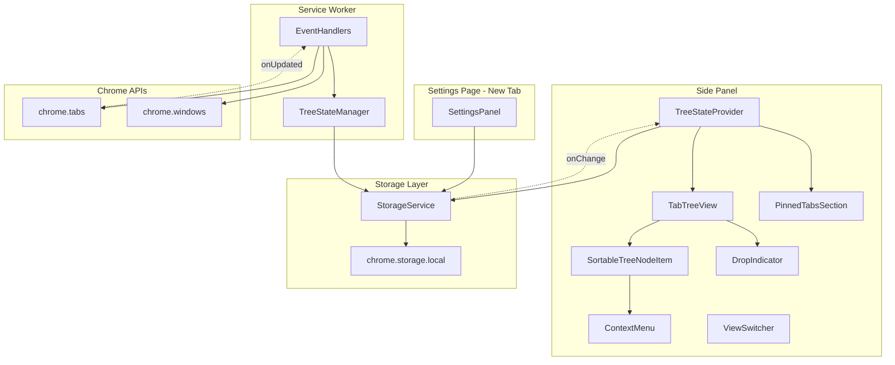
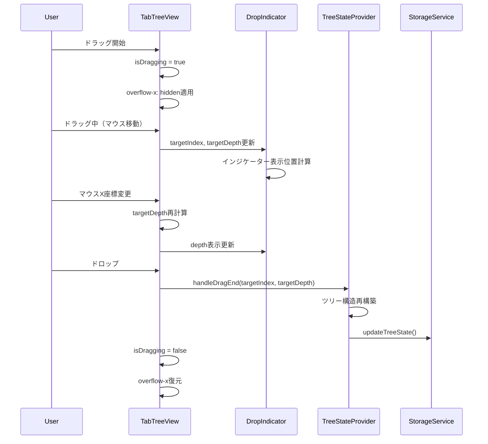
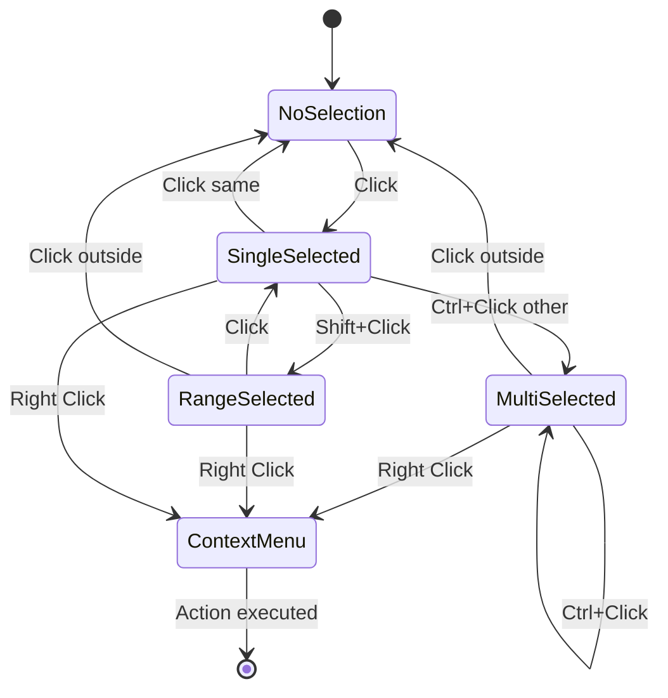
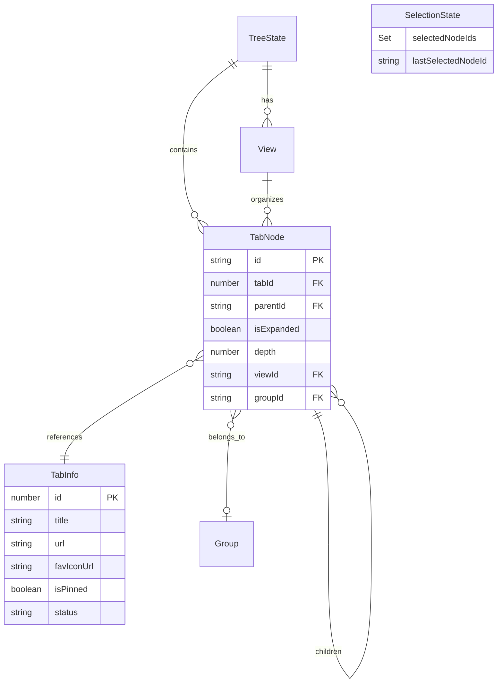

# Design Document

## Overview

**Purpose**: この機能は、Vivaldi-TT拡張機能のタブツリービューのユーザーエクスペリエンスを大幅に改善し、より直感的で効率的なタブ管理体験を提供する。

**Users**: Vivaldiブラウザを使用し、大量のタブを階層的に管理したいパワーユーザーがこの機能を活用する。タブの識別、操作、整理のすべてのワークフローが改善される。

**Impact**: 既存のサイドパネルUIを拡張し、タブ情報表示の強化、ドラッグ&ドロップ操作の改善、複数選択機能の追加、設定画面の分離を行う。

### Goals

- タブのタイトルとファビコンを正確に表示し、タブの識別性を向上させる
- ドラッグ&ドロップ時のビジュアルフィードバックを強化し、操作の予測可能性を高める
- 複数選択機能により、効率的な一括タブ操作を実現する
- ピン留めタブの専用セクションで、重要なタブへの素早いアクセスを提供する
- 統一されたダークテーマでVivaldiのUIに調和するデザインを実現する

### Non-Goals

- Chrome Tab Groups API（`chrome.tabGroups`）との完全統合（既存の拡張機能独自グループ機能を維持）
- サイドパネルのブラウザ組み込みナビゲーションUI（履歴・ホームボタン等）の非表示化（Chrome API制約）
- タブの自動整理やAIベースの分類機能
- 複数ウィンドウ間でのドラッグ&ドロップ（既存機能を維持、今回のスコープ外）

## Architecture

### Existing Architecture Analysis

現在のアーキテクチャ:
- **TreeStateProvider**: ツリー状態管理（nodes、views、tabToNode）
- **TabTreeView**: dnd-kit + SortableContextによるドラッグ&ドロップ対応ツリービュー
- **SortableTreeNodeItem**: 各タブノードの表示とドラッグ操作
- **StorageService**: chrome.storage.localラッパー

既存パターン:
- React Context APIによる状態管理（Redux/Zustand不使用）
- Providerパターンによるグローバル状態の提供
- dnd-kit v6/v8によるドラッグ&ドロップ

技術的制約:
- `SortableTreeNodeItem`には現在`TabInfo`データが渡されていない（タイトル・ファビコン表示不可）
- ドラッグ中のビジュアルフィードバック（インジケーター）が未実装
- 選択状態管理が存在しない

### Architecture Pattern & Boundary Map



**Architecture Integration**:
- **Selected pattern**: 既存のProvider拡張パターンを継続
- **Domain boundaries**: SidePanel UI / Settings UI / Background / Storage の4層を維持
- **Existing patterns preserved**: TreeStateProvider、StorageService、dnd-kit統合
- **New components rationale**:
  - `DropIndicator`: ドラッグ&ドロップのビジュアルフィードバック専用
  - `PinnedTabsSection`: ピン留めタブの特殊表示を分離
  - Settings Page: サイドパネルから独立した設定画面
- **Steering compliance**: TypeScript strict mode、dnd-kit使用、Provider Pattern維持

### Technology Stack

| Layer | Choice / Version | Role in Feature | Notes |
|-------|------------------|-----------------|-------|
| Frontend | React 18 | SidePanelとSettings Pageのレンダリング | 既存 |
| State | React Context API | TreeStateProvider拡張（tabInfoMap、selectedNodeIds追加） | 既存拡張 |
| Drag & Drop | @dnd-kit/core 6.1.0 + @dnd-kit/sortable 8.0.0 | ドロップインジケーター、depth選択 | 既存拡張 |
| Styling | Tailwind CSS 3 | ダークテーマ統一、インジケータースタイル | 既存 |
| Build | Vite 5 + @crxjs/vite-plugin | Settings Page用マルチエントリポイント追加 | 設定変更 |

## System Flows

### ドラッグ&ドロップ操作フロー



**Key Decisions**:
- ドラッグ中は横スクロール無効化（要件14）
- マウスX座標でdepthを動的に決定（要件8.5）
- ドロップ時のみツリー構造を更新（要件16）

### 複数選択フロー



## Requirements Traceability

| Requirement | Summary | Components | Interfaces | Flows |
|-------------|---------|------------|------------|-------|
| 1.1, 1.2, 1.3, 1.4 | タブ表示改善（タイトル、ファビコン） | TreeStateProvider, SortableTreeNodeItem | TabInfo, tabInfoMap | - |
| 2.1, 2.2, 2.3 | タブグループ統合表示 | TabTreeView, SortableTreeNodeItem | TabNode.groupId | - |
| 3.1, 3.2, 3.3, 3.4, 3.5 | ビュー切り替えUI改善 | ViewSwitcher, ViewEditModal | View.icon | - |
| 4.1, 4.2, 4.3 | スナップショットUI改善 | ContextMenu, SnapshotManager | MenuAction | - |
| 5.1, 5.2, 5.3, 5.4 | 設定画面の新タブ表示 | SettingsPage, ActionMenu | - | - |
| 6.1, 6.2, 6.3, 6.4, 6.5 | 自動保存設定 | SettingsPanel | UserSettings.maxSnapshots | - |
| 7.1, 7.2, 7.3 | ドラッグ&ドロップビジュアル | DropIndicator, TabTreeView | DropIndicatorProps | D&D Flow |
| 8.1, 8.2, 8.3, 8.4, 8.5 | 親子タブドラッグ改善 | TabTreeView, DropIndicator | targetDepth | D&D Flow |
| 9.1, 9.2, 9.3, 9.4, 9.5 | 複数選択機能 | TreeStateProvider, SortableTreeNodeItem, ContextMenu | selectedNodeIds | Selection Flow |
| 10.1, 10.2, 10.3 | 閉じるボタン表示 | SortableTreeNodeItem, CloseButton | - | - |
| 11.1, 11.2, 11.3, 11.4 | ダークテーマ統一 | All UI Components | CSS variables | - |
| 12.1, 12.2, 12.3, 12.4 | ピン留めタブ表示 | PinnedTabsSection, TreeStateProvider | TabInfo.isPinned | - |
| 13.1, 13.3 | サイドパネルUI簡素化 | SidePanelRoot, ViewSwitcher | - | - |
| 14.1, 14.2, 14.3 | ドラッグ時横スクロール防止 | TabTreeView | isDragging | D&D Flow |
| 15.1, 15.2, 15.3, 15.4, 15.5 | ツリー外ドロップで新規ウィンドウ | TabTreeView, ExternalDropZone | CREATE_WINDOW_WITH_SUBTREE | - |
| 16.1, 16.2, 16.3, 16.4 | ドラッグ中タブ位置固定 | TabTreeView, DropIndicator | - | D&D Flow |

## Components and Interfaces

### Summary

| Component | Domain/Layer | Intent | Req Coverage | Key Dependencies | Contracts |
|-----------|--------------|--------|--------------|------------------|-----------|
| TreeStateProvider | State | タブツリー状態管理とTabInfo・選択状態の一元管理 | 1, 9, 12 | StorageService (P0) | State |
| TabTreeView | UI | ドラッグ&ドロップ対応ツリービュー | 7, 8, 14, 16 | TreeStateProvider (P0), dnd-kit (P0) | - |
| SortableTreeNodeItem | UI | 個別タブノードの表示と操作 | 1, 10, 11 | TreeStateProvider (P1) | - |
| DropIndicator | UI | ドロップ位置とdepthの視覚表示 | 7, 8, 16 | TabTreeView (P0) | - |
| PinnedTabsSection | UI | ピン留めタブの横並び表示 | 12 | TreeStateProvider (P0) | - |
| ViewSwitcher | UI | ファビコンサイズのビュー切り替え | 3 | TreeStateProvider (P1) | - |
| ViewEditModal | UI | ビュー編集モーダル | 3 | - | - |
| ContextMenu | UI | 複数選択対応コンテキストメニュー | 4, 9 | TreeStateProvider (P1) | - |
| SettingsPage | Settings | 新規タブ設定画面 | 5, 6 | StorageService (P0) | - |
| ExternalDropZone | UI | ツリービュー外ドロップエリア | 15 | TabTreeView (P0) | - |

### State Management Layer

#### TreeStateProvider（拡張）

| Field | Detail |
|-------|--------|
| Intent | タブツリー状態、TabInfo、選択状態の一元管理 |
| Requirements | 1.1, 1.2, 1.3, 1.4, 9.1, 9.2, 9.3, 12.1 |

**Responsibilities & Constraints**
- 既存のツリー状態（nodes、views、currentViewId）の管理を継続
- 新規: タブ情報（タイトル、ファビコン、ピン状態）の管理
- 新規: 複数選択状態の管理
- chrome.tabs.onUpdatedイベントによるリアルタイム同期

**Dependencies**
- Inbound: SortableTreeNodeItem, PinnedTabsSection, ContextMenu — 状態参照 (P0)
- Outbound: StorageService — 永続化 (P0)
- External: chrome.tabs API — タブ情報取得 (P0)

**Contracts**: State [x]

##### State Management

```typescript
interface TabInfoMap {
  [tabId: number]: TabInfo;
}

interface ExtendedTabInfo extends TabInfo {
  isPinned: boolean;
}

interface SelectionState {
  selectedNodeIds: Set<string>;
  lastSelectedNodeId: string | null;
}

interface ExtendedTreeStateContext {
  // 既存
  treeState: TreeState;
  updateTreeState: (newState: TreeState) => Promise<void>;
  handleDragEnd: (event: DragEndEvent) => void;

  // 新規: タブ情報管理
  tabInfoMap: TabInfoMap;
  getTabInfo: (tabId: number) => ExtendedTabInfo | undefined;

  // 新規: 選択状態管理
  selectedNodeIds: Set<string>;
  lastSelectedNodeId: string | null;
  selectNode: (nodeId: string, modifiers: { shift: boolean; ctrl: boolean }) => void;
  clearSelection: () => void;
  isNodeSelected: (nodeId: string) => boolean;

  // 新規: ピン留めタブ
  pinnedTabIds: number[];
}
```

- State model: React useState + useReducer（選択状態用）
- Persistence: chrome.storage.local（ツリー状態のみ、選択状態は非永続）
- Concurrency: chrome.storage.onChangedリスナーによる外部変更の反映

**Implementation Notes**
- Integration: chrome.tabs.onUpdatedでtabInfoMapを更新、changeInfo.pinned/title/favIconUrlを監視
- Validation: tabIdの存在確認、無効なnodeIdの選択防止
- Risks: 大量タブ時のメモリ使用量（tabInfoMapの肥大化）

---

### UI Layer

#### TabTreeView（拡張）

| Field | Detail |
|-------|--------|
| Intent | ドラッグ&ドロップ対応ツリービューのレンダリングと操作制御 |
| Requirements | 7.1, 7.2, 7.3, 8.3, 8.4, 8.5, 14.1, 14.2, 14.3, 16.1, 16.2, 16.3, 16.4 |

**Responsibilities & Constraints**
- dnd-kitによるドラッグ&ドロップの制御
- 新規: ドロップインジケーターの表示制御
- 新規: ドラッグ中のdepth計算（マウスX座標ベース）
- 新規: ドラッグ中の横スクロール無効化
- 新規: ドラッグ中のタブ位置固定（リアルタイム並べ替え無効化）

**Dependencies**
- Inbound: SidePanelRoot — 親コンポーネント (P1)
- Outbound: TreeStateProvider — 状態取得・更新 (P0)
- External: @dnd-kit/core, @dnd-kit/sortable — ドラッグ&ドロップ (P0)

**Contracts**: -

```typescript
interface DragState {
  isDragging: boolean;
  activeNodeId: string | null;
  targetIndex: number | null;
  targetDepth: number;
}

interface TabTreeViewExtendedProps extends TabTreeViewProps {
  onDepthChange?: (depth: number) => void;
}

// depth計算ユーティリティ
const calculateTargetDepth = (
  mouseX: number,
  containerLeft: number,
  indentWidth: number,
  maxDepth: number
): number => {
  const relativeX = mouseX - containerLeft;
  const calculatedDepth = Math.floor(relativeX / indentWidth);
  return Math.max(0, Math.min(calculatedDepth, maxDepth));
};
```

**Implementation Notes**
- Integration: `useDndMonitor`のonDragMoveでマウス座標を取得し、depthを計算
- Validation: depth範囲は0から隣接ノードのdepth+1まで
- Risks: dnd-kitのverticalListSortingStrategyとの干渉（リアルタイム並べ替えの無効化が必要）

---

#### DropIndicator（新規）

| Field | Detail |
|-------|--------|
| Intent | ドロップ位置とdepthを視覚的に表示 |
| Requirements | 7.1, 7.2, 8.4, 16.4 |

**Responsibilities & Constraints**
- ドロップ位置に水平線インジケーターを表示
- インデントでdepthを視覚化
- ドラッグ中のみ表示

**Dependencies**
- Inbound: TabTreeView — 表示制御 (P0)
- Outbound: なし

**Contracts**: -

```typescript
interface DropIndicatorProps {
  targetIndex: number;
  targetDepth: number;
  indentWidth: number;
  isVisible: boolean;
}

// CSS: 水平線とインデント
// left: depth * indentWidth + containerPadding
// width: 100% - left
// height: 2px, background: var(--accent-color)
```

**Implementation Notes**
- Integration: TabTreeView内でドラッグ中に条件付きレンダリング
- Validation: targetIndexが有効範囲内であること
- Risks: 高速なマウス移動時のちらつき（RAF使用でスロットリング）

---

#### SortableTreeNodeItem（拡張）

| Field | Detail |
|-------|--------|
| Intent | 個別タブノードの表示、ホバー時閉じるボタン、選択状態の反映 |
| Requirements | 1.1, 1.2, 1.3, 1.4, 10.1, 10.2, 10.3, 11.1, 11.3 |

**Responsibilities & Constraints**
- タイトルとファビコンの表示（TreeStateProviderからTabInfo取得）
- 選択状態の視覚的反映
- ホバー時の閉じるボタン表示
- ダークテーマに統一されたスタイル

**Dependencies**
- Inbound: TabTreeView — ノードレンダリング (P0)
- Outbound: TreeStateProvider — TabInfo、選択状態取得 (P0)

**Contracts**: -

```typescript
interface SortableTreeNodeItemExtendedProps {
  node: TabNode;
  tabInfo: ExtendedTabInfo | undefined;
  isSelected: boolean;
  isActive: boolean;
  onSelect: (nodeId: string, modifiers: { shift: boolean; ctrl: boolean }) => void;
  onClose: (tabId: number) => void;
}
```

**Implementation Notes**
- Integration: useTreeState()でtabInfoMapから該当タブの情報を取得
- Validation: tabInfoがundefinedの場合はローディング表示
- Risks: なし

---

#### PinnedTabsSection（新規）

| Field | Detail |
|-------|--------|
| Intent | ピン留めタブをファビコンサイズで横並び表示 |
| Requirements | 12.1, 12.2, 12.3, 12.4 |

**Responsibilities & Constraints**
- ピン留めタブをツリービュー上部に配置
- ファビコンサイズ（16x16または24x24px）のグリッド表示
- 通常タブとの間に区切り線
- ピン留めタブはツリーのドラッグ&ドロップ対象外

**Dependencies**
- Inbound: SidePanelRoot — 親コンポーネント (P1)
- Outbound: TreeStateProvider — pinnedTabIds取得 (P0)

**Contracts**: -

```typescript
interface PinnedTabsSectionProps {
  pinnedTabIds: number[];
  tabInfoMap: TabInfoMap;
  onTabClick: (tabId: number) => void;
  onTabClose: (tabId: number) => void;
}
```

**Implementation Notes**
- Integration: TreeStateProviderのpinnedTabIdsをフィルタリングして表示
- Validation: ピン留めタブが0件の場合はセクション非表示
- Risks: なし

---

#### ViewSwitcher（改修）

| Field | Detail |
|-------|--------|
| Intent | ファビコンサイズのコンパクトなビュー切り替え |
| Requirements | 3.1, 3.2, 3.3, 3.4, 3.5 |

**Responsibilities & Constraints**
- ビューをファビコンサイズのアイコンボタンで表示
- 右クリックでコンテキストメニュー（編集、削除）
- 鉛筆ボタン（インライン編集）を削除
- 編集はモーダルダイアログで実行

**Dependencies**
- Inbound: SidePanelRoot — 親コンポーネント (P1)
- Outbound: TreeStateProvider — views、currentViewId (P0)

**Contracts**: -

```typescript
interface ViewIconButtonProps {
  view: View;
  isActive: boolean;
  onClick: () => void;
  onContextMenu: (event: React.MouseEvent) => void;
}

// ViewSwitcherは横並びのViewIconButtonを表示
// + ボタンで新規ビュー作成
```

**Implementation Notes**
- Integration: View.iconフィールドを使用（未設定時はカラーサークル表示）
- Validation: ビュー名の重複防止
- Risks: なし

---

#### ViewEditModal（新規）

| Field | Detail |
|-------|--------|
| Intent | ビュー編集用モーダルダイアログ |
| Requirements | 3.4 |

**Responsibilities & Constraints**
- ビュー名、色、アイコンの編集
- モーダルオーバーレイで表示
- 保存/キャンセル操作

**Dependencies**
- Inbound: ViewSwitcher — モーダル表示制御 (P0)
- Outbound: TreeStateProvider — updateView (P0)

**Contracts**: -

```typescript
interface ViewEditModalProps {
  view: View | null;
  isOpen: boolean;
  onSave: (view: View) => void;
  onClose: () => void;
}
```

---

#### ContextMenu（拡張）

| Field | Detail |
|-------|--------|
| Intent | 複数選択対応、スナップショット取得オプション追加 |
| Requirements | 4.2, 4.3, 9.3, 9.4, 9.5 |

**Responsibilities & Constraints**
- 既存のタブ操作オプションを維持
- 新規: 「スナップショットを取得」オプション
- 複数選択時の一括操作表示

**Dependencies**
- Inbound: SortableTreeNodeItem — 右クリック時表示 (P0)
- Outbound: TreeStateProvider — 選択状態取得 (P1)
- External: SnapshotManager — スナップショット保存 (P1)

**Contracts**: -

```typescript
// MenuAction型を拡張
type ExtendedMenuAction = MenuAction | 'snapshot';

interface ExtendedContextMenuProps extends ContextMenuProps {
  onSnapshot?: () => void;
  selectedCount?: number;
}
```

---

#### SettingsPage（新規）

| Field | Detail |
|-------|--------|
| Intent | 新規タブで開く設定画面 |
| Requirements | 5.1, 5.2, 5.3, 6.1, 6.2, 6.3, 6.4, 6.5 |

**Responsibilities & Constraints**
- 新規ブラウザタブとして全幅レイアウトで表示
- 既存のSettingsPanelコンポーネントを再利用
- スナップショット自動保存設定セクションを追加

**Dependencies**
- Outbound: StorageService — 設定保存・読込 (P0)
- Outbound: SettingsPanel — UIコンポーネント再利用 (P0)

**Contracts**: -

```typescript
// 新規エントリポイント: src/settings/index.tsx
// vite.config.tsにエントリポイント追加

// UserSettings型を拡張
interface ExtendedUserSettings extends UserSettings {
  maxSnapshots?: number;  // 保持する最大スナップショット数
}
```

**Implementation Notes**
- Integration: `chrome.tabs.create({ url: chrome.runtime.getURL('settings.html') })`で開く
- Validation: maxSnapshotsは1以上の整数
- Risks: crxjs/vite-pluginのマルチエントリポイント設定の互換性

---

#### ExternalDropZone（新規）

| Field | Detail |
|-------|--------|
| Intent | ツリービュー外へのドロップによる新規ウィンドウ作成 |
| Requirements | 15.1, 15.2, 15.3, 15.4, 15.5 |

**Responsibilities & Constraints**
- ツリービュー下部にドロップエリアを表示
- ドラッグ中のみアクティブ化
- ドロップ時に新規ウィンドウ作成

**Dependencies**
- Inbound: SidePanelRoot — 配置 (P1)
- Outbound: chrome.windows API — 新規ウィンドウ作成 (P0)

**Contracts**: -

```typescript
interface ExternalDropZoneProps {
  isDragging: boolean;
  onDrop: (tabIds: number[]) => void;
}

// 既存のCREATE_WINDOW_WITH_SUBTREEメッセージを使用
```

## Data Models

### Domain Model



**Aggregates and Boundaries**:
- `TreeState`: ツリー構造のルートアグリゲート（永続化対象）
- `TabInfo`: 読み取り専用の参照データ（chrome.tabs APIから同期）
- `SelectionState`: UI状態（非永続化）

**Business Rules & Invariants**:
- TabNode.tabIdは一意（重複不可）
- depth = 親ノードのdepth + 1（ルートノードは0）
- ピン留めタブはツリー構造に参加しない（PinnedTabsSectionで別管理）

### Logical Data Model

**ExtendedTabInfo Structure**:

```typescript
interface ExtendedTabInfo {
  id: number;           // chrome.tabs.Tab.id
  title: string;        // ページタイトル
  url: string;          // ページURL
  favIconUrl: string | undefined;  // ファビコンURL
  status: 'loading' | 'complete';  // ロード状態
  isPinned: boolean;    // ピン留め状態（新規）
}
```

**ExtendedUserSettings Structure**:

```typescript
interface ExtendedUserSettings extends UserSettings {
  maxSnapshots?: number;  // 新規: 保持する最大スナップショット数（デフォルト: 10）
}
```

**Consistency & Integrity**:
- tabInfoMapはchrome.tabs.onUpdatedで非同期更新
- 選択状態はUIセッション内のみ有効（ページリロードでクリア）

## Error Handling

### Error Strategy

ユーザー操作エラーは即座にフィードバック、システムエラーは graceful degradation で対応。

### Error Categories and Responses

**User Errors**:
- 無効なドロップ位置 → インジケーター非表示、ドロップ操作を無視
- 存在しないタブへの操作 → タブリスト自動更新、トースト通知

**System Errors**:
- chrome.tabs API失敗 → リトライ後にデフォルト値使用（タイトル: "Loading..."）
- Storage同期失敗 → ローカル状態を維持、次回起動時に再同期

### Monitoring

- console.warn/errorで開発者向けログ出力
- 本番環境ではエラーレートの監視は未実装（将来課題）

## Testing Strategy

### Unit Tests

- `TreeStateProvider`: tabInfoMap更新、選択状態管理、pinnedTabIds抽出
- `calculateTargetDepth`: 境界値テスト（0、maxDepth、負の値）
- `DropIndicator`: props変更時の再レンダリング

### Integration Tests

- `TabTreeView + DropIndicator`: ドラッグ中のインジケーター表示
- `SortableTreeNodeItem + TreeStateProvider`: TabInfo表示、選択状態反映
- `ViewSwitcher + ViewEditModal`: 右クリックメニュー、モーダル編集フロー

### E2E Tests

- ドラッグ&ドロップ: 隙間へのドロップ、depth変更、位置固定の確認
- 複数選択: Shift+クリック範囲選択、Ctrl+クリック追加選択
- ピン留めタブ: セクション表示、クリックでタブアクティブ化
- 設定画面: 新規タブで開く、設定保存・反映

### Performance

- tabInfoMap更新頻度テスト（100タブ以上での遅延計測）
- ドラッグ中のフレームレート計測（60fps維持確認）

## Optional Sections

### Security Considerations

- chrome.tabs APIへのアクセスは`tabs`権限で制御済み
- 設定データはchrome.storage.localに保存（ブラウザサンドボックス内）
- 外部通信なし（プライバシーリスクなし）

### Performance & Scalability

**Target Metrics**:
- tabInfoMap更新: 100タブで50ms以下
- ドラッグ操作: 60fps維持
- 選択操作: 即座に反映（16ms以下）

**Optimization Techniques**:
- React.memoによるノードコンポーネントのメモ化
- useDeferredValueによるdepth計算のスロットリング
- 不要な再レンダリング防止のためのuseCallback活用

### Migration Strategy

段階的な機能追加のため、既存コードへの破壊的変更を最小化:

1. **Phase 1**: TreeStateProvider拡張（tabInfoMap、pinnedTabIds）
2. **Phase 2**: SortableTreeNodeItem改修（TabInfo表示、閉じるボタン）
3. **Phase 3**: DropIndicator追加、ドラッグ操作改善
4. **Phase 4**: 複数選択機能追加
5. **Phase 5**: 設定画面分離、ViewSwitcher改修
