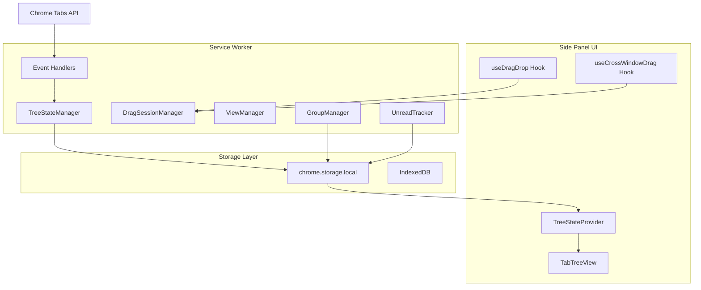
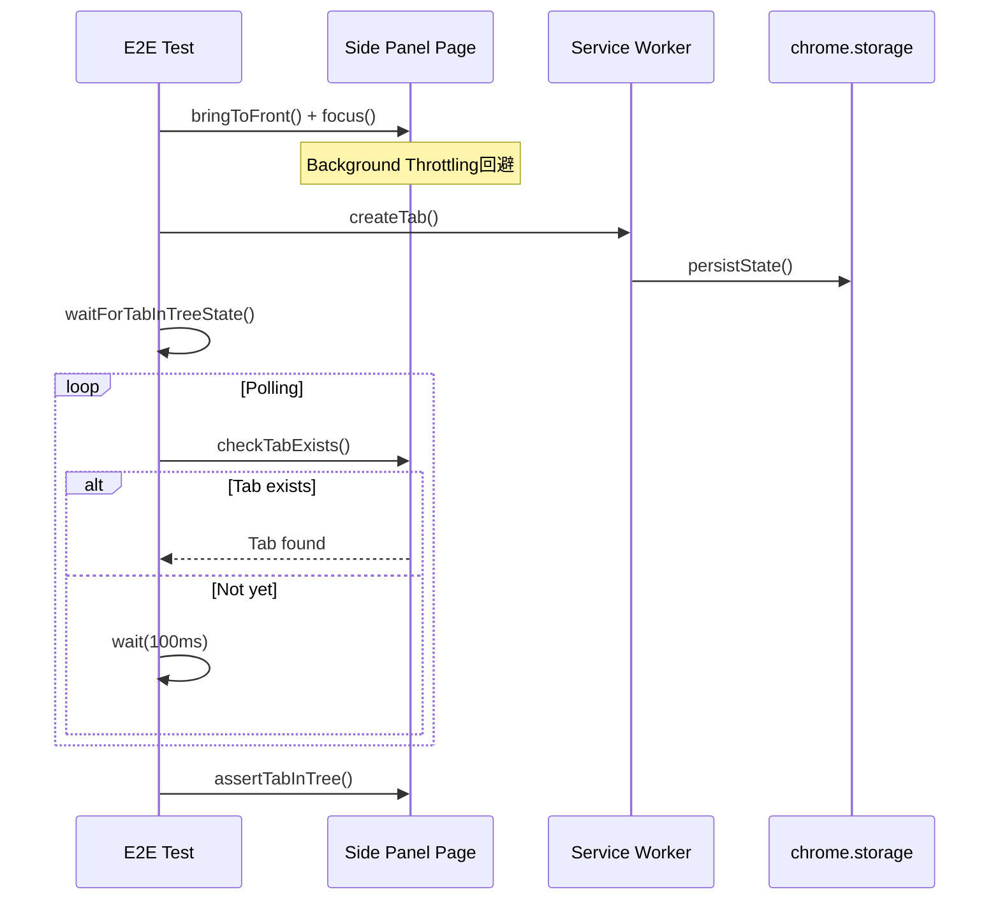
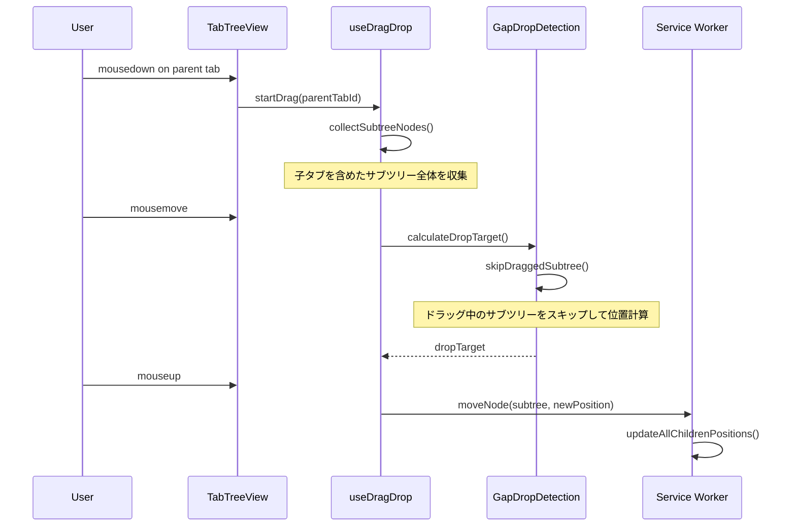
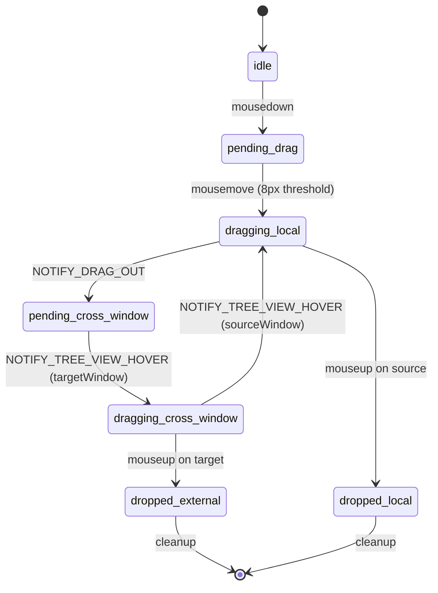
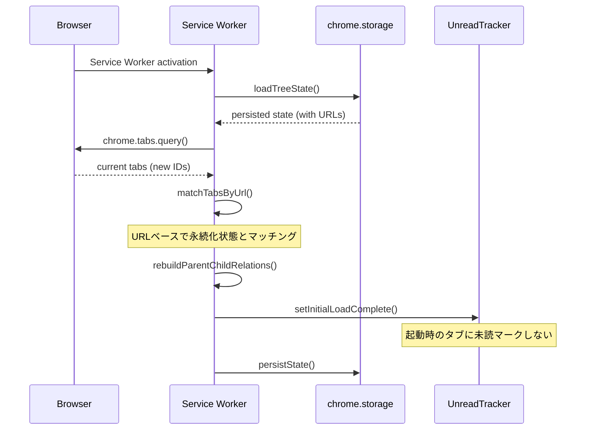
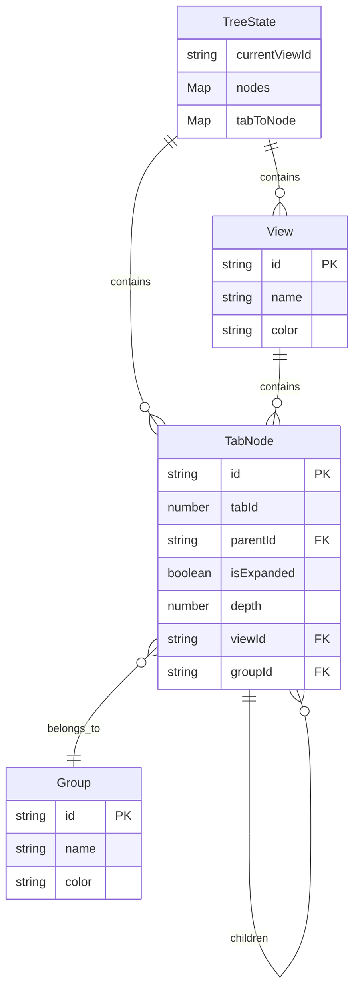

# Technical Design Document

## Overview

**Purpose**: Vivaldi-TTツリー型タブマネージャーの既存実装に存在するバグと動作不良を包括的に修正する。本設計書では、13項目の要件を実現するための技術的アプローチを定義する。

**Users**: Vivaldi-TTを使用するエンドユーザーおよび開発者。エンドユーザーは安定したタブツリー操作を期待し、開発者はCI/CDパイプラインの信頼性を必要とする。

**Impact**: 既存のService Worker、Side Panel UI、および永続化層に対する修正を行う。アーキテクチャの根本的な変更は行わず、既存パターン内でのバグ修正に焦点を当てる。

### Goals
- E2Eテストの100%安定化（`--repeat-each=10`で10回連続成功）
- すべてのドラッグ＆ドロップ操作の正常動作
- タブ親子関係の整合性維持
- ブラウザ再起動後の状態完全復元
- ユーザー設定の正確な反映

### Non-Goals
- アーキテクチャの全面的なリファクタリング
- 新機能の追加
- パフォーマンス最適化（バグ修正に必要な場合を除く）
- 他のブラウザ（Chrome/Edge）への対応拡張

## Architecture

### Existing Architecture Analysis



**現在のアーキテクチャの制約**:
- Service WorkerとSide Panelは独立したコンテキストで動作
- 状態同期はchrome.storage.localのonChangeイベントに依存
- クロスウィンドウ操作はメッセージングで調整

**対処すべき技術的負債**:
- 状態更新時のイミュータビリティ違反
- 非同期処理の競合状態
- E2Eテストでの固定時間待機

### Architecture Pattern & Boundary Map

**Architecture Integration**:
- Selected pattern: 既存のService Worker + Side Panel構成を維持（バグ修正に最適）
- Domain/feature boundaries: Service Worker（状態管理）、Side Panel（UI表示）、Storage（永続化）
- Existing patterns preserved: メッセージングパターン、Providerパターン、イベントハンドラパターン
- New components rationale: 新規コンポーネントは追加しない（既存コンポーネントの修正のみ）
- Steering compliance: TypeScript strict mode、`any`禁止、E2Eテスト品質基準を維持

### Technology Stack

| Layer | Choice / Version | Role in Feature | Notes |
|-------|------------------|-----------------|-------|
| Runtime | Chrome Extensions API (Manifest V3) | タブ操作、永続化、ウィンドウ管理 | 既存維持 |
| Frontend | React 18 + TypeScript 5.5+ | Side Panel UI | 既存維持 |
| Testing | Playwright | E2Eテスト安定化 | ポーリングユーティリティの活用 |
| Storage | chrome.storage.local | ツリー状態、設定、ファビコン永続化 | 既存維持 |

## System Flows

### E2Eテスト安定化フロー



### サブツリードラッグ移動フロー



### クロスウィンドウドラッグフロー



### ブラウザ再起動時の復元フロー



## Requirements Traceability

| Requirement | Summary | Components | Interfaces | Flows |
|-------------|---------|------------|------------|-------|
| 1.1-1.6 | E2Eテスト安定化 | polling-utils.ts, 各spec.ts | waitForTabInTreeState, waitForParentChildRelation | E2Eテスト安定化フロー |
| 2.1-2.8 | サブツリードラッグ移動 | useDragDrop, GapDropDetection, TreeStateManager | calculateDropTarget, moveNode | サブツリードラッグ移動フロー |
| 3.1-3.7 | 新規タブ親子関係維持 | event-handlers.ts, TreeStateManager | handleTabCreated, addTab | - |
| 4.1-4.13 | グループ化機能 | GroupManager, useMenuActions | createGroup, canCreateGroup | - |
| 5.1-5.7 | クロスウィンドウドラッグ | DragSessionManager, useCrossWindowDrag | DragSession state machine | クロスウィンドウドラッグフロー |
| 6.1-6.6 | 空ウィンドウ自動クローズ | event-handlers.ts | tryCloseEmptyWindow | - |
| 7.1-7.7 | ビューへの新規タブ追加 | ViewManager, event-handlers.ts | getCurrentViewId, addTab | - |
| 8.1-8.7 | 親子関係不整合解消 | TreeStateManager | updateNode (immutable) | - |
| 9.1-9.6 | ファビコン永続化復元 | TitlePersistenceService, TabTreeView | saveFavicon, loadFavicons | ブラウザ再起動時の復元フロー |
| 10.1-10.7 | ツリー状態永続化 | TreeStateManager, StorageService | persistState, loadState | ブラウザ再起動時の復元フロー |
| 11.1-11.5 | タブ複製時配置 | event-handlers.ts | pendingDuplicateSources | - |
| 12.1-12.8 | リンクタブ配置設定 | event-handlers.ts, UserSettings | handleTabCreated, getSettings | - |
| 13.1-13.5 | 未読インジケーター復元時制御 | UnreadTracker | initialLoadComplete, markAsUnread | ブラウザ再起動時の復元フロー |

## Components and Interfaces

| Component | Domain/Layer | Intent | Req Coverage | Key Dependencies | Contracts |
|-----------|--------------|--------|--------------|------------------|-----------|
| polling-utils.ts | E2E Testing | 状態変化のポーリング待機 | 1.1-1.6 | Playwright (P0) | - |
| useDragDrop | UI Hooks | ドラッグ＆ドロップ操作 | 2.1-2.8 | GapDropDetection (P0) | State |
| GapDropDetection | UI Utils | ドロップ位置計算 | 2.1-2.8 | - | Service |
| event-handlers.ts | Service Worker | Chromeイベント処理 | 3, 6, 7, 11, 12 | TreeStateManager (P0) | Event |
| TreeStateManager | Services | ツリー状態管理 | 2, 3, 8, 10 | StorageService (P0) | Service, State |
| GroupManager | Services | グループ作成管理 | 4.1-4.13 | chrome.tabs API (P0) | Service |
| DragSessionManager | Service Worker | クロスウィンドウドラッグ管理 | 5.1-5.7 | chrome.alarms (P1) | State |
| ViewManager | Services | ビュー管理 | 7.1-7.7 | StorageService (P0) | Service |
| UnreadTracker | Services | 未読状態追跡 | 13.1-13.5 | StorageService (P0) | Service |
| TitlePersistenceService | Services | タイトル・ファビコン永続化 | 9.1-9.6 | StorageService (P0) | Service |

### E2E Testing Layer

#### polling-utils.ts

| Field | Detail |
|-------|--------|
| Intent | E2Eテストで状態変化を安定して待機するユーティリティ |
| Requirements | 1.1, 1.2, 1.3, 1.4 |

**Responsibilities & Constraints**
- 固定時間待機（`waitForTimeout`）を禁止し、ポーリングで状態確定を待機
- タイムアウトは適切な短さを維持（過度に長いタイムアウトは禁止）
- DOM状態、Service Worker状態、Storage状態の変化を検出

**Dependencies**
- External: Playwright Page API — DOM操作とassertion (P0)
- External: Service Worker — chrome.* API呼び出し (P0)

**Contracts**: Service [x]

##### Service Interface
```typescript
interface PollingUtils {
  waitForTabInTreeState(
    context: ExtensionContext,
    tabId: number,
    options?: { timeout?: number; interval?: number }
  ): Promise<void>;

  waitForParentChildRelation(
    context: ExtensionContext,
    childTabId: number,
    parentTabId: number,
    options?: { timeout?: number; interval?: number }
  ): Promise<void>;

  waitForTabRemovedFromTreeState(
    context: ExtensionContext,
    tabId: number,
    options?: { timeout?: number }
  ): Promise<void>;

  waitForCondition<T>(
    fn: () => Promise<T | null | undefined>,
    options?: { timeout?: number; interval?: number }
  ): Promise<T>;
}
```
- Preconditions: 有効なExtensionContextが存在すること
- Postconditions: 指定した状態が達成されるか、タイムアウトでエラー
- Invariants: ポーリング間隔は100ms以上

**Implementation Notes**
- Integration: 既存のpolling-utils.tsを拡張
- Validation: 各待機関数でタイムアウト時に詳細なエラーメッセージを出力
- Risks: ポーリング間隔が短すぎるとCPU負荷増加

### UI Hooks Layer

#### useDragDrop

| Field | Detail |
|-------|--------|
| Intent | タブのドラッグ＆ドロップ操作を管理 |
| Requirements | 2.1, 2.2, 2.3, 2.4 |

**Responsibilities & Constraints**
- マウスイベントの追跡とドラッグ状態管理
- サブツリー全体の収集とドラッグ
- ドロップ位置の計算と反映

**Dependencies**
- Outbound: GapDropDetection — ドロップ位置計算 (P0)
- Outbound: TreeStateProvider — 状態更新 (P0)
- Outbound: DragSessionManager — クロスウィンドウ調整 (P1)

**Contracts**: State [x]

##### State Management
- State model:
  ```typescript
  interface DragState {
    isDragging: boolean;
    draggedItemId: string | null;
    draggedSubtree: TabNode[]; // サブツリー全体
    dropTarget: DropTarget | null;
  }
  ```
- Persistence: React state（永続化不要）
- Concurrency strategy: 単一ドラッグセッションのみ許可

**Implementation Notes**
- Integration: サブツリー収集時にTreeStateManagerから子ノードを取得
- Validation: ドラッグ開始時にサブツリーの完全性を検証
- Risks: 大量の子タブがある場合のパフォーマンス

#### GapDropDetection

| Field | Detail |
|-------|--------|
| Intent | ドロップ位置の精密な計算 |
| Requirements | 2.1, 2.2, 2.5 |

**Responsibilities & Constraints**
- マウス位置からドロップターゲットを計算
- ドラッグ中のサブツリーをスキップした位置計算
- 折りたたまれた親タブの子タブ高さを考慮

**Dependencies**
- Inbound: useDragDrop — ドロップ位置リクエスト (P0)

**Contracts**: Service [x]

##### Service Interface
```typescript
interface GapDropDetectionService {
  calculateDropTarget(
    mousePosition: { x: number; y: number },
    treeItems: TreeItemRect[],
    draggedSubtreeIds: Set<string>, // ドラッグ中のサブツリーをスキップ
    containerRect: DOMRect
  ): DropTarget | null;
}

interface DropTarget {
  type: 'child' | 'before' | 'after';
  targetNodeId: string;
  insertIndex?: number;
  newDepth?: number;
}
```
- Preconditions: treeItemsが空でないこと
- Postconditions: 有効なドロップ位置またはnull
- Invariants: ドラッグ中のノードはドロップターゲットにならない

**Implementation Notes**
- Integration: ドラッグ中のサブツリーIDセットを受け取り、計算から除外
- Validation: 計算結果が有効な位置かを検証
- Risks: 複雑なツリー構造での計算精度

### Service Worker Layer

#### event-handlers.ts

| Field | Detail |
|-------|--------|
| Intent | Chrome APIイベントの処理とツリー状態への反映 |
| Requirements | 3.1-3.4, 6.1-6.3, 7.1-7.3, 11.1-11.2, 12.1-12.3 |

**Responsibilities & Constraints**
- タブ作成・削除・移動・更新イベントの処理
- 親子関係の維持と設定に基づく配置
- 空ウィンドウの自動クローズ判定

**Dependencies**
- Outbound: TreeStateManager — 状態更新 (P0)
- Outbound: ViewManager — ビューID取得 (P0)
- Outbound: UnreadTracker — 未読状態更新 (P1)
- External: chrome.tabs API — タブ操作 (P0)

**Contracts**: Event [x]

##### Event Contract
- Published events:
  - `STATE_UPDATED` — 状態更新通知をSide Panelへ
- Subscribed events:
  - `chrome.tabs.onCreated` — タブ作成
  - `chrome.tabs.onRemoved` — タブ削除
  - `chrome.tabs.onMoved` — タブ移動
  - `chrome.tabs.onUpdated` — タブ更新
  - `chrome.tabs.onActivated` — タブアクティブ化
- Ordering / delivery guarantees: イベントは受信順に処理

**Implementation Notes**
- Integration: handleTabCreatedで以下を順次実行:
  1. 現在のビューID取得
  2. 親タブ設定の確認（pendingTabParents）
  3. 配置設定（linkOpenPosition）の確認
  4. TreeStateManager.addTab呼び出し
- Validation: タブIDの有効性確認、ビューIDの存在確認
- Risks: 非同期処理の競合状態

#### DragSessionManager

| Field | Detail |
|-------|--------|
| Intent | クロスウィンドウドラッグ操作のセッション管理 |
| Requirements | 5.1, 5.2, 5.3 |

**Responsibilities & Constraints**
- ドラッグセッションの状態マシン管理
- ウィンドウ間のドラッグ状態共有
- セッションタイムアウト処理

**Dependencies**
- External: chrome.alarms API — タイムアウト管理 (P1)
- External: chrome.runtime messaging — ウィンドウ間通信 (P0)

**Contracts**: State [x]

##### State Management
- State model:
  ```typescript
  type DragSessionState =
    | 'idle'
    | 'pending_drag'
    | 'dragging_local'
    | 'pending_cross_window'
    | 'dragging_cross_window'
    | 'dropped_local'
    | 'dropped_external';

  interface DragSession {
    state: DragSessionState;
    tabId: number;
    sourceWindowId: number;
    targetWindowId: number | null;
    treeData: TabNode[];
  }
  ```
- Persistence: メモリ内のみ（セッション中のみ有効）
- Concurrency strategy: 単一セッションのみ許可、新規ドラッグ開始時に既存セッションをクリア

**Implementation Notes**
- Integration: NOTIFY_TREE_VIEW_HOVER受信時にtargetWindowIdを更新し、状態遷移
- Validation: 状態遷移の有効性確認（無効な遷移は拒否）
- Risks: ウィンドウクローズ時のセッションクリーンアップ

### Services Layer

#### TreeStateManager

| Field | Detail |
|-------|--------|
| Intent | タブツリー状態の一元管理と永続化 |
| Requirements | 2.5, 3.1, 8.1, 8.2, 10.1, 10.2, 10.3 |

**Responsibilities & Constraints**
- ツリー状態のイミュータブルな更新
- 親子関係の整合性維持
- ブラウザ再起動後の状態復元

**Dependencies**
- Outbound: StorageService — 永続化 (P0)
- Inbound: event-handlers.ts — 状態更新リクエスト (P0)

**Contracts**: Service [x], State [x]

##### Service Interface
```typescript
interface ITreeStateManager {
  addTab(
    tab: chrome.tabs.Tab,
    parentId: string | null,
    viewId: string
  ): TabNode;

  removeTab(
    tabId: number,
    childBehavior: 'promote' | 'close_all'
  ): void;

  moveNode(
    nodeId: string,
    newParentId: string | null,
    index: number
  ): void;

  updateNode(
    nodeId: string,
    updates: Partial<TabNode>
  ): void; // イミュータブル更新

  persistState(): Promise<void>;
  loadState(): Promise<TreeState | null>;

  matchAndRestoreState(
    currentTabs: chrome.tabs.Tab[],
    persistedState: TreeState
  ): void;
}
```
- Preconditions: 有効なタブ情報またはノードID
- Postconditions: 状態が一貫性を保って更新される
- Invariants: 親子関係の循環なし、ノードIDの一意性

##### State Management
- State model: `Map<string, TabNode>` with immutable updates
- Persistence: chrome.storage.local (`tree_state` key)
- Concurrency strategy: 更新は即時反映、永続化はデバウンス

**Implementation Notes**
- Integration: 状態更新時に新しいオブジェクトを生成（スプレッド演算子使用）
- Validation: 親子関係の循環チェック、ノードの存在確認
- Risks: 大規模ツリーでのメモリ使用量

#### GroupManager

| Field | Detail |
|-------|--------|
| Intent | タブグループの作成と管理 |
| Requirements | 4.1, 4.2, 4.3, 4.4, 4.5, 4.6, 4.7, 4.8 |

**Responsibilities & Constraints**
- グループタブ（親タブ）の作成
- 選択タブの子タブ化
- グループ解散処理

**Dependencies**
- External: chrome.tabs API — タブ作成 (P0)
- External: chrome.runtime API — 拡張機能URL取得 (P0)
- Outbound: TreeStateManager — 親子関係設定 (P0)

**Contracts**: Service [x]

##### Service Interface
```typescript
interface IGroupManager {
  canCreateGroup(selectedCount: number): boolean;

  createGroup(
    tabIds: number[],
    name?: string,
    color?: string
  ): Promise<{ groupTabId: number; groupId: string }>;

  dissolveGroup(groupId: string): Promise<void>;

  determineGroupPosition(nodes: TabNode[]): {
    insertIndex: number;
    parentId: string | null;
  };
}
```
- Preconditions: tabIds.length >= 2 for createGroup
- Postconditions: グループタブが作成され、選択タブが子タブになる
- Invariants: グループタブはgroup.htmlを表示

**Implementation Notes**
- Integration: グループタブURL生成に`chrome.runtime.getURL('group.html')`を使用
- Validation: 選択タブ数の確認、タブ存在確認
- Risks: グループタブ作成の非同期タイミング

#### ViewManager

| Field | Detail |
|-------|--------|
| Intent | ビューの管理と現在ビューの追跡 |
| Requirements | 7.1, 7.2, 7.3 |

**Responsibilities & Constraints**
- 現在のビューIDの一貫した取得
- ビュー切り替え時の状態永続化
- 新規タブへのビューID割り当て

**Dependencies**
- Outbound: StorageService — ビュー状態永続化 (P0)

**Contracts**: Service [x]

##### Service Interface
```typescript
interface IViewManager {
  getCurrentViewId(): string;
  setCurrentViewId(viewId: string): Promise<void>;
  getViews(): View[];
  createView(name: string, color?: string): string;
  deleteView(viewId: string): void;
}
```
- Preconditions: none
- Postconditions: 現在のビューIDが常に有効な値
- Invariants: デフォルトビューは削除不可

**Implementation Notes**
- Integration: getCurrentViewIdはメモリキャッシュを優先し、ストレージにフォールバック
- Validation: ビューIDの存在確認
- Risks: Side Panel間でのビュー状態不整合

#### UnreadTracker

| Field | Detail |
|-------|--------|
| Intent | 未読タブの追跡と起動時制御 |
| Requirements | 13.1, 13.2 |

**Responsibilities & Constraints**
- 起動完了フラグの管理
- 復元タブの未読マーク防止
- 通常の未読判定ルールの適用

**Dependencies**
- Outbound: StorageService — 未読状態永続化 (P0)

**Contracts**: Service [x]

##### Service Interface
```typescript
interface IUnreadTracker {
  setInitialLoadComplete(): void;
  isInitialLoadComplete(): boolean;
  markAsUnread(tabId: number): void;
  markAsRead(tabId: number): void;
  isUnread(tabId: number): boolean;
}
```
- Preconditions: none
- Postconditions: 起動完了前のタブは未読マークされない
- Invariants: initialLoadCompleteは一度trueになると変更不可

**Implementation Notes**
- Integration: Service Worker起動時に早期にsetInitialLoadCompleteを呼び出す
- Validation: タブIDの有効性確認
- Risks: 起動完了判定のタイミング

#### TitlePersistenceService

| Field | Detail |
|-------|--------|
| Intent | タブタイトルとファビコンの永続化・復元 |
| Requirements | 9.1, 9.2, 9.3 |

**Responsibilities & Constraints**
- タイトル・ファビコンの保存（デバウンス処理）
- ブラウザ起動時の早期読み込み
- タブクローズ時のクリーンアップ

**Dependencies**
- Outbound: StorageService — 永続化 (P0)

**Contracts**: Service [x]

##### Service Interface
```typescript
interface ITitlePersistenceService {
  saveTitle(tabId: number, title: string): void;
  saveFavicon(tabId: number, favIconUrl: string): void;
  getTitle(tabId: number): string | undefined;
  getFavicon(tabId: number): string | undefined;
  loadAll(): Promise<void>;
  cleanup(existingTabIds: Set<number>): void;
}
```
- Preconditions: 有効なタブID
- Postconditions: データが永続化される
- Invariants: 保存はデバウンス処理（300ms）

**Implementation Notes**
- Integration: loadAllをService Worker起動直後に呼び出し
- Validation: URLの妥当性確認（ファビコン）
- Risks: 大量タブでのストレージ使用量

## Data Models

### Domain Model



**Business Rules & Invariants**:
- TabNodeの親子関係は循環してはならない
- tabIdはグローバルに一意（ブラウザセッション内）
- デフォルトビューは必ず存在し、削除不可
- グループは最低2つのタブを含む

### Logical Data Model

**Structure Definition**:
- TreeState: ルート集約、すべてのノードとビューを管理
- TabNode: タブの階層構造を表現するエンティティ
- View: タブのフィルタリング単位（仮想ワークスペース）
- Group: タブのグループ化（UIのみの概念）

**Consistency & Integrity**:
- ノード更新時はイミュータブルパターンを使用
- 親子関係の更新は親ノードと子ノードの両方を更新
- ビュー切り替えはフィルタリングのみ（タブの移動なし）

### Physical Data Model

**Storage Schema** (chrome.storage.local):

```typescript
// tree_state キー
interface PersistedTreeState {
  views: Array<{
    id: string;
    name: string;
    color: string;
  }>;
  currentViewId: string;
  nodes: Record<string, {
    id: string;
    tabId: number;
    parentId: string | null;
    children: string[]; // 子ノードIDの配列（復元用）
    isExpanded: boolean;
    depth: number;
    viewId: string;
    groupId?: string;
    url?: string; // URLベースマッチング用
  }>;
}

// tab_titles キー
type TabTitles = Record<number, string>;

// tab_favicons キー
type TabFavicons = Record<number, string>;

// unread_tabs キー
type UnreadTabs = number[];
```

## Error Handling

### Error Strategy
シンプルさを優先し、エッジケースの複雑なエラーハンドリングは行わない（tech.md準拠）。

### Error Categories and Responses
- **Chrome API Errors**: サイレントに無視（タブが既に閉じられている場合など）
- **State Inconsistency**: 同期処理でリカバリー（`syncWithChromeTabs`）
- **Storage Errors**: リトライなし、エラーログのみ

## Testing Strategy

### E2E Tests（Priority: Critical）
- タブ作成・削除の状態同期テスト
- サブツリードラッグ＆ドロップテスト（折りたたみ/展開状態）
- クロスウィンドウドラッグテスト
- ブラウザ再起動後の復元テスト
- グループ化機能テスト

### E2E Test Quality Requirements
すべてのE2Eテストは以下を満たすこと：
- `--repeat-each=10`で10回連続成功
- `waitForTimeout`使用禁止、ポーリング待機を使用
- 適切なタイムアウト設定（過度に長いタイムアウト禁止）
- Background Throttling対策（`bringToFront` + `focus`）

### Unit Tests
- TreeStateManager: イミュータブル更新の検証
- GapDropDetection: ドロップ位置計算の精度テスト
- GroupManager: グループ作成条件の検証
- UnreadTracker: 起動時制御の検証

### Integration Tests
- Service Worker - Side Panel 間のメッセージング
- Storage変更の状態同期
