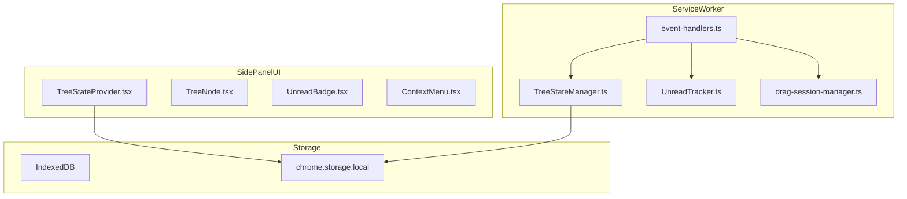
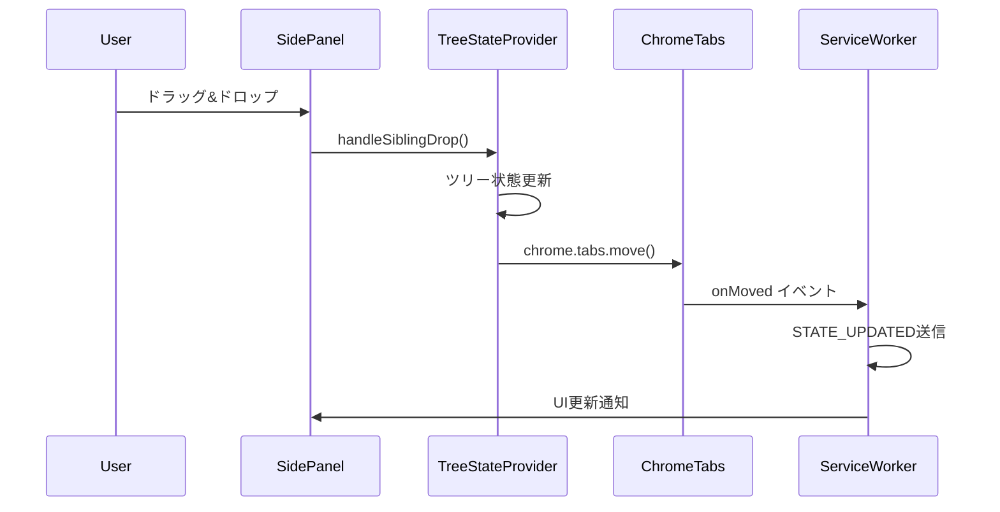
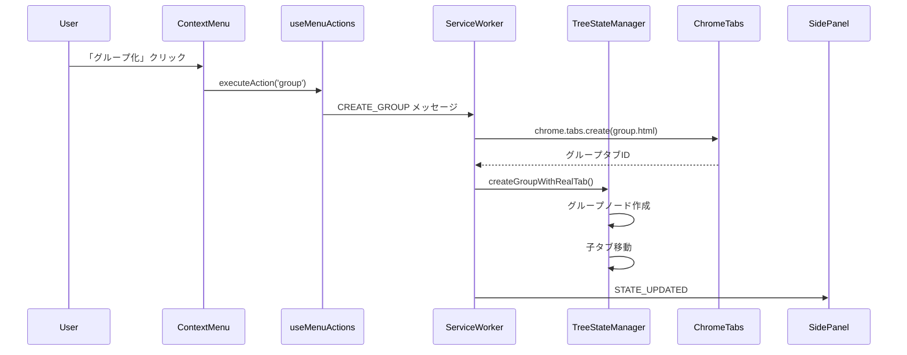
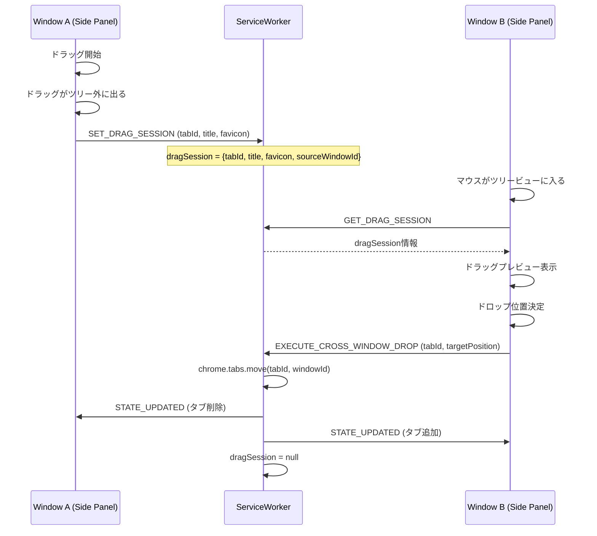
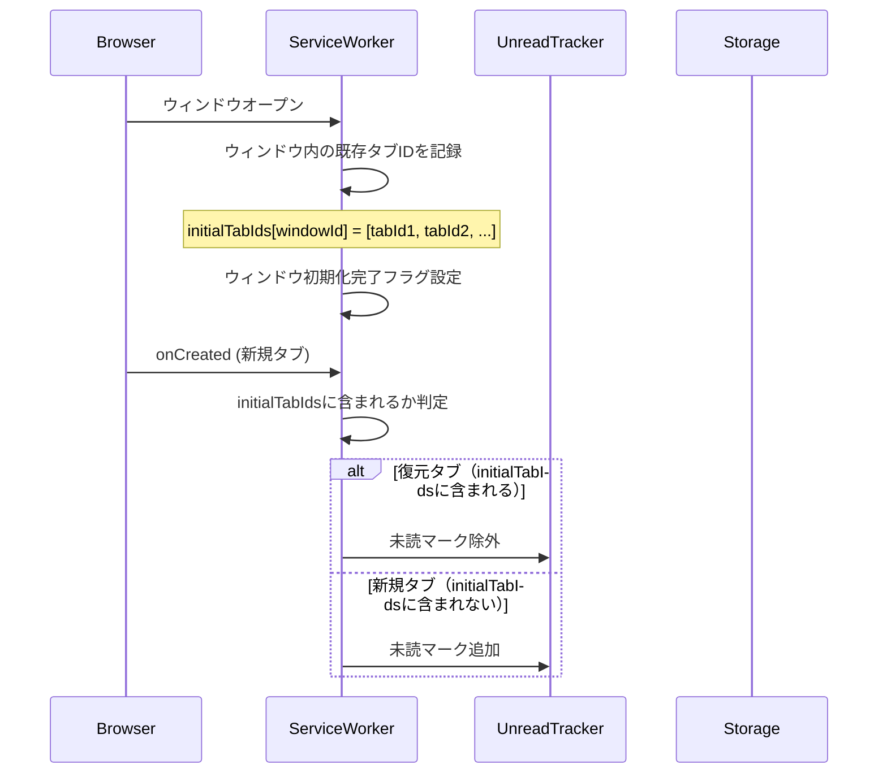

# Technical Design Document

## Overview

**Purpose**: Vivaldi Tree Tab拡張機能で発見された11件のバグ修正およびUX改善を実施し、ユーザーが安定して機能を使用できるようにする。

**Users**: Vivaldiブラウザユーザー、開発者（E2Eテスト）

**Impact**: ドラッグ&ドロップ操作、タブグループ化、ビュー管理、永続化処理、UI表示に関する問題を解決し、信頼性を向上させる。

### Goals
- E2Eテストの安定性向上（フレーキー排除、ポーリングベース待機）
- ドラッグ&ドロップによるタブ並び替えの正常動作
- コンテキストメニューからのタブグループ化の動作修正
- クロスウィンドウドラッグの正常動作
- 空ウィンドウの自動クローズ
- ビューへの新規タブ追加の正常動作
- 設定タブの適切な名前表示
- 未読インジケーターのUI改善（左下三角形）
- ファビコンの永続化復元
- タブ複製時の兄弟配置
- 復元タブの未読除外

### Non-Goals
- 新機能の追加（既存機能の修正のみ）
- アーキテクチャの大幅な変更
- パフォーマンス最適化（動作改善のみ）

## Architecture

### Existing Architecture Analysis

Vivaldi Tree Tabは以下のアーキテクチャを採用:
- **Service Worker** (`src/background/`): タブイベント処理、ツリー状態管理、メッセージハンドリング
- **Side Panel UI** (`src/sidepanel/`): React 18ベースのツリービューUI
- **Shared Services** (`src/services/`): TreeStateManager、UnreadTracker等のビジネスロジック
- **Storage Layer** (`src/storage/`): IndexedDBベースの永続化



### Architecture Pattern & Boundary Map

**Selected pattern**: 既存のService Worker + Side Panel UIパターンを維持
**Domain boundaries**:
- Service Worker: タブ操作、状態管理、永続化
- Side Panel: UI表示、ユーザー入力処理、ドラッグ&ドロップ
**Existing patterns preserved**: メッセージベース通信、ポーリングユーティリティ、Reactコンテキスト
**Steering compliance**: TypeScript strict mode、E2Eテスト必須、polling-utils使用

### Technology Stack

| Layer | Choice / Version | Role in Feature | Notes |
|-------|------------------|-----------------|-------|
| Frontend | React 18 + TypeScript 5.5+ | Side Panel UI | 既存 |
| Backend | Chrome Extensions API (MV3) | Service Worker | 既存 |
| Data | chrome.storage.local | 永続化 | 既存 |
| Testing | Playwright + Vitest | E2E/Unit Test | 既存 |

## System Flows

### タブ並び替えフロー



### タブグループ化フロー



### クロスウィンドウドラッグフロー



### セッション復元フロー（ウィンドウ単位）



## Requirements Traceability

| Requirement | Summary | Components | Interfaces | Flows |
|-------------|---------|------------|------------|-------|
| 1.1, 1.2 | E2Eテストの安定性 | E2Eテストファイル | polling-utils | - |
| 1.3, 1.4, 1.5 | テスト品質基準 | E2Eテストファイル | polling-utils | - |
| 2.1, 2.2, 2.3 | タブ並び替え | TreeStateProvider | handleSiblingDrop | タブ並び替え |
| 3.1, 3.2, 3.3, 3.4 | タブグループ化 | useMenuActions, event-handlers | CREATE_GROUP | タブグループ化 |
| 4.1, 4.2, 4.3 | クロスウィンドウドラッグ | useCrossWindowDrag, DragSessionManager | BEGIN_CROSS_WINDOW_MOVE | - |
| 5.1, 5.2, 5.3 | 空ウィンドウ自動クローズ | event-handlers | CREATE_WINDOW_WITH_SUBTREE | - |
| 6.1, 6.2, 6.3 | ビューへの新規タブ追加 | event-handlers, TreeStateProvider | getCurrentViewId | - |
| 7.1, 7.2 | 設定タブの名前 | settings.html | - | - |
| 8.1, 8.2, 8.3 | 未読インジケーター | UnreadBadge | - | - |
| 9.1, 9.2, 9.3 | ファビコン復元 | TreeStateProvider | loadTabInfoMap | セッション復元 |
| 10.1, 10.2, 10.3 | タブ複製配置 | event-handlers | REGISTER_DUPLICATE_SOURCE | - |
| 11.1, 11.2, 11.3 | 復元タブ未読除外 | event-handlers, UnreadTracker | - | セッション復元 |
| 12.1-12.7 | E2Eテスト品質基準 | E2Eテストファイル | polling-utils | - |

## Components and Interfaces

| Component | Domain/Layer | Intent | Req Coverage | Key Dependencies | Contracts |
|-----------|--------------|--------|--------------|------------------|-----------|
| E2Eテスト修正 | Testing | フレーキーテストの安定化 | 1.1-1.5, 12.1-12.7 | polling-utils (P0) | - |
| TreeStateProvider修正 | UI/Provider | タブ並び替え同期 | 2.1-2.3 | chrome.tabs (P0) | State |
| handleCreateGroup修正 | Background | グループ化機能 | 3.1-3.4 | TreeStateManager (P0) | Service |
| useCrossWindowDrag修正 | UI/Hook | クロスウィンドウドラッグ（Service Worker中継方式） | 4.1-4.3 | DragSessionManager (P0) | Service |
| handleCreateWindowWithSubtree修正 | Background | 空ウィンドウクローズ | 5.1-5.3 | chrome.windows (P0) | Service |
| getCurrentViewId修正 | Background | ビュー維持（原因分析→修正） | 6.1-6.3 | StorageService (P0) | Service |
| settings.html | Settings | 設定タブ名 | 7.1-7.2 | - | - |
| UnreadBadge修正 | UI/Component | 未読UI改善 | 8.1-8.3 | - | - |
| loadTabInfoMap修正 | UI/Provider | ファビコン復元 | 9.1-9.3 | chrome.storage (P0) | - |
| handleTabCreated修正 | Background | タブ複製・復元 | 10.1-10.3, 11.1-11.3 | UnreadTracker (P0) | Service |

### Background Layer

#### handleTabMoved修正

| Field | Detail |
|-------|--------|
| Intent | ブラウザタブ移動時のツリー状態同期 |
| Requirements | 2.1, 2.2, 2.3 |

**Responsibilities & Constraints**
- ブラウザタブの順序変更をツリー状態に反映
- 永続化データとの同期

**Dependencies**
- Inbound: chrome.tabs.onMoved — イベント受信 (P0)
- Outbound: TreeStateManager — 状態更新 (P0)

**Contracts**: Service [x]

##### Service Interface
```typescript
// event-handlers.ts
async function handleTabMoved(
  tabId: number,
  moveInfo: chrome.tabs.TabMoveInfo
): Promise<void>;
```
- Preconditions: tabIdが有効なタブID
- Postconditions: ツリー状態がブラウザタブ順序と同期
- Invariants: 親子関係は維持

**Implementation Notes**
- Integration: 現在は`STATE_UPDATED`送信のみ、ツリー内の位置更新ロジックを追加
- Validation: 移動元・移動先の有効性確認
- Risks: 頻繁な移動操作でのパフォーマンス

#### useCrossWindowDrag修正

| Field | Detail |
|-------|--------|
| Intent | クロスウィンドウドラッグでのタブ移動（Service Worker中継方式） |
| Requirements | 4.1, 4.2, 4.3 |

**Responsibilities & Constraints**
- ドラッグがツリー外に出たときにService Workerへタブ情報を送信
- 別ウィンドウのツリービューでドラッグ情報を取得・表示
- ドロップ実行時にタブを移動

**Dependencies**
- Inbound: DragDropProvider (P0)
- Outbound: DragSessionManager (P0), chrome.tabs (P0)

**Contracts**: Service [x]

##### Service Interface
```typescript
// メッセージ型
type SetDragSessionMessage = {
  type: 'SET_DRAG_SESSION';
  data: { tabId: number; title: string; favicon: string; sourceWindowId: number };
};

type GetDragSessionMessage = {
  type: 'GET_DRAG_SESSION';
};

type ExecuteCrossWindowDropMessage = {
  type: 'EXECUTE_CROSS_WINDOW_DROP';
  data: { tabId: number; targetWindowId: number; targetPosition: number };
};
```
- Preconditions: ドラッグ中のタブが有効
- Postconditions: タブが移動先ウィンドウに移動、両ウィンドウのツリービューが更新
- Invariants: ドラッグセッションは一度に1つのみ

**Implementation Notes**
- Integration: Service Workerがドラッグセッション情報を保持し、各ウィンドウのSide Panelが必要に応じて取得
- Validation: 移動元・移動先ウィンドウの有効性、タブIDの存在確認
- Risks: ドラッグ中にウィンドウが閉じられた場合のクリーンアップ

#### handleCreateGroup修正

| Field | Detail |
|-------|--------|
| Intent | コンテキストメニューからのグループ作成 |
| Requirements | 3.1, 3.2, 3.3, 3.4 |

**Responsibilities & Constraints**
- グループタブの実タブ作成
- 選択タブの子要素化
- グループページ（group.html）のロード

**Dependencies**
- Inbound: CREATE_GROUP メッセージ (P0)
- Outbound: TreeStateManager.createGroupWithRealTab (P0)
- External: chrome.tabs.create (P0)

**Contracts**: Service [x]

##### Service Interface
```typescript
// event-handlers.ts
async function handleCreateGroup(
  tabIds: number[],
  sendResponse: (response: MessageResponse<unknown>) => void
): Promise<void>;
```
- Preconditions: tabIds.length > 0
- Postconditions: グループタブが作成され、選択タブが子要素になる
- Invariants: グループページURLは`chrome-extension://xxx/group.html?tabId=xxx`形式

**Implementation Notes**
- Integration: レースコンディション対策としてバックグラウンド作成→状態更新→アクティブ化の順序を維持
- Validation: タブIDの有効性確認
- Risks: グループタブ作成失敗時のロールバック

#### ビュー維持機能修正

| Field | Detail |
|-------|--------|
| Intent | ビューを開いた状態で新規タブを追加したときにビューが閉じない |
| Requirements | 6.1, 6.2, 6.3 |

**Responsibilities & Constraints**
- 新規タブ作成時のビュー状態維持
- 新規タブの現在ビューへの追加

**Dependencies**
- Inbound: chrome.tabs.onCreated (P0)
- Outbound: StorageService (P0), TreeStateProvider (P0)

**Contracts**: Service [x]

**Implementation Notes**
- **原因分析フェーズ**: まず既存コードを調査し、新規タブ作成時にビューが閉じる根本原因を特定する
  - タブ作成時のイベントハンドリングフロー
  - ビュー状態の管理・更新ロジック
  - 状態更新のタイミング問題の有無
- **修正フェーズ**: 原因特定後、対症療法ではなく根本原因に対処する修正を実施
- Risks: 原因が複数箇所にまたがる可能性

#### handleTabCreated修正（復元タブ対応）

| Field | Detail |
|-------|--------|
| Intent | セッション復元タブの未読除外、複製タブの兄弟配置 |
| Requirements | 10.1, 10.2, 10.3, 11.1, 11.2, 11.3 |

**Responsibilities & Constraints**
- ウィンドウ単位でのセッション復元タブの識別
- 復元タブの未読マーク除外
- 複製タブの兄弟として配置

**Dependencies**
- Inbound: chrome.tabs.onCreated (P0)
- Outbound: UnreadTracker (P0), TreeStateManager (P0)

**Contracts**: Service [x]

##### Service Interface
```typescript
// event-handlers.ts
export async function handleTabCreated(tab: chrome.tabs.Tab): Promise<void>;

// ウィンドウ初期化時のタブID記録用
const initialTabIdsByWindow: Map<number, Set<number>> = new Map();
```
- Preconditions: tab.idが有効
- Postconditions: タブがツリーに追加、復元タブは既読状態
- Invariants: 複製タブは元タブの兄弟として配置

**Implementation Notes**
- Integration: ウィンドウが開いた時点で、そのウィンドウ内の既存タブIDを`initialTabIdsByWindow`に記録。`onCreated`イベントで追加されるタブがこのセットに含まれていれば復元タブ、含まれていなければ新規タブとして判定
- Validation: ウィンドウIDとタブIDの有効性確認
- Risks: ウィンドウ初期化完了の検出タイミング

### UI Layer

#### UnreadBadge修正

| Field | Detail |
|-------|--------|
| Intent | 未読インジケーターの位置・形状変更 |
| Requirements | 8.1, 8.2, 8.3 |

**Responsibilities & Constraints**
- 左下角に三角形切り欠きで表示
- タブ要素に重なる形で配置

**Dependencies**
- Inbound: isUnread prop (P0)

**Contracts**: State [x]

##### State Management
```typescript
// UnreadBadge.tsx - Props
interface UnreadBadgeProps {
  isUnread: boolean;
  showIndicator: boolean;
  className?: string;
}
```
- State model: propsベースのステートレスコンポーネント
- Persistence: なし（親コンポーネントから受け取る）

**Implementation Notes**
- Integration: CSSの`::before`疑似要素で三角形を実装
- Validation: isUnread && showIndicatorの両方がtrueの場合のみ表示
- Risks: スタイリングの他コンポーネントへの影響

#### loadTabInfoMap修正

| Field | Detail |
|-------|--------|
| Intent | ファビコンの永続化復元 |
| Requirements | 9.1, 9.2, 9.3 |

**Responsibilities & Constraints**
- ストレージから永続化されたファビコンを取得
- タブがロードされていない状態でも表示

**Dependencies**
- Inbound: chrome.storage.local (P0)
- External: STORAGE_KEYS.TAB_FAVICONS (P0)

**Contracts**: State [x]

##### State Management
```typescript
// TreeStateProvider.tsx
const loadTabInfoMap = useCallback(async () => {
  const persistedFavicons = await chrome.storage.local.get(STORAGE_KEYS.TAB_FAVICONS);
  // ...
}, []);
```
- State model: tabInfoMap Record
- Persistence: chrome.storage.local
- Concurrency: useCallbackでメモ化

**Implementation Notes**
- Integration: 永続化ファビコンを優先して使用、ロード後は新しいファビコンで上書き
- Validation: ファビコンURLの有効性
- Risks: 大量タブ時のストレージ読み込み遅延

### Testing Layer

#### E2Eテスト安定化

| Field | Detail |
|-------|--------|
| Intent | フレーキーテストの修正と安定性確保 |
| Requirements | 1.1-1.5, 12.1-12.7 |

**Responsibilities & Constraints**
- 固定時間待機の排除
- ポーリングベース待機の使用
- Chrome Background Throttling対策

**Dependencies**
- External: polling-utils.ts (P0)

**Contracts**: - (テストコード)

**Implementation Notes**
- Integration: `waitForCondition`, `waitForTabInTreeState`等のポーリングユーティリティを使用
- Validation: `--repeat-each=10`で10回連続成功
- Risks: テスト実行時間の増加

### Static Files

#### settings.html修正

| Field | Detail |
|-------|--------|
| Intent | 設定タブに適切な名前を表示 |
| Requirements | 7.1, 7.2 |

**Implementation Notes**
- HTMLの`<title>`タグに「設定」を設定
- 既存のReact SPAエントリポイントとして機能

## Data Models

### Domain Model

本仕様は既存のデータモデルに変更を加えない。以下は参照のみ:

- **TabNode**: タブのツリーノード表現
- **TreeState**: ツリー全体の状態
- **UnreadTracker**: 未読タブIDのセット管理

### Physical Data Model

**chrome.storage.local キー**:
- `tree_state`: TreeState オブジェクト
- `tab_titles`: Record<number, string> タブタイトル永続化
- `tab_favicons`: Record<number, string> ファビコンURL永続化
- `unread_tabs`: number[] 未読タブIDリスト
- `groups`: Record<string, Group> グループ情報

## Error Handling

### Error Strategy

各コンポーネントで適切なエラーハンドリングを実装:

### Error Categories and Responses

**User Errors (4xx)**:
- 無効なタブID → 操作無視、コンソールログ
- グループ化対象タブなし → エラーメッセージ返却

**System Errors (5xx)**:
- chrome.tabs API失敗 → エラーログ、操作中止
- ストレージ読み書き失敗 → フォールバック値使用

**Business Logic Errors**:
- 循環参照検出 → 操作無視
- セッション復元判定失敗 → 安全側（未読マークなし）にフォールバック

## Testing Strategy

### Unit Tests
- UnreadBadge: 三角形インジケーター表示条件
- handleTabCreated: セッション復元判定ロジック
- handleTabMoved: ツリー状態更新ロジック

### Integration Tests
- グループ化フロー: メッセージ送受信、状態更新
- クロスウィンドウドラッグ: セッション管理、タブ移動

### E2E Tests（必須）
- tab-grouping.spec.ts:853 の安定化
- tab-persistence.spec.ts:201 の安定化
- 各要件に対応するE2Eテスト追加
- `--repeat-each=10`で10回連続成功検証

### E2Eテスト品質基準
- 固定時間待機（waitForTimeout）禁止
- ポーリングベース待機（polling-utils.ts）使用
- Chrome Background Throttling対策実施
- 必要十分な短い実行時間
