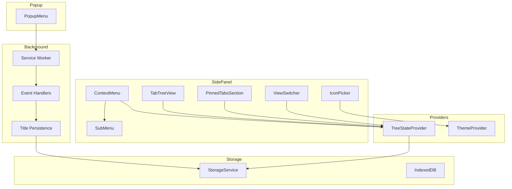
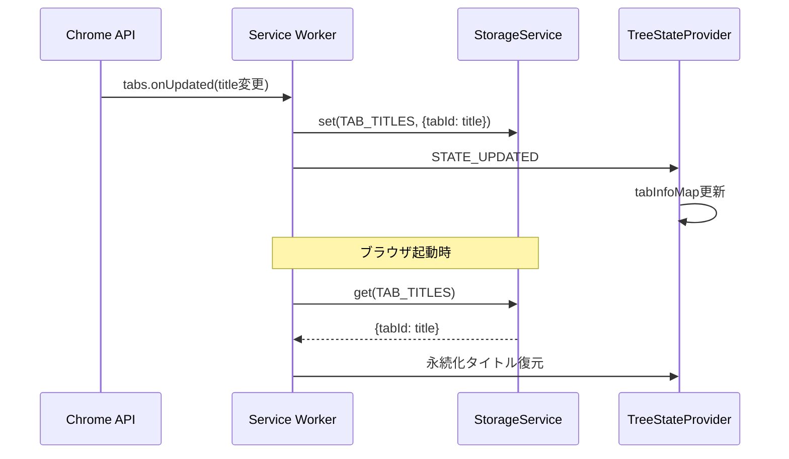
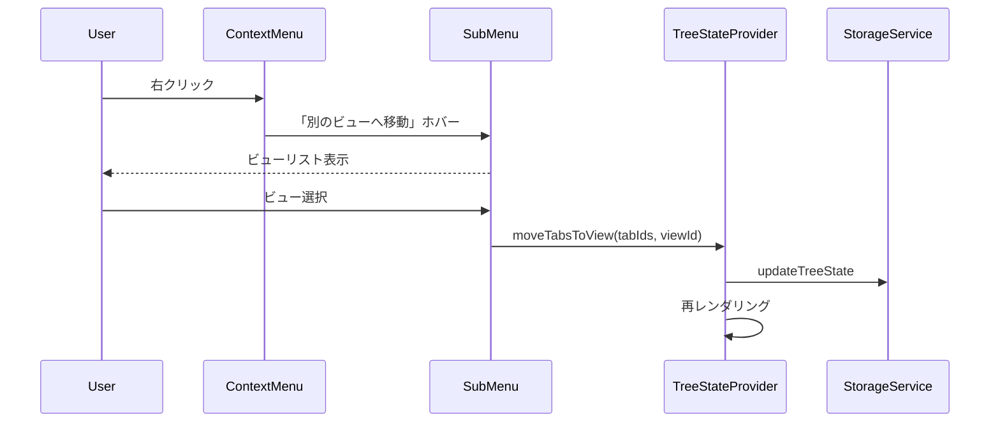

# Design Document

## Overview

**Purpose**: 本機能はVivaldi-TT（ツリー型タブマネージャー）の実使用で発見された21のUX問題を修正し、操作性と一貫性を大幅に向上させる。

**Users**: Vivaldiブラウザユーザーがタブの階層管理、ビュー切り替え、スナップショット取得などの日常的なワークフローで本機能を利用する。

**Impact**: ピン留めタブ、ドラッグ&ドロップ、ビュー機能、設定アクセス方法など、既存UIの動作を改善・拡張し、直感的で一貫した操作体験を提供する。

### Goals
- ピン留めタブの閉じるボタン非表示化と操作の一貫性確保
- タブタイトルの永続化による再起動後のタブ識別性向上
- ドラッグ&ドロップ操作の安定性と精度向上
- ビュー機能の拡張（スクロール切り替え、タブ数表示、カスタムアイコン）
- ポップアップメニューによる設定・スナップショット機能へのアクセス改善

### Non-Goals
- タブグループのChrome Tab Groups APIとの完全互換（独自のツリー内グループ実装を維持）
- 複数ウィンドウ間でのツリー状態同期（単一ウィンドウスコープを維持）
- キーボードショートカットの追加（本仕様の範囲外）

## Architecture

### Existing Architecture Analysis

現行システムは以下の構成を採用している：

- **Chrome Extension Manifest V3**: Service Worker + Side Panel構成
- **状態管理**: React Context（TreeStateProvider, ThemeProvider）
- **メッセージング**: `chrome.runtime.sendMessage`による双方向通信
- **ストレージ**: `chrome.storage.local`（ツリー状態）、IndexedDB（スナップショット）

本仕様の要件はすべて既存アーキテクチャを維持したまま、コンポーネント単位の拡張で対応する。

### Architecture Pattern & Boundary Map



**Architecture Integration**:
- Selected pattern: 既存React Context + Service Workerパターンの維持・拡張
- Domain/feature boundaries: UI（Side Panel / Popup）、状態管理（Providers）、バックグラウンド処理（Service Worker）の明確な分離
- Existing patterns preserved: TreeStateProviderによる状態集中管理、メッセージングによるBackground/UI間通信
- New components rationale:
  - `PopupMenu`: 要件20-21に対応、設定・スナップショットへのアクセス提供
  - `SubMenu`: 要件18に対応、汎用サブメニューコンポーネント
  - `IconPicker`: 要件19に対応、カスタムアイコン選択UI
  - `TitlePersistence`: 要件5に対応、タブタイトル永続化ロジック
- Steering compliance: TypeScript strict mode、anyの使用禁止、E2Eテスト必須を遵守

### Technology Stack

| Layer | Choice / Version | Role in Feature | Notes |
|-------|------------------|-----------------|-------|
| Frontend | React 18 + TypeScript 5.5+ | UIコンポーネント拡張 | 既存スタック維持 |
| Icons | lucide-react | カスタムアイコン提供 | MIT License、tree-shaking対応 |
| DnD | @dnd-kit/core | ドラッグ&ドロップ改善 | 既存ライブラリ活用 |
| Storage | chrome.storage.local | タブタイトル永続化 | 既存StorageService拡張 |
| Testing | Playwright | E2Eテスト | 既存フレームワーク維持 |

## System Flows

### タブタイトル永続化フロー



### ビュー移動フロー（コンテキストメニュー）



## Requirements Traceability

| Requirement | Summary | Components | Interfaces | Flows |
|-------------|---------|------------|------------|-------|
| 1.1-1.5 | ピン留めタブ動作改善 | PinnedTabsSection | - | - |
| 1.6-1.7 | ピン留め解除メニュー | ContextMenu | - | - |
| 2.1-2.3 | 古いタブデータクリーンアップ | TreeStateManager | syncWithChromeTabs | - |
| 3.1-3.3 | 閉じるボタン位置改善 | TreeNode | - | - |
| 4.1-4.4 | タブタイトル表示改善 | TreeNode, TreeStateProvider | - | - |
| 5.1-5.4 | タブタイトル永続化 | TitlePersistence, StorageService | - | タイトル永続化フロー |
| 6.1-6.2 | 新規ウィンドウドロップエリア削除 | ExternalDropZone削除 | - | - |
| 7.1-7.2 | ドラッグ時スクロール制御 | TabTreeView | - | - |
| 8.1-8.4 | ドロップ判定領域改善 | GapDropDetection | - | - |
| 9.1-9.3 | スクロールバー改善 | TabTreeView (CSS) | - | - |
| 10.1-10.3 | タブグループ仕様変更 | GroupSection削除, TreeNode | - | - |
| 11.1-11.3 | テキスト選択無効化 | TreeNode (CSS) | - | - |
| 12.1-12.3 | 複数タブグループ化 | ContextMenu, useMenuActions | createGroup | - |
| 13.1-13.3 | 起動時未読バッジ制御 | UnreadTracker, EventHandlers | - | - |
| 14.1-14.3 | ドラッグ中タブサイズ安定化 | TreeNode (CSS) | - | - |
| 15.1-15.3 | ビュー切り替え修正 | ViewSwitcher, TreeStateProvider | - | - |
| 16.1-16.3 | ビュースクロール切り替え | ViewSwitcher | onWheel | - |
| 17.1-17.3 | ビュータブ数表示 | ViewSwitcher | - | - |
| 18.1-18.3 | コンテキストメニューからビュー移動 | ContextMenu, SubMenu | moveToView | ビュー移動フロー |
| 19.1-19.4 | ビューカスタムアイコン | IconPicker, ViewEditModal | - | - |
| 20.1-20.4 | 設定ボタン配置変更 | PopupMenu, SettingsButton削除 | - | - |
| 21.1-21.3 | ポップアップからスナップショット | PopupMenu | createSnapshot | - |

## Components and Interfaces

| Component | Domain/Layer | Intent | Req Coverage | Key Dependencies | Contracts |
|-----------|--------------|--------|--------------|------------------|-----------|
| PinnedTabsSection | UI | ピン留めタブ表示（閉じるボタン非表示化） | 1.1-1.5 | TreeStateProvider (P0) | - |
| ContextMenu | UI | 拡張コンテキストメニュー | 1.6-1.7, 12.1-12.3, 18.1-18.3 | SubMenu (P1), useMenuActions (P0) | - |
| SubMenu | UI | 汎用サブメニューコンポーネント | 18.1-18.3 | - | State |
| TreeNode | UI | タブ表示改善（閉じるボタン位置、テキスト選択無効化） | 3.1-3.3, 4.1-4.4, 11.1-11.3, 14.1-14.3 | TreeStateProvider (P0) | - |
| ViewSwitcher | UI | ビュー切り替えUI拡張 | 15.1-15.3, 16.1-16.3, 17.1-17.3 | TreeStateProvider (P0) | State |
| IconPicker | UI | カスタムアイコン選択 | 19.1-19.4 | lucide-react (P1) | State |
| PopupMenu | UI | ポップアップメニュー | 20.1-20.4, 21.1-21.3 | SnapshotManager (P1) | - |
| TitlePersistence | Service | タブタイトル永続化 | 5.1-5.4 | StorageService (P0) | Service |
| UnreadTracker | Service | 未読バッジ制御改善 | 13.1-13.3 | StorageService (P0) | Service |
| TreeStateManager | Service | 古いタブクリーンアップ | 2.1-2.3 | StorageService (P0) | Service |

### UI Layer

#### PinnedTabsSection

| Field | Detail |
|-------|--------|
| Intent | ピン留めタブをファビコンサイズで表示（閉じるボタンを常に非表示化） |
| Requirements | 1.1, 1.2, 1.3, 1.4, 1.5 |

**Responsibilities & Constraints**
- ピン留めタブのファビコン表示
- 閉じるボタンを非表示（要件1.1対応）
- ツリー一覧からのピン留めタブ除外は既存動作を維持

**Dependencies**
- Inbound: TreeStateProvider — pinnedTabIds, tabInfoMap取得 (P0)

**Contracts**: State [ ]

**Implementation Notes**
- Integration: 既存コンポーネントの条件変更のみ（閉じるボタン非表示化）
- Validation: 空配列時は非表示

#### ContextMenu

| Field | Detail |
|-------|--------|
| Intent | タブ右クリックメニュー（サブメニュー対応追加） |
| Requirements | 1.6, 1.7, 12.1, 12.2, 12.3, 18.1, 18.2, 18.3 |

**Responsibilities & Constraints**
- 既存メニュー項目の維持
- 「別のビューへ移動」サブメニュー追加
- 複数選択時のグループ化強化

**Dependencies**
- Inbound: TreeStateProvider — selectedNodeIds, views取得 (P0)
- Outbound: SubMenu — サブメニュー表示 (P1)
- Outbound: useMenuActions — アクション実行 (P0)

**Contracts**: State [ ]

**Implementation Notes**
- Integration: SubMenuコンポーネントを「別のビューへ移動」項目にネスト
- Validation: 現在のビューはサブメニューから除外

#### SubMenu

| Field | Detail |
|-------|--------|
| Intent | ホバーで展開する汎用サブメニュー |
| Requirements | 18.1, 18.2, 18.3 |

**Responsibilities & Constraints**
- 親メニュー項目ホバーで子メニュー表示
- 画面端での位置自動調整
- キーボードナビゲーション対応

**Dependencies**
- Inbound: ContextMenu — 表示トリガー (P0)

**Contracts**: State [x]

##### State Management

```typescript
interface SubMenuProps {
  /** サブメニューのラベル */
  label: string;
  /** サブメニュー項目 */
  items: SubMenuItem[];
  /** 項目選択時のコールバック */
  onSelect: (itemId: string) => void;
  /** 親メニューからの相対位置 */
  parentRect: DOMRect;
}

interface SubMenuItem {
  id: string;
  label: string;
  disabled?: boolean;
}
```

**Implementation Notes**
- Integration: ContextMenu内で`onMouseEnter`/`onMouseLeave`で表示切り替え
- Risks: 画面端でのポジショニング計算が複雑

#### TreeNode

| Field | Detail |
|-------|--------|
| Intent | 個別タブの表示（閉じるボタン位置、テキスト選択無効化、サイズ安定化） |
| Requirements | 3.1, 3.2, 3.3, 4.1, 4.2, 4.3, 4.4, 11.1, 11.2, 11.3, 14.1, 14.2, 14.3 |

**Responsibilities & Constraints**
- 閉じるボタンをタブ右端に固定（`justify-end`）
- テキスト選択を無効化（`user-select: none`）
- ドラッグ中の他タブサイズ維持

**Dependencies**
- Inbound: TreeStateProvider — tabInfo取得 (P0)
- Inbound: DragDropContext — ドラッグ状態 (P0)

**Contracts**: State [ ]

**Implementation Notes**
- Integration: CSS変更が中心（Tailwind クラス追加）
- Validation: ピン留めタブには閉じるボタン非表示

#### ViewSwitcher

| Field | Detail |
|-------|--------|
| Intent | ビュー切り替えUI（スクロール切り替え、タブ数表示追加） |
| Requirements | 15.1, 15.2, 15.3, 16.1, 16.2, 16.3, 17.1, 17.2, 17.3 |

**Responsibilities & Constraints**
- ファビコンサイズのビューボタン表示
- マウスホイールでビュー切り替え
- 各ビューのタブ数をバッジ表示

**Dependencies**
- Inbound: TreeStateProvider — views, currentViewId, nodes取得 (P0)

**Contracts**: State [x]

##### State Management

```typescript
interface ViewSwitcherProps {
  views: View[];
  currentViewId: string;
  /** 各ビューのタブ数 */
  tabCounts: Record<string, number>;
  onViewSwitch: (viewId: string) => void;
  onViewCreate: () => void;
  onViewDelete: (viewId: string) => void;
  onViewUpdate: (viewId: string, updates: Partial<View>) => void;
}
```

**Implementation Notes**
- Integration: `onWheel`ハンドラ追加、タブ数計算はTreeStateProviderで実施
- Validation: 最初/最後のビューでスクロール停止

#### IconPicker

| Field | Detail |
|-------|--------|
| Intent | カスタムアイコン選択UI |
| Requirements | 19.1, 19.2, 19.3, 19.4 |

**Responsibilities & Constraints**
- カテゴリ別アイコングリッド表示
- 選択アイコンのプレビュー
- URL入力によるファビコン取得オプション

**Dependencies**
- External: lucide-react — アイコンセット (P1)

**Contracts**: State [x]

##### State Management

```typescript
interface IconPickerProps {
  /** 現在選択中のアイコン（URLまたはアイコン名） */
  currentIcon: string | undefined;
  /** アイコン選択時のコールバック */
  onSelect: (icon: string) => void;
  /** キャンセル時のコールバック */
  onCancel: () => void;
}

/** アイコンカテゴリ */
type IconCategory = 'work' | 'hobby' | 'social' | 'dev' | 'general';
```

**Implementation Notes**
- Integration: ViewEditModalから呼び出し
- Risks: アイコン数が多い場合のパフォーマンス（仮想スクロール検討）

#### PopupMenu

| Field | Detail |
|-------|--------|
| Intent | ブラウザアクションクリック時のポップアップメニュー |
| Requirements | 20.1, 20.2, 20.3, 20.4, 21.1, 21.2, 21.3 |

**Responsibilities & Constraints**
- 「設定を開く」ボタン表示
- 「スナップショットを取得」ボタン表示
- 操作完了通知

**Dependencies**
- External: chrome.runtime.openOptionsPage — 設定ページ表示 (P0)
- Outbound: SnapshotManager — スナップショット作成 (P1)

**Contracts**: State [ ]

**Implementation Notes**
- Integration: manifest.jsonにaction.default_popup追加
- Validation: スナップショット完了時にトースト表示

### Service Layer

#### TitlePersistence

| Field | Detail |
|-------|--------|
| Intent | タブタイトルの永続化と復元 |
| Requirements | 5.1, 5.2, 5.3, 5.4 |

**Responsibilities & Constraints**
- タブタイトル変更時にストレージ保存
- ブラウザ起動時に永続化タイトル復元
- タブ削除時にタイトルデータ削除

**Dependencies**
- Outbound: StorageService — データ永続化 (P0)

**Contracts**: Service [x]

##### Service Interface

```typescript
interface TitlePersistenceService {
  /** タイトルを永続化 */
  saveTitle(tabId: number, title: string): Promise<void>;
  /** 永続化タイトルを取得 */
  getTitle(tabId: number): Promise<string | undefined>;
  /** 全タイトルを取得（起動時復元用） */
  getAllTitles(): Promise<Record<number, string>>;
  /** タイトルを削除 */
  removeTitle(tabId: number): Promise<void>;
  /** 存在しないタブのタイトルをクリーンアップ */
  cleanup(existingTabIds: number[]): Promise<void>;
}
```

- Preconditions: tabIdは正の整数、titleは空文字列可
- Postconditions: ストレージに永続化完了
- Invariants: タブ削除後はタイトルデータも削除

#### UnreadTracker（拡張）

| Field | Detail |
|-------|--------|
| Intent | 未読バッジ制御（起動時制御追加） |
| Requirements | 13.1, 13.2, 13.3 |

**Responsibilities & Constraints**
- 既存: バックグラウンドタブを未読マーク
- 追加: ブラウザ起動時の既存タブは未読マークしない

**Dependencies**
- Outbound: StorageService — 未読状態永続化 (P0)

**Contracts**: Service [x]

##### Service Interface

```typescript
interface UnreadTrackerExtension {
  /** 起動完了フラグを設定 */
  setInitialLoadComplete(): void;
  /** 起動完了かどうかを取得 */
  isInitialLoadComplete(): boolean;
}
```

- Preconditions: Service Worker初期化後に呼び出し
- Postconditions: 以降のタブ作成は未読マーク対象
- Invariants: 起動完了フラグはセッション中変化しない

#### TreeStateManager（拡張）

| Field | Detail |
|-------|--------|
| Intent | ツリー状態管理（古いタブクリーンアップ追加） |
| Requirements | 2.1, 2.2, 2.3 |

**Responsibilities & Constraints**
- 既存: ツリー状態の管理・永続化
- 追加: ブラウザ起動時に存在しないタブを自動削除

**Dependencies**
- Outbound: StorageService — ツリー状態永続化 (P0)
- External: chrome.tabs.query — 現在のタブ一覧取得 (P0)

**Contracts**: Service [x]

##### Service Interface

```typescript
interface TreeStateManagerExtension {
  /** 存在しないタブをクリーンアップ */
  cleanupStaleNodes(): Promise<number>;
}
```

- Preconditions: chrome.tabs.queryが利用可能
- Postconditions: 存在しないタブノードが削除される
- Invariants: 有効なタブノードは削除されない

## Data Models

### Domain Model

#### タブタイトル永続化

```typescript
/** ストレージキー追加 */
const STORAGE_KEYS = {
  // 既存キー...
  TAB_TITLES: 'tab_titles',  // 新規追加
} as const;

/** タブタイトルマップ */
type TabTitlesMap = Record<number, string>;
```

- Aggregate: TabTitlesMapは独立したストレージエントリ
- Invariants: tabIdは一意、削除されたタブのエントリは存在しない

#### ビュータブ数

```typescript
/** ビューごとのタブ数（派生データ、永続化不要） */
type ViewTabCounts = Record<string, number>;
```

- 計算: TreeStateのnodesから各viewIdでグループ化してカウント

### Logical Data Model

**構造定義**:
- `tab_titles`: `Record<number, string>` — tabId → title のマッピング
- 既存のtree_stateは変更なし

**一貫性**:
- タブ削除時にtab_titlesからも対応エントリを削除
- 起動時のクリーンアップで孤立エントリを削除

## Error Handling

### Error Strategy

| エラー種別 | 対応 | ユーザー通知 |
|-----------|------|-------------|
| タイトル永続化失敗 | サイレント失敗（次回再試行） | なし |
| スナップショット取得失敗 | エラートースト表示 | 「スナップショットの取得に失敗しました」 |
| ビュー移動失敗 | ロールバック | 「タブの移動に失敗しました」 |
| アイコン読み込み失敗 | デフォルトアイコンにフォールバック | なし |

### Monitoring

- 既存のconsole.errorロギングを維持
- 新規エラーも同様のパターンで記録

## Testing Strategy

### Unit Tests
- `TitlePersistence.saveTitle()`: タイトル保存と取得
- `TitlePersistence.cleanup()`: 孤立エントリ削除
- `UnreadTracker.setInitialLoadComplete()`: 起動フラグ動作
- `SubMenu`: ホバー表示/非表示
- `IconPicker`: カテゴリ切り替え、選択コールバック

### Integration Tests
- ContextMenu + SubMenu: サブメニュー展開と項目選択
- ViewSwitcher + TreeStateProvider: スクロール切り替え
- PopupMenu + SnapshotManager: スナップショット作成フロー

### E2E Tests
- ピン留めタブ: 閉じるボタン非表示確認
- ビュー切り替え: ホイールスクロールでの切り替え
- タブタイトル永続化: ブラウザ再起動後のタイトル復元
- ポップアップメニュー: 設定ページ表示、スナップショット取得

### E2E Test Considerations
- **フレーキーテスト回避**: 既存の`polling-utils.ts`を使用、`waitForTimeout`禁止
- **Chrome Background Throttling対策**: ドラッグ操作前に`bringToFront()`実行
- **削除UIのテスト対応**: ExternalDropZone削除に伴い、関連E2Eテストも削除

## Optional Sections

### Performance & Scalability

- **タブタイトル永続化**: デバウンス（300ms）でストレージ書き込み頻度を制限
- **アイコンピッカー**: 仮想スクロールは初期実装では不要（100アイコン程度）
- **ビュータブ数計算**: useMemoでメモ化、nodes変更時のみ再計算

### Migration Strategy

**ExternalDropZone削除**:
1. コンポーネント削除
2. 関連E2Eテスト削除（`e2e/external-drop.spec.ts`等）
3. SidePanelRootからのimport削除

**SettingsButton削除**:
1. サイドパネルからボタン削除
2. PopupMenuに機能移行
3. 関連テスト更新
