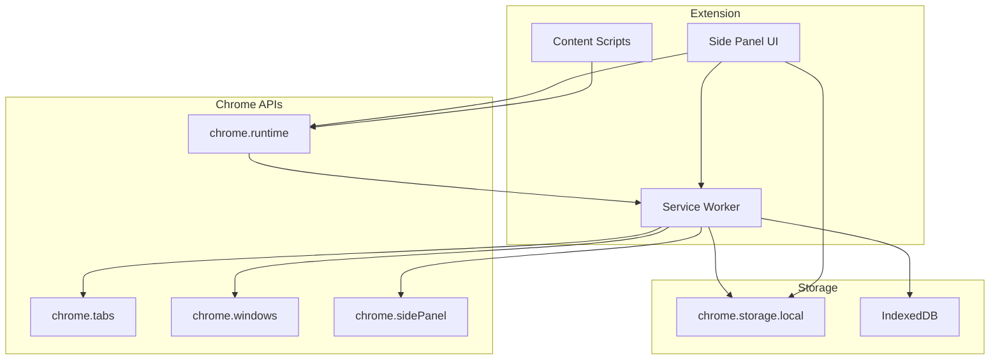
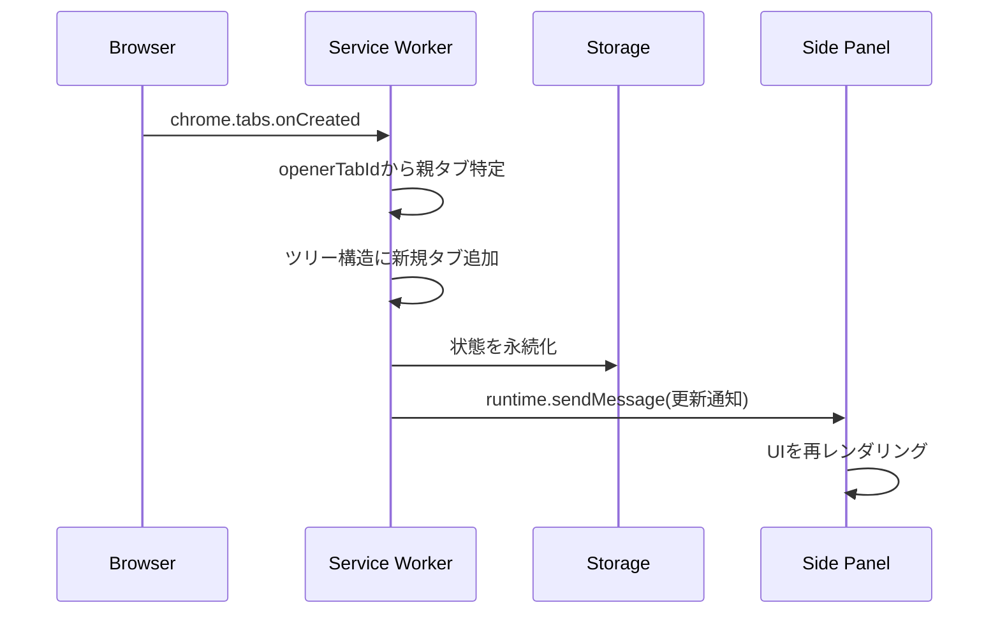
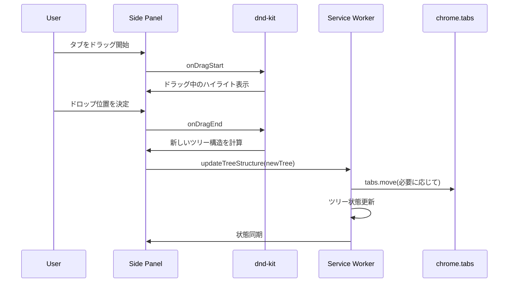
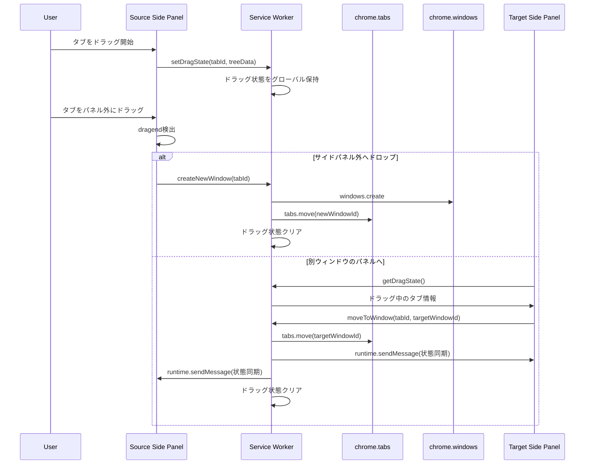
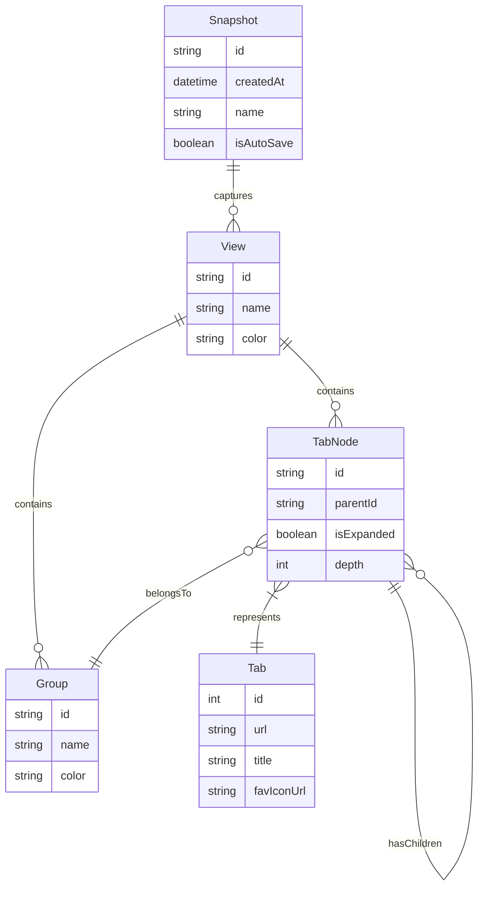

# Technical Design Document - Vivaldi-TT

## Overview

**Purpose**: Vivaldi-TTは、Vivaldiブラウザのサイドパネルにツリー型タブ管理インターフェースを提供するChrome拡張機能である。ユーザーは多数のタブを階層的に整理し、ドラッグ&ドロップで直感的に操作できる。

**Users**: 多数のタブを開いて作業するパワーユーザー、リサーチャー、開発者が、関連するタブをグループ化し、コンテキストを維持しながら効率的にブラウジングできる。

**Impact**: Vivaldiの標準タブバーを補完し、ツリー構造による視覚的な階層表現とスナップショットによるセッション管理を実現する。

### Goals

- Chrome Side Panel APIを使用してVivaldiで動作するツリー型タブUI
- ドラッグ&ドロップによる直感的なツリー構造編集
- 複数ウィンドウ間でのタブ移動サポート
- セッション状態のスナップショット保存・復元
- カスタマイズ可能なUI（フォント、CSS）

### Non-Goals

- Vivaldiネイティブのタブスタック機能との統合
- 他のChromiumブラウザ（Chrome, Edge等）の公式サポート（動作する可能性はある）
- タブの内容プレビュー/サムネイル表示
- クラウド同期によるマルチデバイス対応

## Architecture

### Architecture Pattern & Boundary Map



**Architecture Integration**:
- **Selected Pattern**: レイヤードアーキテクチャ（UI Layer / Service Layer / Storage Layer）
- **Domain Boundaries**:
  - UI Layer: Reactコンポーネント、状態管理、ドラッグ&ドロップ
  - Service Layer: Service Worker、Chrome API連携、ビジネスロジック
  - Storage Layer: ストレージ抽象化、永続化
- **Existing Patterns Preserved**: Chrome拡張機能の標準パターン（manifest.json, service worker, side panel）
- **New Components Rationale**: ツリー状態管理、ビュー管理、スナップショット管理が必要
- **Steering Compliance**: 該当なし（steeringディレクトリ未設定）

### Technology Stack

| Layer | Choice / Version | Role in Feature | Notes |
|-------|------------------|-----------------|-------|
| Frontend | React 18.x + TypeScript 5.x | サイドパネルUIのレンダリング | コンポーネントベースでツリーUIを構築 |
| Drag & Drop | [@dnd-kit/core](https://dndkit.com/) 6.x + [dnd-kit-sortable-tree](https://github.com/Shaddix/dnd-kit-sortable-tree) | ツリー構造のドラッグ&ドロップ | パネル内D&D専用。dnd-kit-sortable-treeはツリー特化コンポーネント |
| State Management | React Context + useReducer | タブツリー状態管理 | Redux不要、標準機能で十分 |
| Styling | TailwindCSS 3.x | UIスタイリング | カスタムCSS機能と共存 |
| Build Tool | Vite 5.x + CRXJS | ビルド、ホットリロード | MV3対応、開発効率化 |
| Runtime | Chrome Extension Manifest V3 | 拡張機能実行環境 | Service Worker、Side Panel API |
| Data Storage | chrome.storage.local + IndexedDB | 設定・状態・スナップショット保存 | 用途別に使い分け |

## System Flows

### タブ作成時のツリー構築フロー



### ドラッグ&ドロップによるツリー再構成フロー



### クロスウィンドウタブ移動フロー

**実装アプローチ**: Service Workerでドラッグ中のタブ情報をグローバルに保持し、`chrome.runtime.sendMessage`でウィンドウ間通信を実現します。



**技術的詳細**:
- Service Workerに`dragState: { tabId, treeData, sourceWindowId } | null`を保持
- `chrome.runtime.onMessage`でウィンドウ間通信
- 非アクティブウィンドウのパネルも`storage.onChanged`で状態同期
- 参考実装: [Tab Shelf拡張機能](https://chromewebstore.google.com/detail/tab-shelf-side-panel-vert/gkiobnohamhihbaipacecjfljepjjlmg)

## Requirements Traceability

| Requirement | Summary | Components | Interfaces | Flows |
|-------------|---------|------------|------------|-------|
| 1.1-1.5 | サイドパネル表示 | SidePanelRoot, TabTreeView | TabTreeState | タブ作成フロー |
| 2.1-2.5 | ツリー構造管理 | TreeNode, TreeStateManager | TreeOperations | ツリー構築フロー |
| 3.1-3.5 | パネル内D&D | DragDropProvider, SortableTree | DndCallbacks | D&Dフロー |
| 4.1-4.4 | クロスウィンドウD&D | CrossWindowDragHandler | CrossWindowOps | クロスウィンドウフロー |
| 5.1-5.5 | グループ化 | GroupNode, GroupManager | GroupOperations | - |
| 6.1-6.5 | ビュー切り替え | ViewSwitcher, ViewManager | ViewState | - |
| 7.1-7.4 | 未読インジケータ | UnreadBadge, UnreadTracker | UnreadState | - |
| 8.1-8.5 | タブ閉じる警告 | CloseButton, ConfirmDialog | CloseHandlers | - |
| 9.1-9.4 | 新規タブ位置 | NewTabPositionSettings | PositionConfig | - |
| 10.1-10.6 | UI/UXカスタマイズ | SettingsPanel, ThemeProvider | ThemeConfig | - |
| 11.1-11.6 | スナップショット | SnapshotManager, SnapshotList | SnapshotOps | - |
| 12.1-12.4 | コンテキストメニュー | ContextMenu, MenuItems | MenuActions | - |
| 13.1-13.5 | ホットリロード | DevReloadPlugin | - | - |
| 14.1-14.5 | Vivaldi互換性 | VivaldiCompat, Fallbacks | - | - |

## Components and Interfaces

| Component | Domain/Layer | Intent | Req Coverage | Key Dependencies | Contracts |
|-----------|--------------|--------|--------------|------------------|-----------|
| SidePanelRoot | UI | サイドパネルのルートコンポーネント | 1.1-1.5 | React, TreeStateProvider (P0) | State |
| ViewSwitcher | UI | ビュー切り替えタブUI | 6.1-6.4 | ViewManager (P0) | State |
| TabTreeView | UI | タブツリーの表示 | 1.2-1.5, 2.4 | TreeNode (P0), dnd-kit (P0) | State |
| TreeNode | UI | 個別タブノードの表示 | 2.4, 7.1, 8.1 | CloseButton (P1), UnreadBadge (P1) | State |
| DragDropProvider | UI | D&D機能のプロバイダー | 3.1-3.5 | dnd-kit (P0) | Service |
| SortableTree | UI | ソート可能なツリーコンポーネント | 3.1-3.5 | dnd-kit-sortable-tree (P0) | Service |
| TreeStateManager | Service | ツリー状態の管理 | 2.1-2.3, 3.2-3.3 | StorageService (P0), TabsAPI (P0) | Service, State |
| GroupManager | Service | グループの作成・管理 | 5.1-5.5 | TreeStateManager (P0) | Service |
| ViewManager | Service | ビュー切り替えの管理 | 6.1-6.5 | StorageService (P0) | Service, State |
| SnapshotManager | Service | スナップショットの保存・復元 | 11.1-11.6 | IndexedDBService (P0) | Service |
| StorageService | Storage | chrome.storage.local操作 | 全体 | chrome.storage (P0) | Service |
| IndexedDBService | Storage | IndexedDB操作 | 11.4-11.6 | IndexedDB (P0) | Service |
| ServiceWorker | Runtime | バックグラウンド処理 | 全体 | Chrome APIs (P0) | Service, Event |

### UI Layer

#### SidePanelRoot

| Field | Detail |
|-------|--------|
| Intent | サイドパネル全体のレイアウトとプロバイダー設定 |
| Requirements | 1.1, 1.2 |

**Responsibilities & Constraints**
- サイドパネルのルートレイアウトを提供
- 状態管理プロバイダー（Context）のセットアップ
- テーマとカスタムCSSの適用

**Dependencies**
- Inbound: なし（エントリーポイント）
- Outbound: TreeStateProvider — 状態管理 (P0)
- Outbound: ThemeProvider — テーマ適用 (P1)
- External: React — UIフレームワーク (P0)

**Contracts**: State [x]

##### State Management

```typescript
interface SidePanelState {
  currentViewId: string;
  views: View[];
  settings: UserSettings;
  isLoading: boolean;
}

interface View {
  id: string;
  name: string;
  color: string;
  rootNodes: TabNode[];
}
```

#### TabTreeView

| Field | Detail |
|-------|--------|
| Intent | タブツリーの再帰的表示とD&D領域の提供 |
| Requirements | 1.2, 1.3, 2.4, 2.5 |

**Responsibilities & Constraints**
- ツリー構造の視覚的レンダリング
- 展開/折りたたみ状態の管理
- ドラッグ&ドロップのコンテナ

**Dependencies**
- Inbound: SidePanelRoot — 親コンポーネント (P0)
- Outbound: TreeNode — 個別ノード表示 (P0)
- External: dnd-kit — D&D機能 (P0)

**Contracts**: State [x]

##### State Management

```typescript
interface TabNode {
  id: string;
  tabId: number;
  parentId: string | null;
  children: TabNode[];
  isExpanded: boolean;
  depth: number;
  viewId: string; // ビュー切り替え用（Requirement 6）
}

interface TabTreeViewProps {
  nodes: TabNode[];
  currentViewId: string; // フィルタリング用
  onNodeClick: (tabId: number) => void;
  onToggleExpand: (nodeId: string) => void;
  onDragEnd: (result: DragEndResult) => void;
}
```

#### TreeNode

| Field | Detail |
|-------|--------|
| Intent | 個別タブノードのUI表示 |
| Requirements | 1.3, 2.4, 7.1, 7.2, 8.1, 8.2 |

**Responsibilities & Constraints**
- ファビコン、タイトル、インデントの表示
- 未読インジケータの表示
- ホバー時の閉じるボタン表示
- 展開/折りたたみトグル

**Dependencies**
- Inbound: TabTreeView — 親コンポーネント (P0)
- Outbound: CloseButton — 閉じるボタン (P1)
- Outbound: UnreadBadge — 未読バッジ (P1)

**Contracts**: State [x]

##### State Management

```typescript
interface TreeNodeProps {
  node: TabNode;
  tab: TabInfo;
  isUnread: boolean;
  isActive: boolean;
  onClose: (tabId: number, hasChildren: boolean) => void;
  onActivate: (tabId: number) => void;
  onToggle: (nodeId: string) => void;
}

interface TabInfo {
  id: number;
  title: string;
  url: string;
  favIconUrl: string | undefined;
  status: 'loading' | 'complete';
}
```

#### DragDropProvider

| Field | Detail |
|-------|--------|
| Intent | dnd-kitのDndContextとセンサーの設定 |
| Requirements | 3.1, 3.4, 3.5 |

**Responsibilities & Constraints**
- ドラッグセンサーの設定（ポインター、キーボード）
- 衝突検出アルゴリズムの設定
- ドラッグオーバーレイの管理

**Dependencies**
- External: @dnd-kit/core — コアD&D機能 (P0)
- External: @dnd-kit/sortable — ソート機能 (P0)

**Contracts**: Service [x]

##### Service Interface

```typescript
interface DragDropCallbacks {
  onDragStart: (event: DragStartEvent) => void;
  onDragOver: (event: DragOverEvent) => void;
  onDragEnd: (event: DragEndEvent) => void;
  onDragCancel: () => void;
}

interface DragEndResult {
  activeId: string;
  overId: string | null;
  newParentId: string | null;
  newIndex: number;
}
```

#### ContextMenu

| Field | Detail |
|-------|--------|
| Intent | 右クリックコンテキストメニューの表示 |
| Requirements | 12.1, 12.2, 12.3, 12.4 |

**Responsibilities & Constraints**
- メニュー位置の計算と表示
- 選択状態に応じたメニュー項目の動的生成
- メニュー外クリックでの閉じ処理

**Dependencies**
- Inbound: TabTreeView — イベントトリガー (P0)
- Outbound: MenuActions — アクション実行 (P0)

**Contracts**: Service [x]

##### Service Interface

```typescript
type MenuAction =
  | 'close'
  | 'closeOthers'
  | 'duplicate'
  | 'pin'
  | 'unpin'
  | 'newWindow'
  | 'group'
  | 'ungroup'
  | 'reload';

interface ContextMenuProps {
  targetTabIds: number[];
  position: { x: number; y: number };
  onAction: (action: MenuAction) => void;
  onClose: () => void;
}
```

#### SettingsPanel

| Field | Detail |
|-------|--------|
| Intent | ユーザー設定UIの提供 |
| Requirements | 10.1, 10.2, 10.3, 10.4, 10.5, 10.6, 9.1, 9.4 |

**Responsibilities & Constraints**
- フォントサイズ・ファミリー設定
- カスタムCSS入力/ファイル選択
- 新規タブ位置設定
- 警告閾値設定

**Dependencies**
- Outbound: StorageService — 設定保存 (P0)
- Outbound: ThemeProvider — テーマ適用 (P1)

**Contracts**: State [x]

##### State Management

```typescript
interface UserSettings {
  fontSize: number;
  fontFamily: string;
  customCSS: string;
  newTabPosition: 'child' | 'sibling' | 'end';
  closeWarningThreshold: number;
  showUnreadIndicator: boolean;
  autoSnapshotInterval: number; // minutes, 0 = disabled
}
```

#### ViewSwitcher

| Field | Detail |
|-------|--------|
| Intent | サイドパネル上部でビュー切り替えUIを提供 |
| Requirements | 6.1, 6.2, 6.3, 6.4 |

**Responsibilities & Constraints**
- サイドパネル上部にファビコンサイズの小さなタブUIを横並びで表示
- クリックで現在のビューを切り替え
- アクティブなビューを視覚的にハイライト
- 新しいビューの追加ボタン

**UI仕様**:
- 各ビューは16x16pxのファビコンサイズ + ビュー名（省略形）
- 横スクロール可能なタブバー形式
- ドラッグ&ドロップでビューの順序変更可能（オプション）

**Dependencies**
- Inbound: SidePanelRoot — 親コンポーネント (P0)
- Outbound: ViewManager — ビュー切り替えロジック (P0)

**Contracts**: State [x]

##### State Management

```typescript
interface ViewSwitcherProps {
  views: View[];
  currentViewId: string;
  onViewSwitch: (viewId: string) => void;
  onViewCreate: () => void;
  onViewDelete: (viewId: string) => void;
  onViewUpdate: (viewId: string, updates: Partial<View>) => void;
}

interface View {
  id: string;
  name: string;
  color: string;
  icon?: string; // カスタムアイコンURL（オプション）
}
```

**重要**: 非アクティブビューのタブはChromeタブとして閉じず、UIでフィルタリングして非表示にします。TabTreeViewは`currentViewId`に基づいて表示するタブをフィルタリングします。

### Service Layer

#### TreeStateManager

| Field | Detail |
|-------|--------|
| Intent | タブツリー状態の集中管理と永続化 |
| Requirements | 2.1, 2.2, 2.3, 3.2, 3.3 |

**Responsibilities & Constraints**
- タブとツリーノードのマッピング管理
- 親子関係の追跡と更新
- 状態変更時の即時永続化
- Chrome tabs APIとの同期

**Dependencies**
- Outbound: StorageService — 状態永続化 (P0)
- External: chrome.tabs — タブ操作 (P0)
- External: chrome.runtime — メッセージング (P0)

**Contracts**: Service [x] / Event [x] / State [x]

##### Service Interface

```typescript
interface TreeStateManager {
  // 状態取得
  getTree(viewId: string): TabNode[];
  getNodeByTabId(tabId: number): TabNode | null;

  // 状態変更
  addTab(tab: chrome.tabs.Tab, parentId: string | null): void;
  removeTab(tabId: number): void;
  moveNode(nodeId: string, newParentId: string | null, index: number): void;
  toggleExpand(nodeId: string): void;

  // 同期
  syncWithChromeTabs(): Promise<void>;
}
```

##### Event Contract

- Published events: `tree-updated`, `node-added`, `node-removed`, `node-moved`
- Subscribed events: `chrome.tabs.onCreated`, `chrome.tabs.onRemoved`, `chrome.tabs.onMoved`, `chrome.tabs.onUpdated`
- Ordering: イベントは受信順に処理、状態更新は同期的に実行

##### State Management

```typescript
interface TreeState {
  nodes: Map<string, TabNode>;
  tabToNode: Map<number, string>;
  expandedNodes: Set<string>;
}
```

#### GroupManager

| Field | Detail |
|-------|--------|
| Intent | タブグループの作成・編集・削除 |
| Requirements | 5.1, 5.2, 5.3, 5.4, 5.5 |

**Responsibilities & Constraints**
- グループノードの作成と管理
- グループプロパティ（名前、色）の編集
- グループ解除とタブの昇格

**Dependencies**
- Inbound: TreeStateManager — ツリー操作 (P0)
- Outbound: StorageService — グループ情報保存 (P0)

**Contracts**: Service [x]

##### Service Interface

```typescript
interface Group {
  id: string;
  name: string;
  color: string;
  isExpanded: boolean;
}

interface GroupManager {
  createGroup(tabIds: number[], name: string, color: string): Group;
  updateGroup(groupId: string, updates: Partial<Group>): void;
  dissolveGroup(groupId: string): void;
  getGroups(): Group[];
}
```

#### ViewManager

| Field | Detail |
|-------|--------|
| Intent | 複数ビュー（仮想ワークスペース）の管理 |
| Requirements | 6.1, 6.2, 6.3, 6.4, 6.5 |

**Responsibilities & Constraints**
- ビューの作成・削除・切り替え
- タブとビューの関連付け
- ビュー間のタブ移動
- **重要**: タブは物理的に閉じず、各タブに`viewId`メタデータを付与して管理
- UIレイヤーでは`currentViewId`に一致するタブのみを表示（フィルタリング）

**実装詳細**:
- 各タブノードに`viewId: string`プロパティを追加
- ビュー切り替え時は`currentViewId`を変更するのみ
- TabTreeViewコンポーネントが`node.viewId === currentViewId`でフィルタリング
- すべてのChromeタブは開いたまま維持される

**Dependencies**
- Inbound: TreeStateManager — タブ状態 (P0)
- Outbound: StorageService — ビュー設定保存 (P0)

**Contracts**: Service [x] / State [x]

##### Service Interface

```typescript
interface ViewManager {
  createView(name: string, color: string): View;
  deleteView(viewId: string): void;
  switchView(viewId: string): void;
  moveTabToView(tabId: number, viewId: string): void;
  getCurrentView(): View;
  getViews(): View[];
  getTabsByView(viewId: string): TabNode[]; // 指定ビューのタブを取得
}
```

#### SnapshotManager

| Field | Detail |
|-------|--------|
| Intent | セッションスナップショットの保存・復元・管理 |
| Requirements | 11.1, 11.2, 11.3, 11.4, 11.5, 11.6 |

**Responsibilities & Constraints**
- 現在状態のJSON形式スナップショット作成
- スナップショットからのセッション復元
- 自動スナップショットのスケジューリング
- 履歴管理と古いスナップショットの削除

**Dependencies**
- Inbound: TreeStateManager — 現在状態取得 (P0)
- Outbound: IndexedDBService — スナップショット保存 (P0)

**Contracts**: Service [x]

##### Service Interface

```typescript
interface Snapshot {
  id: string;
  createdAt: Date;
  name: string;
  isAutoSave: boolean;
  data: SnapshotData;
}

interface SnapshotData {
  views: View[];
  tabs: TabSnapshot[];
  groups: Group[];
}

interface TabSnapshot {
  url: string;
  title: string;
  parentId: string | null;
  viewId: string;
}

interface SnapshotManager {
  createSnapshot(name: string): Promise<Snapshot>;
  restoreSnapshot(snapshotId: string): Promise<void>;
  deleteSnapshot(snapshotId: string): Promise<void>;
  getSnapshots(): Promise<Snapshot[]>;
  exportSnapshot(snapshotId: string): Promise<string>; // JSON string
  importSnapshot(jsonData: string): Promise<Snapshot>;
  startAutoSnapshot(intervalMinutes: number): void;
  stopAutoSnapshot(): void;
}
```

#### UnreadTracker

| Field | Detail |
|-------|--------|
| Intent | タブの未読状態の追跡 |
| Requirements | 7.1, 7.2, 7.3, 7.4 |

**Responsibilities & Constraints**
- 新規タブを未読としてマーク
- タブアクティブ化時に既読としてマーク
- 未読タブ数のカウント

**Dependencies**
- External: chrome.tabs.onCreated — 新規タブ検出 (P0)
- External: chrome.tabs.onActivated — アクティブ化検出 (P0)
- Outbound: StorageService — 未読状態保存 (P1)

**Contracts**: State [x]

##### State Management

```typescript
interface UnreadState {
  unreadTabIds: Set<number>;
  getUnreadCount(): number;
  markAsUnread(tabId: number): void;
  markAsRead(tabId: number): void;
  isUnread(tabId: number): boolean;
}
```

### Storage Layer

#### StorageService

| Field | Detail |
|-------|--------|
| Intent | chrome.storage.localの抽象化 |
| Requirements | 全体（状態永続化） |

**Responsibilities & Constraints**
- キーバリューストアの抽象化
- 型安全なget/set操作
- 変更監視

**Dependencies**
- External: chrome.storage.local — ストレージAPI (P0)

**Contracts**: Service [x]

##### Service Interface

```typescript
interface StorageService {
  get<T>(key: string): Promise<T | null>;
  set<T>(key: string, value: T): Promise<void>;
  remove(key: string): Promise<void>;
  onChange(callback: (changes: StorageChanges) => void): void;
}

type StorageChanges = {
  [key: string]: { oldValue: unknown; newValue: unknown };
};
```

#### IndexedDBService

| Field | Detail |
|-------|--------|
| Intent | IndexedDBの抽象化（大容量データ用） |
| Requirements | 11.4, 11.5, 11.6 |

**Responsibilities & Constraints**
- スナップショット履歴の保存
- インデックス付きクエリ
- 容量管理と古いデータ削除

**Dependencies**
- External: IndexedDB — ブラウザストレージ (P0)

**Contracts**: Service [x]

##### Service Interface

```typescript
interface IndexedDBService {
  // Snapshot operations
  saveSnapshot(snapshot: Snapshot): Promise<void>;
  getSnapshot(id: string): Promise<Snapshot | null>;
  getAllSnapshots(): Promise<Snapshot[]>;
  deleteSnapshot(id: string): Promise<void>;
  deleteOldSnapshots(keepCount: number): Promise<void>;
}
```

### Runtime Layer

#### ServiceWorker (Background Script)

| Field | Detail |
|-------|--------|
| Intent | バックグラウンドでのイベント処理とAPI連携 |
| Requirements | 全体 |

**Responsibilities & Constraints**
- Chrome タブイベントの監視と処理
- サイドパネルとのメッセージング
- 状態の永続化トリガー
- アラームによる定期処理

**Dependencies**
- External: chrome.tabs — タブAPI (P0)
- External: chrome.windows — ウィンドウAPI (P0)
- External: chrome.runtime — メッセージング (P0)
- External: chrome.alarms — 定期実行 (P1)
- Outbound: StorageService — 状態永続化 (P0)

**Contracts**: Service [x] / Event [x]

##### Event Contract

- Published events: `state-updated`, `tab-event`
- Subscribed events: すべてのchrome.tabs.on*イベント、chrome.windows.on*イベント
- Delivery: chrome.runtime.sendMessageによる即時通知

##### Service Interface

```typescript
type MessageType =
  | { type: 'GET_STATE' }
  | { type: 'UPDATE_TREE'; payload: TreeUpdatePayload }
  | { type: 'MOVE_TAB_TO_WINDOW'; payload: { tabId: number; windowId: number } }
  | { type: 'CREATE_WINDOW_WITH_TAB'; payload: { tabId: number } }
  | { type: 'CLOSE_TAB'; payload: { tabId: number } }
  | { type: 'ACTIVATE_TAB'; payload: { tabId: number } }
  // クロスウィンドウD&D用（Requirement 4）
  | { type: 'SET_DRAG_STATE'; payload: { tabId: number; treeData: any; sourceWindowId: number } }
  | { type: 'GET_DRAG_STATE' }
  | { type: 'CLEAR_DRAG_STATE' };

type MessageResponse<T> = { success: true; data: T } | { success: false; error: string };
```

## Data Models

### Domain Model



**Aggregates and Boundaries**:
- **View Aggregate**: View、そこに含まれるTabNode、Groupを管理
- **Snapshot Aggregate**: スナップショットとそのデータを管理

**Business Rules & Invariants**:
- タブは常に1つのビューにのみ所属
- グループは必ず少なくとも1つのタブを含む
- ツリーは循環参照を持たない

### Logical Data Model

**chrome.storage.local Schema**:

```typescript
interface StorageSchema {
  // 現在のツリー状態
  'tree_state': {
    views: View[];
    currentViewId: string;
    nodes: Record<string, TabNode>;
    tabToNode: Record<number, string>;
  };

  // ユーザー設定
  'user_settings': UserSettings;

  // 未読タブID
  'unread_tabs': number[];

  // グループ情報
  'groups': Record<string, Group>;
}
```

**IndexedDB Schema (Snapshots)**:

```typescript
// Database: vivaldi-tt-snapshots
// Object Store: snapshots
// Key Path: id
// Indexes: createdAt, isAutoSave

interface SnapshotRecord {
  id: string;
  createdAt: number; // timestamp
  name: string;
  isAutoSave: boolean;
  data: string; // JSON stringified SnapshotData
}
```

## Error Handling

### Error Strategy

エラーは発生箇所で適切にハンドリングし、ユーザーには回復可能なアクションを提示する。

### Error Categories and Responses

**User Errors (UI)**:
- 無効なカスタムCSS → CSSパースエラーを表示、前のスタイルを維持
- スナップショットインポート失敗 → JSONフォーマットエラーを表示

**System Errors (Chrome API)**:
- タブ操作失敗 → ログ出力、UIに反映せず静かに失敗
- ストレージ容量超過 → 警告表示、古いスナップショット削除を提案

**Business Logic Errors**:
- 循環参照の検出 → 操作をキャンセル、エラーログ

### Monitoring

- `console.error`でエラーをログ出力
- Service Workerでの未処理エラーは`self.onerror`でキャッチ
- 開発モードでは詳細なスタックトレースを表示

## Testing Strategy

### Unit Tests
- TreeStateManager: ノード追加/削除/移動のロジック
- SnapshotManager: JSON変換、履歴管理
- StorageService: get/set/remove操作
- UnreadTracker: 未読状態の追跡

### Integration Tests
- Service Worker ↔ Side Panel メッセージング
- Chrome tabs API連携によるツリー同期
- IndexedDB操作のCRUD

### E2E/UI Tests
- タブクリックによるアクティブ化
- ドラッグ&ドロップによるツリー再構成
- コンテキストメニュー操作
- 設定変更の即時反映

### Performance Tests
- 100タブ以上でのレンダリング性能
- 大量スナップショット時のIndexedDB性能
- ドラッグ中のフレームレート

## Optional Sections

### Security Considerations

- `tabs`権限でURLアクセス可能だが、機密URLは表示用のみに限定
- カスタムCSSはサニタイズせず適用するため、ユーザー責任とする
- スナップショットにはURLが含まれるため、エクスポートファイルの取り扱いに注意

### Performance & Scalability

**Target Metrics**:
- 初期レンダリング: 100タブで500ms以内
- ドラッグ中: 60fps維持
- ストレージ操作: 100ms以内

**Optimization Techniques**:
- React.memoによるコンポーネントメモ化
- 仮想スクロール（react-window）の導入検討
- デバウンスによるストレージ書き込み最適化

## Supporting References

### Manifest V3 Configuration

```json
{
  "manifest_version": 3,
  "name": "Vivaldi-TT",
  "version": "1.0.0",
  "permissions": [
    "sidePanel",
    "tabs",
    "storage",
    "unlimitedStorage",
    "alarms"
  ],
  "side_panel": {
    "default_path": "sidepanel.html"
  },
  "background": {
    "service_worker": "background.js",
    "type": "module"
  },
  "action": {
    "default_title": "Toggle Tree Tabs"
  }
}
```

### Project Structure

```
vivaldi-tt/
├── src/
│   ├── background/
│   │   └── service-worker.ts
│   ├── sidepanel/
│   │   ├── index.tsx
│   │   ├── components/
│   │   │   ├── SidePanelRoot.tsx
│   │   │   ├── TabTreeView.tsx
│   │   │   ├── TreeNode.tsx
│   │   │   ├── ContextMenu.tsx
│   │   │   └── SettingsPanel.tsx
│   │   ├── hooks/
│   │   │   └── useTreeState.ts
│   │   └── providers/
│   │       ├── TreeStateProvider.tsx
│   │       └── ThemeProvider.tsx
│   ├── services/
│   │   ├── TreeStateManager.ts
│   │   ├── GroupManager.ts
│   │   ├── ViewManager.ts
│   │   ├── SnapshotManager.ts
│   │   └── UnreadTracker.ts
│   ├── storage/
│   │   ├── StorageService.ts
│   │   └── IndexedDBService.ts
│   ├── types/
│   │   └── index.ts
│   └── utils/
│       └── tree-utils.ts
├── public/
│   └── icons/
├── manifest.json
├── vite.config.ts
├── tailwind.config.js
├── tsconfig.json
└── package.json
```
